# K-12 SEAA Azure Architecture - Target Backend System

**Document Purpose:** Define the target Azure architecture for the K-12 SEAA backend system including integration with the NC Residency Determination Service (RDS)

**Last Updated:** 2025-10-15  
**Technology Stack:** Microsoft Azure, .NET Core, SQL Server

---

## Table of Contents

1. [Architecture Overview](#architecture-overview)
2. [Azure Services & Components](#azure-services--components)
3. [System Architecture Diagram](#system-architecture-diagram)
4. [RDS Integration Architecture](#rds-integration-architecture)
5. [Sequence Diagrams](#sequence-diagrams)
6. [Data Flow Patterns](#data-flow-patterns)
7. [Security & Compliance](#security--compliance)
8. [Deployment & Operations](#deployment--operations)

---

## Architecture Overview

The K-12 SEAA backend system is designed as a cloud-native, microservices-based architecture hosted on Microsoft Azure. The system supports:

- **Opportunity Scholarship** application and award processing
- **ESA+ (Education Student Accounts)** program management
- **Residency verification** integration with NC RDS
- **Document management** and storage
- **Payment processing** and disbursements
- **Event-driven workflows** for inter-service communication
- **Compliance and audit** capabilities

### Key Architecture Principles

1. **Cloud-Native:** Fully leverages Azure PaaS services
2. **Microservices:** Domain-driven service boundaries
3. **Event-Driven:** Asynchronous communication via Event Grid
4. **API-First:** RESTful APIs with Azure API Management
5. **Secure by Default:** Azure AD, Key Vault, Private Link
6. **Scalable:** Auto-scaling with App Services and Functions
7. **Observable:** Application Insights, Log Analytics

---

## Azure Services & Components

### Compute Services

| Service | Purpose | Usage |
|---------|---------|-------|
| **Azure App Service** | Host .NET Core Web APIs | Application Service, Award Service, Certification Service |
| **Azure Functions** | Serverless event processing | Batch jobs, event handlers, scheduled tasks |
| **Azure Logic Apps** | Workflow orchestration | Complex multi-step business processes, integrations |

### Data Services

| Service | Purpose | Usage |
|---------|---------|-------|
| **Azure SQL Database** | Relational data store | Student data, applications, awards, audit logs |
| **Azure Blob Storage** | Document storage | PDFs, images, exported reports |
| **Azure Cache for Redis** | Distributed caching | RDS response cache, session state |

### Integration & Messaging

| Service | Purpose | Usage |
|---------|---------|-------|
| **Azure API Management (APIM)** | API gateway | Rate limiting, authentication, monitoring |
| **Azure Event Grid** | Event routing | Domain events, integration events |
| **Azure Service Bus** | Message queue | Reliable async messaging, dead letter queue |

### Security & Identity

| Service | Purpose | Usage |
|---------|---------|-------|
| **Azure Active Directory (Entra ID)** | Identity provider | User authentication, RBAC |
| **Azure Key Vault** | Secrets management | Connection strings, API keys, certificates |
| **Azure Private Link** | Network isolation | Secure connectivity to PaaS services |

### Monitoring & Operations

| Service | Purpose | Usage |
|---------|---------|-------|
| **Application Insights** | APM & monitoring | Performance, errors, custom metrics |
| **Log Analytics** | Centralized logging | Aggregated logs, queries, alerts |
| **Azure Monitor** | Alerting & dashboards | Health checks, threshold alerts |

---

## System Architecture Diagram

### High-Level Azure Architecture

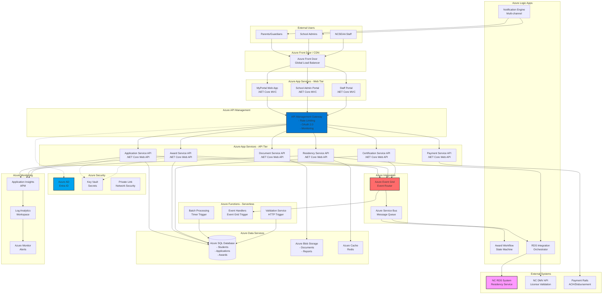

---

## RDS Integration Architecture

### Detailed RDS Integration Components

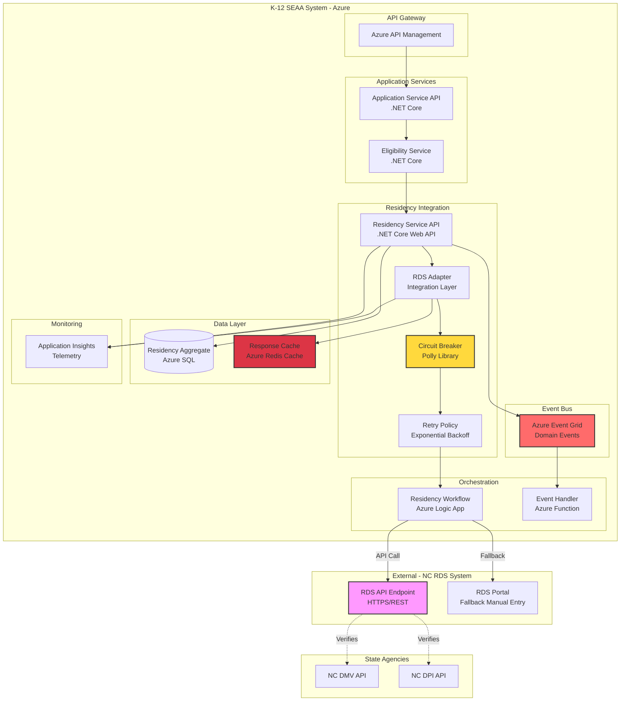

### RDS Integration Service Components

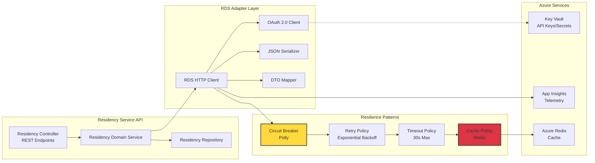

---

## Sequence Diagrams

### Use Case 1: New Residency Validation for Household

This sequence diagram shows the complete workflow for validating residency when a parent submits a new K-12 scholarship application.

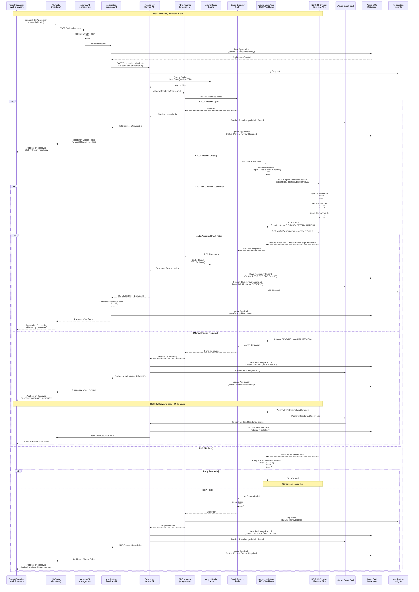

### Use Case 2: Re-Verification of Existing Residency

This sequence diagram shows the workflow for re-verifying residency for a household that already has an RDS determination (e.g., renewal application).

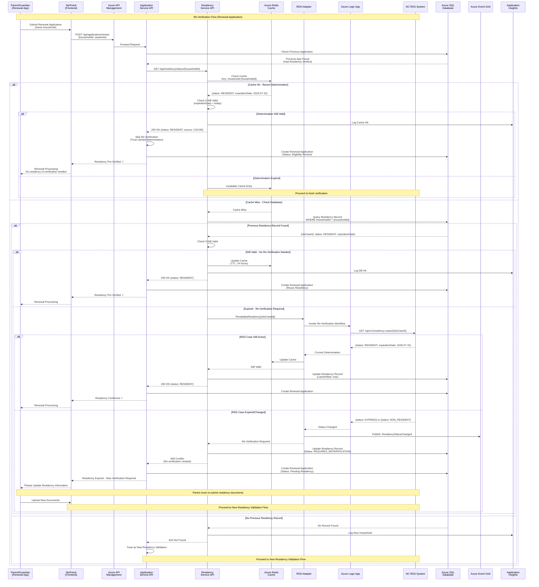

---

## Data Flow Patterns

### Event-Driven Architecture with Azure Event Grid

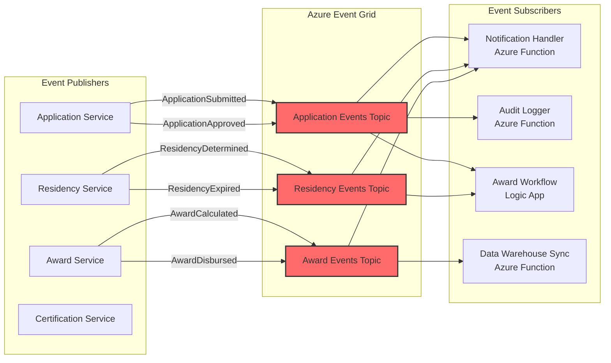

### Caching Strategy

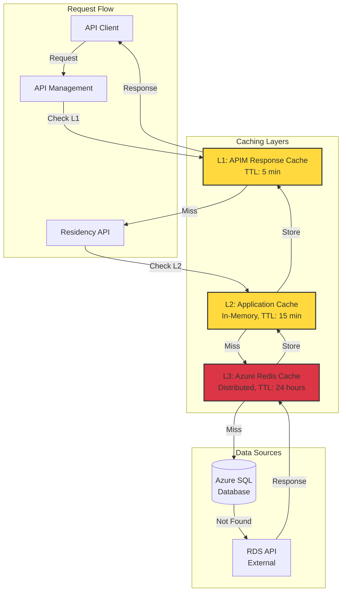

---

## Security & Compliance

### Azure Security Architecture

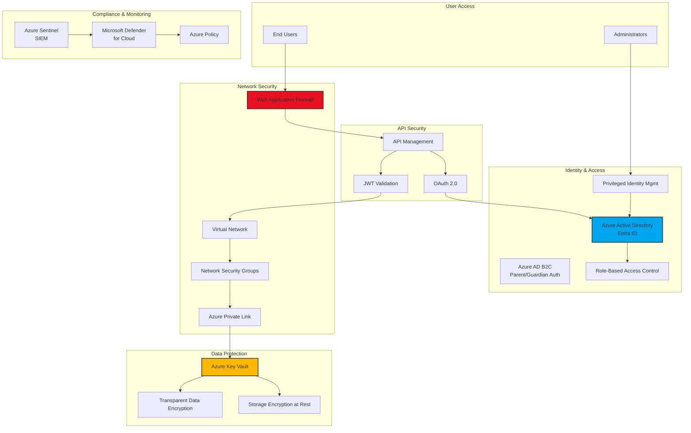

### Data Encryption Flow

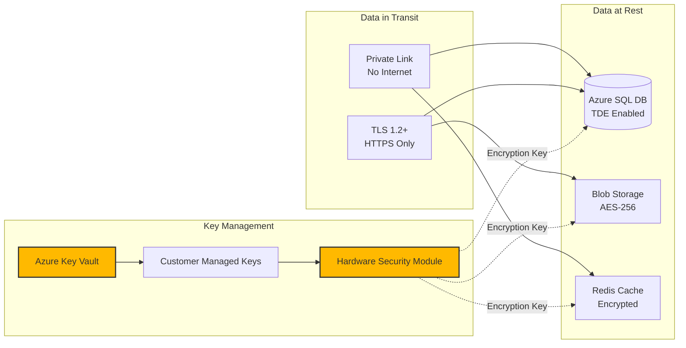

---

## Deployment & Operations

### CI/CD Pipeline Architecture

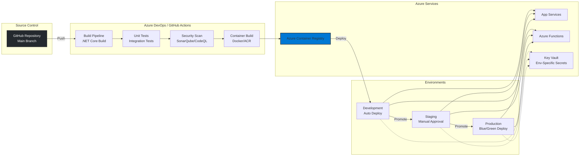

### Monitoring & Observability

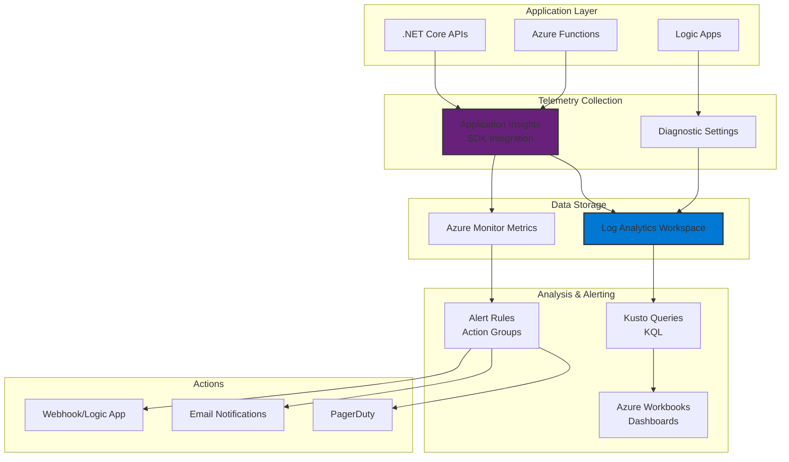

---

## Azure Service Configuration

### App Service Configuration

```yaml
App Service Plan:
  Tier: Premium V3 (P1V3 or higher)
  Auto-scaling: Enabled
    - Min Instances: 2
    - Max Instances: 10
    - Scale Rules:
      - CPU > 70% for 5 min → Scale Out
      - CPU < 30% for 10 min → Scale In
  
  Always On: Enabled
  HTTPS Only: Enabled
  Managed Identity: System-assigned
  
  Application Settings:
    - APPLICATIONINSIGHTS_CONNECTION_STRING: @KeyVault
    - AzureAd__ClientSecret: @KeyVault
    - ConnectionStrings__DefaultConnection: @KeyVault
    - RDS__ApiKey: @KeyVault
    - Redis__ConnectionString: @KeyVault
```

### Azure SQL Database Configuration

```yaml
Azure SQL Database:
  Tier: General Purpose
  Compute: Provisioned (4-8 vCores)
  Storage: 100-500 GB (auto-grow enabled)
  
  Security:
    - Transparent Data Encryption: Enabled
    - Advanced Data Security: Enabled
    - Auditing: Enabled (Log Analytics)
    - Firewall: Azure Services Only
    - Private Endpoint: Enabled
  
  High Availability:
    - Zone Redundant: Enabled (Production)
    - Backup Retention: 35 days
    - Point-in-time Restore: Enabled
    - Geo-Replication: Enabled (Production)
```

### Azure Redis Cache Configuration

```yaml
Azure Cache for Redis:
  Tier: Premium
  Capacity: P1 (6 GB) or higher
  
  Features:
    - Clustering: Enabled
    - Persistence: RDB backup every 60 min
    - Non-SSL Port: Disabled
    - Firewall: VNet integration
    - Geo-Replication: Enabled (Production)
  
  Configuration:
    - maxmemory-policy: allkeys-lru
    - Default TTL: 86400 (24 hours)
```

---

## Cost Optimization

### Azure Cost Estimates (Monthly)

| Service | Configuration | Est. Monthly Cost |
|---------|--------------|-------------------|
| App Service (x3 APIs) | Premium P1V3 x 3 | $450 |
| Azure Functions | Consumption Plan | $50 |
| Azure Logic Apps | Standard, 10K runs | $100 |
| Azure SQL Database | GP 4 vCore | $550 |
| Azure Blob Storage | 500 GB + operations | $25 |
| Azure Redis Cache | Premium P1 | $275 |
| API Management | Developer Tier | $50 |
| Event Grid | 1M operations | $2 |
| Application Insights | 10 GB data ingestion | $25 |
| Azure Key Vault | 10K operations | $5 |
| Azure AD B2C | 50K MAU | Free-$15 |
| **Total Estimated** | | **~$1,550/month** |

*Note: Costs will scale with usage. Production environment may require higher tiers.*

---

## Summary & Recommendations

### Architecture Highlights

1. **Cloud-Native Design**: Fully leverages Azure PaaS services for reduced operational overhead
2. **Microservices Pattern**: Domain-driven service boundaries with independent scaling
3. **Event-Driven Integration**: Loose coupling via Azure Event Grid for system resilience
4. **Multi-Layer Caching**: Redis + APIM caching reduces RDS API calls and improves performance
5. **Circuit Breaker Pattern**: Polly library protects against cascading failures
6. **Security First**: Azure AD, Key Vault, Private Link, TDE for comprehensive security
7. **Observable**: Application Insights + Log Analytics for full system visibility

### Next Steps

1. **Provision Azure Resources**: Use Terraform/Bicep for infrastructure as code
2. **Implement RDS Adapter**: Build .NET Core integration layer with Polly resilience
3. **Configure Event Grid**: Set up domain event topics and subscriptions
4. **Set Up Monitoring**: Configure Application Insights, alerts, and dashboards
5. **Establish CI/CD**: GitHub Actions or Azure DevOps pipelines
6. **Load Testing**: Validate auto-scaling and performance under load
7. **Security Review**: Penetration testing and compliance validation

---

## Document Version History

| Version | Date | Author | Changes |
|---------|------|--------|---------|
| 1.0 | 2025-10-15 | System Architect | Initial Azure architecture documentation |

