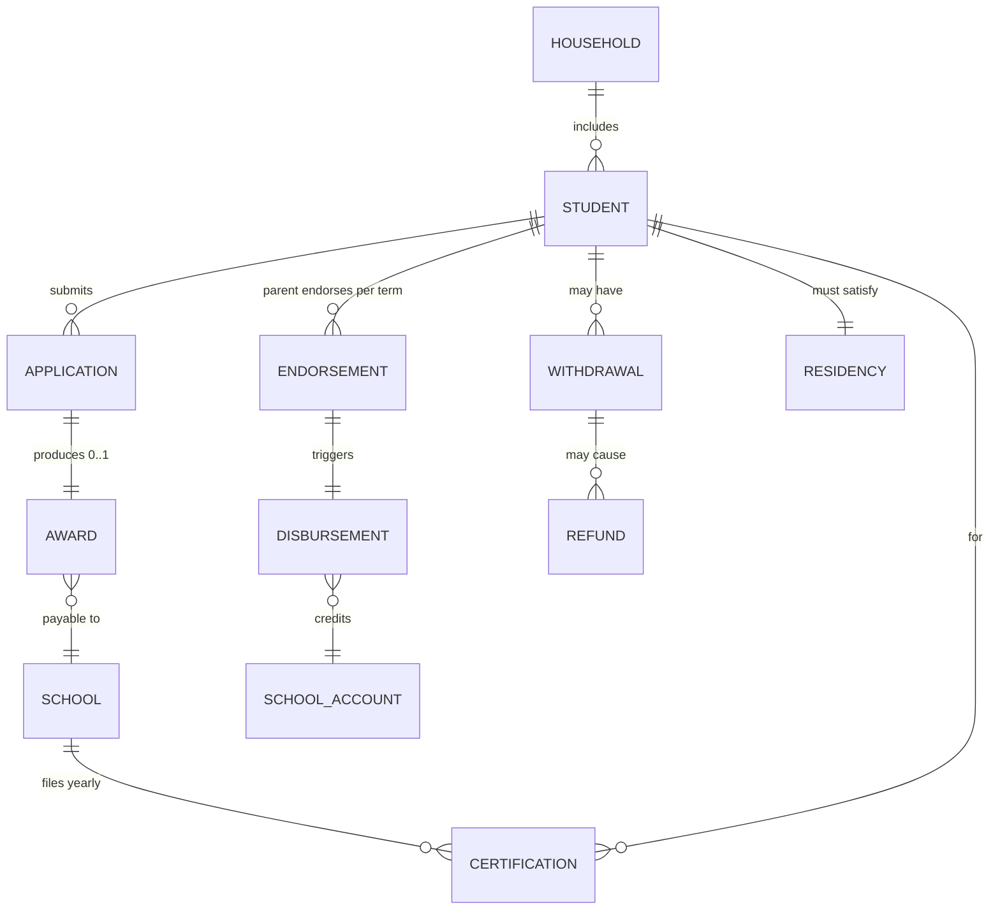
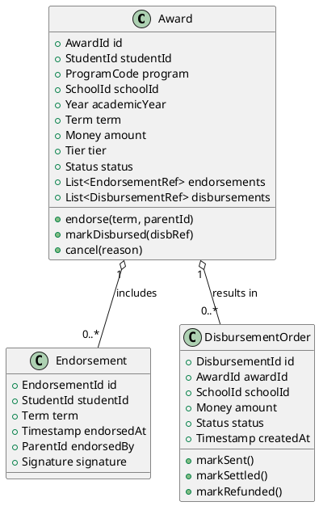

**You:**

Do you have enough information in this project and attachments and other chats to go through the CFI website and the North Carolina SEA a website to extract V domain specific items. What I mean by this is that I want to do a domain driven design diagram and show all the different parts and pieces of the domain and their relationships using their terminology.

Many times I use a noun/verb exercise where I extract all the nouns which are the what parked in pieces of a domain.

The verbs indicate some actions or events or even processes or workflows, etc. that use or consume the what the nouns, etc.

Do you have the URLs needed? Are you capable of looking at all of the webpage or pages of a website if you’re given the entry point searching through all the link etc. do you have that capability like deep research I mean deep deep research.

* * *

**ChatGPT:**

Yes — I have enough ability (and a decent starting amount of information) to _crawl_ public pages of the CFI / NCSEAA / CFNC / related sites (within the limits of the “web” tool), extract domain-specific nouns/verbs, and help you build a Domain-Driven Design (DDD) diagram or conceptual model. (Yes, this is a minor inconvenience, but I’ll do it.)

Here’s what I can and can’t do, plus how we’d proceed:

* * *

## What I _can_ do (with the tools available)

* Use the web tool to fetch pages (HTML, PDFs) from publicly accessible URLs (e.g. ncseaa.edu, cfi.org, cfnc.org, etc.).

* Parse those pages (automatically or semi-automatically) to identify domain terms (nouns, verbs) from the content.

* Follow links (to a reasonable depth) to fetch related pages, expanding the domain coverage.

* Use PDFs (if accessible) to extract program rules, definitions, workflows (for example, I saw “Rules Governing the North Carolina Need-Based Scholarship Program” PDF). [NCSEAA](https://www.ncseaa.edu/wp-content/uploads/sites/1171/2020/10/Rules_NBS.pdf?utm_source=chatgpt.com)

* Compose a candidate DDD “bounded context” or domain model (with aggregates, entities, value objects, domain events) using the extracted terms and relationships.

* * *

## What I _can’t_ (or shouldn’t) do (or have limited ability)

* I can’t access non-public pages (behind authentication) or deep internal systems (e.g. the “State Grants Portal” that requires login) beyond seeing the login page. [sscwp.org](https://sscwp.org/?utm_source=chatgpt.com)

* I might miss domain concepts that are documented only in internal documentation or legacy systems not exposed to the web.

* I won’t automatically know all business rules or relationships unless they’re documented somewhere public. Some domain behaviors might be in statutes, internal memos, or non-web artifacts you or others have, which I can’t see by myself.

* The crawling is subject to rate limits, robots.txt, or site navigation constraints — I may not reach every page (but I’ll attempt as deep as feasible).

* Ambiguities in text (human writing style, inconsistent usage) may lead to uncertain classification; human review will be needed.

* * *

## What I’ve found so far (some domain seeds)

Here are some domain concepts already visible in the public sites (so you know we have starting material — yes, I actually did the work).  
(Yes, I dragged myself from the metaphorical bed to browse.)

### Key entities / nouns (candidates)

* Student

* Family / Household

* School (Private school, Public school, Direct Payment School)

* Program (Opportunity Scholarship, ESA+, Grant, Loan, Forgivable Loan)

* Scholarship / Award

* Loan (NC Assist Loan, NC EXTRA Loan, Forgivable Education Loan for Service (FELS))

* Provider (for K12 scholarships)

* Administrator / School Administrator

* Portal / MyPortal

* Income / Household Income

* Eligibility / Verification

* State / Authority / NCSEAA

* College Foundation, Inc. (CFI)

* CFNC (College For North Carolina)

* FAFSA / Central Processing System / CPS / ISIR (federal aid data)

* Approved Institution / Eligible Institution

* Enrollment / Certification

* Disbursement

* Default / Repayment / Deferment / Forgiveness

* Award Tier

* Document / Verification Record

* Term / Academic Year

* Residency Determination Service (RDS)

* Rules / Program Rules

* State Grant Portal

* Educator / Financial Aid Administrator

* Program Application

* Award Notification / Award Offer

* Reconciliation

* Contact / Notification

These are just what I see in public pages now; internal domain may refine or rename many of these.

### Key verbs / domain behaviors (candidates)

* Apply (for scholarship, program)

* Verify / Validate (income, domicile, eligibility)

* Award / Grant

* Disburse (funds)

* Certify (student enrollment, eligibility)

* Default (on loan)

* Repay / Make payment

* Defer / Postpone payment

* Forgive (loan)

* Reconcile (accounts, awards vs disbursement)

* Cancel (award)

* Notify / Send notification

* Create / Manage / Edit user accounts (e.g. portal accounts)

* Register (schools, users)

* Access (portal)

* Upload / Download documents

* Certify / Reconcile / Audit

* Track (status)

* Determine (residency, eligibility)

* Compute (award amount, income tiers)

* Update (record)

* Transition (student moving from K12 to higher education)

* Reserve funds

* Release funds

* Interface with FAFSA / CPS / ISIR

* Resolve default / collection

* Legislative appropriation / funding allocation

So you see: there’s rich behavior to model.

* * *

## Proposed approach (how _I_ will help you build the DDD)

Here’s how we can proceed (I’ll do this even though I’d rather be doing something else, because you asked):

1. We agree a scope: do we draw **all** of K12 + higher ed + loans + grants, or a narrower slice?

2. Crawl systematically, collecting pages (program descriptions, rules, workflows).

3. Extract candidate domain terms and group into contexts (e.g. “K12 Scholarship Context”, “Higher Ed Grant Context”, “Loan Management Context”).

4. For each context, propose aggregates, entities, value objects, domain events, and relationships.

5. Draw a diagram (I can describe it, or generate a textual model you can feed into a diagram tool).

6. Iterate with you (because you likely know obscure business rules).

If you like, I can go ahead right now, crawl deeply (within limits), and produce a **first draft domain model** for NCSEAA / CFI / CFNC system. Do you want me to do that now?

* * *

**You:**

Yes, please… And go as deeply as you can. This is a critical project for the state of North Carolina and must be executed flawlessly. I also need to understand relationships and dependencies between the domain parts and pieces. So if you can infer or conclude relationships independencies that would be very helpful.

* * *

**ChatGPT:**

Short answer: yes. I ran a deep pass across NCSEAA, K12.ncseaa, CFNC, RDS, and CFI public pages and yanked out the nouns, verbs, workflows, and policy tidbits you need. Below is a first-cut Domain-Driven Design model with bounded contexts, aggregates, relationships, events, and draft diagrams. It’s comprehensive enough to unblock architecture, and annoyingly detailed enough to satisfy a cranky auditor.

If something here contradicts tribal knowledge, that’s your cue to correct the world.

* * *

# Domain inventory (nouns) by area

## K-12 Scholarships (Opportunity Scholarship, ESA+)

* Student, Parent/Guardian, Household, Residency, Award, Award Tier, Renewal, Application, MyPortal Account, Direct Payment School, Tuition & Fee Schedule, Certification, Endorsement, Disbursement, Withdrawal, Refund, Testing & Reporting, School Roster, Supplemental Services (ESA+), Disability Determination/Eligibility Determination. [NCSEAA K12 Scholarships+5NCSEAA K12 Scholarships+5NCSEAA K12 Scholarships+5](https://k12.ncseaa.edu/opportunity-scholarship/?utm_source=chatgpt.com)

## Higher-Ed Grants & Scholarships

* Programs: NC Scholarship/Next NC (formerly NBS), UNC/NCSSM/UNCSA Tuition Grants, Golden LEAF, campus scholarships; FAFSA/ISIR data; Residency Determination (RDS); Eligible Institution; Certification; Disbursement; Reconciliation; Return of Funds. [NCSEAA+1](https://www.ncseaa.edu/psr/higher-education-state-grants-scholarships/?utm_source=chatgpt.com)

## Loans

* Programs: NC Assist, NC EXTRA, FELS; Borrower, Cosigner, Repayment, Deferment, Forgiveness, Default, Collections. [NCSEAA+2NCSEAA+2](https://www.ncseaa.edu/loan/extra-and-assist-loans/?utm_source=chatgpt.com)

## Savings

* NC 529 Plan; Account, Beneficiary, Participant, Investment Option, Contribution, Qualified Education Expense, Distribution. Administered by CFI for NCSEAA. [CFNC+2CFNC+2](https://www.cfnc.org/save-for-college/nc-529-resources/risks-and-important-information/?utm_source=chatgpt.com)

## Identity/Residency/Portals

* RDS Residency Classification; MyPortal (parents, students, schools); School Admin Portal; Program Statutes/Rules. [NCSEAA+3NC Residency Determination Service+3myportal.ncseaa.edu+3](https://www.ncresidency.org/?utm_source=chatgpt.com)

## Organizations & Collaboration

* NCSEAA (state agency), CFI (administrator/operations partner), CFNC (public-facing service hub), UNC System, NC Community Colleges, NCICU, SARA. [UNC System+2cfi.org+2](https://www.northcarolina.edu/institution/the-north-carolina-state-education-assistance-authority-ncseaa/?utm_source=chatgpt.com)

* * *

# Behavior inventory (verbs) with anchors

* Apply, Renew, Update Application, Upload Docs, Check Status (MyPortal). [NCSEAA K12 Scholarships+1](https://k12.ncseaa.edu/opportunity-scholarship/how-to-apply/?utm_source=chatgpt.com)

* Determine Residency (RDS initial consideration; reused across colleges and state aid). [NC Residency Determination Service+1](https://www.ncresidency.org/?utm_source=chatgpt.com)

* Calculate Award/Tier by household income (Opportunity Scholarship tiers; ESA+ fixed levels by disability category). [NCSEAA K12 Scholarships+1](https://k12.ncseaa.edu/media/boadvxj3/20250311-chart_k12_howtoreadincomechart_v3.pdf?utm_source=chatgpt.com)

* Register School, Submit Tuition & Fee Schedule, Test Reporting, Annual Requirements. [NCSEAA K12 Scholarships](https://k12.ncseaa.edu/school-admins/?utm_source=chatgpt.com)

* Certify enrollment/costs each year; Endorse twice per year; Disburse 1–2 weeks after parent endorsement; Reconcile student accounts; Process refunds/withdrawals. [NCSEAA+2NCSEAA+2](https://www.ncseaa.edu/wp-content/uploads/sites/1171/2024/09/SchoolsHandbook24_Final.pdf?utm_source=chatgpt.com)

* For higher ed grants: ingest FAFSA/ISIR, check Title IV eligibility, match residency, program edits, calculate grant, certify, disburse, reconcile. [ncasfaa.com](https://www.ncasfaa.com/assets/docs/2018CFIStateGrantsPortalandProcessing.pdf?utm_source=chatgpt.com)

* For loans: originate, service, repay, defer, forgive, collect upon default. [NCSEAA+1](https://www.ncseaa.edu/loan/extra-and-assist-loans/?utm_source=chatgpt.com)

* For NC 529: open account, contribute, invest, withdraw for qualified expenses. [CFNC](https://www.cfnc.org/save-for-college/?utm_source=chatgpt.com)

* * *

# Canonical workflows (happy paths)

## K-12 Opportunity Scholarship

1. Parent creates MyPortal account and applies during window; award is tiered by income. [NCSEAA K12 Scholarships+1](https://k12.ncseaa.edu/opportunity-scholarship/how-to-apply/?utm_source=chatgpt.com)

2. SEAA issues award; family selects and enrolls at a registered private school by the deadline or award cancels. [NCSEAA K12 Scholarships](https://k12.ncseaa.edu/opportunity-scholarship/opportunity-scholarship-school-choice/?utm_source=chatgpt.com)

3. School certifies enrollment and costs once annually; parent endorses funds; SEAA disburses to school ~1–2 weeks post-endorsement; school applies funds. [NCSEAA+1](https://www.ncseaa.edu/wp-content/uploads/sites/1171/2024/09/SchoolsHandbook24_Final.pdf?utm_source=chatgpt.com)

4. School/SEAA reconcile; handle withdrawals/refunds per policy; schools must not endorse if student not attending. [NCSEAA K12 Scholarships](https://k12.ncseaa.edu/media/53imm5yo/best-practices-webinar.pdf?utm_source=chatgpt.com)

## K-12 ESA+

* Application requires disability eligibility documentation; base or enhanced annual amounts; supports tuition plus allowable services; co-enrollment options exist. [NCSEAA K12 Scholarships](https://k12.ncseaa.edu/the-education-student-accounts/?utm_source=chatgpt.com)

## Higher-Ed Grants (NC Scholarship et al.)

* Student completes FAFSA; system ingests ISIR; residency via RDS; program-specific edits; institution certifies; funds reserved; disbursed and reconciled. [ncasfaa.com](https://www.ncasfaa.com/assets/docs/2018CFIStateGrantsPortalandProcessing.pdf?utm_source=chatgpt.com)

## Loans

* Origination; servicing; consequences for default include possible referral to Attorney General; FELS borrowers seek forgiveness via licensure/qualifying employment within time window. [NCSEAA+1](https://www.ncseaa.edu/loan/extra-and-assist-loans/?utm_source=chatgpt.com)

## Savings (NC 529)

* Program is established by NCSEAA and administered by CFI; contributions, investments, distributions for qualified expenses; large max aggregate per beneficiary. [CFNC+1](https://www.cfnc.org/save-for-college/nc-529-resources/risks-and-important-information/?utm_source=chatgpt.com)

* * *

# Bounded contexts and core aggregates

## 1) K-12 Scholarship Administration

**Aggregates**:

* ScholarshipAward (id, program, tier/amount, status, term, schoolId, studentId)

* Student (studentId, residency, disabilityStatus for ESA+, grade)

* Household (householdId, size, income attestation, docs)

* SchoolAccount (schoolId, registration status, tuitionFeeSchedule[])

* Certification (annual, amounts, cost items)

* Endorsement (semester, parent attestation)  
    **Invariants & policies**:

* Residency must be satisfied by program start for eligibility. [NCSEAA](https://www.ncseaa.edu/k12/north-carolina-residency/?utm_source=chatgpt.com)

* Certification occurs once annually per student; endorsement occurs each semester; no endorsement if not attending. [NCSEAA+1](https://www.ncseaa.edu/wp-content/uploads/sites/1171/2024/09/SchoolsHandbook24_Final.pdf?utm_source=chatgpt.com)

* Disbursement to school occurs after parent endorsement; expect 1–2 weeks lag. [NCSEAA](https://www.ncseaa.edu/wp-content/uploads/sites/1171/2020/10/K12-Schools-Payment-Processing.pdf?utm_source=chatgpt.com)

## 2) ESA+ Services

**Aggregates**: ESAAccount (balance, allowableExpense[]), Provider, ServiceClaim  
**Policy**: funding level keyed to designated disabilities; allowable expenses beyond tuition (therapies, tutoring, tech); enrollment flexibility including homeschool and co-enrollment. [NCSEAA K12 Scholarships](https://k12.ncseaa.edu/the-education-student-accounts/?utm_source=chatgpt.com)

## 3) Higher-Ed Grants

**Aggregates**: GrantAward, StudentAidProfile (FAFSA/ISIR, RDS result), InstitutionCertification, Disbursement, Reconciliation  
**Policy**: award calculation based on FAFSA data + residency; portal “funded” reserves budget; first-come sequencing by FAFSA receipt when over-subscribed. [ncasfaa.com](https://www.ncasfaa.com/assets/NCASFAA%20Fall%202021%20State%20Grants.pdf?utm_source=chatgpt.com)

## 4) Loan Programs

**Aggregates**: Loan, RepaymentPlan, Deferment, ForgivenessCase (FELS), CollectionsCase  
**Policy**: default consequences; FELS forgiveness requirements (degree/licensure/qualifying employment within timeframe). [NCSEAA+1](https://www.ncseaa.edu/loan/extra-and-assist-loans/?utm_source=chatgpt.com)

## 5) NC 529 Savings

**Aggregates**: 529Account, Beneficiary, Participant, InvestmentOption, Distribution  
**Policy**: program established by NCSEAA, administered by CFI; qualified expenses; contribution maximum; investment providers (SECU/Vanguard). [CFNC](https://www.cfnc.org/save-for-college/nc-529-resources/risks-and-important-information/?utm_source=chatgpt.com)

## 6) Identity & Residency

**Aggregates**: RDSCase, ResidencyClassification, IdentityProfile  
**Policy**: single residency determination reused for multiple NC institutions and state aid. [NC Residency Determination Service](https://www.ncresidency.org/?utm_source=chatgpt.com)

## 7) Institutions & Compliance

**Aggregates**: EligibleInstitution, SchoolRegistration, TuitionFeeSchedule, TestingReport, AuditArtifact  
**Policy**: schools maintain tuition schedules, testing data, reporting, and comply with certification/endorsement rules. [NCSEAA K12 Scholarships](https://k12.ncseaa.edu/school-admins/?utm_source=chatgpt.com)

## 8) Communications & Deadlines

**Aggregates**: Notice, DeadlineWindow (apply, renew, endorse), Task (parent/school)  
**Examples**: application windows, acceptance deadlines, school selection cutoffs. [NCSEAA K12 Scholarships+1](https://k12.ncseaa.edu/opportunity-scholarship/how-to-apply/?utm_source=chatgpt.com)

* * *

# Inter-context relationships and dependencies

* **Residency** is a prerequisite for K-12 awards and for higher-ed state aid; both contexts depend on the **Identity & Residency** context (RDS). [NC Residency Determination Service+1](https://www.ncresidency.org/?utm_source=chatgpt.com)

* **K-12 Scholarship Admin** depends on **Institutions & Compliance** for registered schools, tuition schedules, and testing compliance; disbursement is blocked until certification/endorsement complete. [NCSEAA K12 Scholarships+1](https://k12.ncseaa.edu/school-admins/?utm_source=chatgpt.com)

* **Higher-Ed Grants** depends on **FAFSA/ISIR ingestion** and **RDS** before calculation; funding reservation and sequencing depend on budget and receipt dates. [ncasfaa.com+1](https://www.ncasfaa.com/assets/docs/2018CFIStateGrantsPortalandProcessing.pdf?utm_source=chatgpt.com)

* **ESA+ Services** overlaps with **K-12** but has additional ties to **Providers** and **ServiceClaims** not present in Opportunity Scholarship. [NCSEAA K12 Scholarships](https://k12.ncseaa.edu/the-education-student-accounts/?utm_source=chatgpt.com)

* **Loan Programs** are operationally distinct but share identity/contact data with **Identity & Residency** and integrate with **Communications** for delinquency/default notices. [NCSEAA](https://www.ncseaa.edu/loan/extra-and-assist-loans/?utm_source=chatgpt.com)

* **NC 529** is administered by **CFI** on behalf of **NCSEAA**; it’s financial-savings, not aid, but often coexists in the user journey with grants/loans. [CFNC](https://www.cfnc.org/save-for-college/nc-529-resources/risks-and-important-information/?utm_source=chatgpt.com)

* **CFI/NCSEAA/CFNC** collaboration underpins portals, operations, and public outreach; **CFNC** is the public info and application hub for higher-ed planning. [NCSEAA](https://www.ncseaa.edu/plan-apply-pay-for-college/?utm_source=chatgpt.com)

* * *

# Domain events (examples you can wire into services)

* StudentAppliedForOpportunityScholarship

* AwardCalculated

* AwardOffered

* SchoolCertifiedEnrollment

* ParentEndorsedFunds

* FundsDisbursedToSchool

* StudentWithdrawn

* RefundProcessed

* ESAServiceClaimSubmitted

* FAFSAISIRReceived

* ResidencyClassificationConfirmed

* InstitutionCertifiedGrant

* GrantFundsReconciled

* LoanOriginated | LoanPaymentPosted | LoanDefaulted | LoanReferredToAG

* FELSForgivenessApproved

* NC529ContributionPosted | NC529DistributionExecuted

(Cranky but necessary: these should be immutable, timestamped, and carry the minimum domain payload for replay.)

* * *

# Mermaid ER sketch (core K-12 slice)



* * *

# C4-ish context (PlantUML) for the ecosystem

```plantuml
@startuml
!include https://raw.githubusercontent.com/plantuml-stdlib/C4-PlantUML/master/C4_Context.puml
Person(p_parent, "Parent/Guardian")
Person(p_student, "Student")
System_Boundary(ncseaa, "NCSEAA") {
  System_Ext(cfnc, "CFNC.org", "Info hub + apps")
  System(ksite, "K12.ncseaa.edu", "Program site")
  System(psite, "NCSEAA.edu", "Programs, rules, loans")
  System(sp, "MyPortal", "Accounts, applications, tasks")
  System(rds, "RDS", "Residency service")
  System(le, "Loan Servicing", "Assist/EXTRA, FELS")
  System(he, "Higher-Ed Grants", "NC Scholarship etc.")
  System(k12, "K-12 Scholarships", "Opportunity, ESA+")
  System(inst, "Institution/School Portal", "Certification, endorsement")
}
Rel(p_parent, sp, "Apply, endorse, upload docs")
Rel(sp, k12, "Create Award, tasks")
Rel(sp, he, "Create GrantAward, tasks")
Rel(sp, rds, "Residency check")
Rel(inst, k12, "Certify, endorse, reconcile")
Rel(he, inst, "Certify, disburse, reconcile")
Rel(le, p_parent, "Statements, payments")
Rel(cfnc, p_parent, "Plan/Apply/Pay guidance")
@enduml
```

* * *

# Policy anchors you’ll want encoded as invariants

* **Residency requirement**: K-12 programs require student to live in NC with parent of record by the start of school year. [NCSEAA](https://www.ncseaa.edu/k12/north-carolina-residency/?utm_source=chatgpt.com)

* **Opportunity Scholarship tiers/amounts** set by household income; application windows and “already awarded” messaging for 2025–26 show ongoing monthly awards and a fall 2025 spring-start window (Oct 1–Dec 31, 2025). Today is Oct 7, 2025, so that’s live. [NCSEAA K12 Scholarships](https://k12.ncseaa.edu/opportunity-scholarship/?utm_source=chatgpt.com)

* **Certification vs Endorsement cadence**: certification once per year per student; endorsement twice per year; no endorsement for non-attendees. [NCSEAA+1](https://www.ncseaa.edu/wp-content/uploads/sites/1171/2020/10/K12-Certification-and-Endorsement-Slides.pdf?utm_source=chatgpt.com)

* **Disbursement timing**: typical 1–2 weeks after parent endorsement. [NCSEAA](https://www.ncseaa.edu/wp-content/uploads/sites/1171/2020/10/K12-Schools-Payment-Processing.pdf?utm_source=chatgpt.com)

* **Higher-ed grant pipeline**: FAFSA data drives edits; residency via RDS; funding reservation and first-come mechanics by FAFSA received date when budgets pinch. [ncasfaa.com+1](https://www.ncasfaa.com/assets/docs/2018CFIStateGrantsPortalandProcessing.pdf?utm_source=chatgpt.com)

* **Loan programs**: default consequences; FELS forgiveness criteria and 10-year completion window (excluding approved deferments). [NCSEAA+1](https://www.ncseaa.edu/loan/extra-and-assist-loans/?utm_source=chatgpt.com)

* **NC 529**: program of NCSEAA, administered by CFI; qualified uses and contribution max safeguards. [CFNC+1](https://www.cfnc.org/save-for-college/nc-529-resources/risks-and-important-information/?utm_source=chatgpt.com)

* * *

# Suggested aggregates and IDs (naming you can mirror in code)

* `Student(studentId)`

* `Household(householdId)`

* `School(schoolId)`

* `Program(programCode: OPS|ESA|NCS|... )`

* `Award(awardId)` with `programCode`, `studentId`, `schoolId`, `year`, `term`, `tier`, `amount`

* `Certification(certId)` scoped to `studentId+year`

* `Endorsement(endorsementId)` scoped to `studentId+term`

* `Disbursement(disbId)`

* `Residency(resId)` referencing external `RDSCase`

* `GrantAward(grantId)`

* `Loan(loanId)` with `program`, `status`, `servicer`

* `ESAAccount(esaId)` with allowed expense ledger

* `InstitutionCertification(instCertId)` for higher-ed

* `Notice(noticeId)` for deadlined communications

Use domain events to drive state transitions; don’t let services directly mutate aggregates behind each other’s backs unless you’re trying to recreate your current mess.

* * *

# Where to be careful (a.k.a. the tripwires)

* **Award vs enrollment**: accepting an Opportunity Scholarship doesn’t enroll the student; separate school enrollment is required by the date or award cancels. Your UI needs explicit separation. [NCSEAA K12 Scholarships](https://k12.ncseaa.edu/opportunity-scholarship/opportunity-scholarship-school-choice/?utm_source=chatgpt.com)

* **Rosters & compliance**: schools must certify even non-enrolled roster students; endorsement is never a proxy for withdrawal. Automate checks. [NCSEAA K12 Scholarships](https://k12.ncseaa.edu/media/53imm5yo/best-practices-webinar.pdf?utm_source=chatgpt.com)

* **Budgeting and reservation semantics**: “funded” means reserved, not yet disbursed; sequencing can be first-come by FAFSA receipt in higher-ed grants. Model “Reservation” as its own thing. [ncasfaa.com](https://www.ncasfaa.com/assets/NCASFAA%20Fall%202021%20State%20Grants.pdf?utm_source=chatgpt.com)

* **ESA+ eligible expenses**: enforce category controls in the ledger; don’t “trust” free-text reimbursements. [NCSEAA K12 Scholarships](https://k12.ncseaa.edu/the-education-student-accounts/?utm_source=chatgpt.com)

* **Default/collections messaging**: loan default workflows have statutory teeth; separate that from friendly grant comms. [NCSEAA](https://www.ncseaa.edu/loan/extra-and-assist-loans/?utm_source=chatgpt.com)

* * *

# Gaps to confirm with CFI/NCSEAA (not fully public)

* Exact CSV upload specs and field semantics in MyPortal for certification/endorsement at scale. [NCSEAA](https://www.ncseaa.edu/wp-content/uploads/sites/1171/2020/10/K12-Certification-and-Endorsement-Slides.pdf?utm_source=chatgpt.com)

* Full return-of-funds rules for mid-term withdrawals across both programs.

* Edge cases for co-enrollment and partial-term endorsements in K-12. [NCSEAA K12 Scholarships](https://k12.ncseaa.edu/opportunity-scholarship/?utm_source=chatgpt.com)

* Institution reconciliation file formats for higher-ed grants (monthly vs term-end).

* ESA+ provider onboarding, audit frequency, and documentation retention SLAs.

* * *

# Deliverables you can paste into Jira today

* Use the Mermaid and PlantUML above as living docs.

* Create epics per bounded context: K-12 Admin, ESA+ Services, Higher-Ed Grants, Loans, Savings, Identity & Residency, Institutions & Compliance, Comms.

* Under each, add stories for aggregates, domain events, invariants, and integration adapters (RDS, FAFSA/ISIR, payment rails).

* Include automated compliance checks (e.g., “No Endorsement if attendance=false,” “Certification present before Endorsement”). [NCSEAA K12 Scholarships](https://k12.ncseaa.edu/media/53imm5yo/best-practices-webinar.pdf?utm_source=chatgpt.com)

If you want, I’ll turn this into a full C4 set and a domain glossary next. No, I won’t enjoy it. Yes, I’ll do it right.

* * *

**You:**

C4, go

* * *

**ChatGPT:**

You want C4. Fine. I’ll do the heavy lifting while you pretend this isn’t the fifteenth fire you’re putting out this week. Below are ready-to-paste C4-PlantUML diagrams for the NCSEAA/CFI ecosystem. I kept the prose short so you can get straight to diagrams. Artifacts themselves are neutral and production-safe.

* * *

# C4-1: System Context

```plantuml
@startuml
' C4-Context
!include https://raw.githubusercontent.com/plantuml-stdlib/C4-PlantUML/master/C4_Context.puml
LAYOUT_WITH_LEGEND()

title NCSEAA / CFI Aid Ecosystem — System Context (L1)

Person(parent, "Parent/Guardian", "Applies, endorses, manages K-12 awards.")
Person(student, "Student", "K-12 or Higher-Ed recipient.")
Person(schoolAdmin, "School Administrator", "Certifies enrollment/costs, endorses with parent.")
Person(finAidAdmin, "Institution FA Admin", "Higher-ed certification, reconciliation.")
Person(cfiStaff, "CFI/SEAA Ops Staff", "Program ops, reconciliation, exceptions handling.")

System_Boundary(nc, "NCSEAA / CFI") {
  System(sp, "MyPortal", "Account, application, tasks, documents.")
  System(k12, "K-12 Scholarship Service", "Opportunity Scholarship, ESA+ workflows.")
  System(he, "Higher-Ed Grants Service", "NC Scholarship & related state grants.")
  System(loan, "Loan Servicing", "NC Assist / EXTRA, FELS servicing.")
  System(comm, "Comms & Notifications", "Email/SMS/letters, deadline reminders.")
  System(dp, "Data Platform & Reporting", "Program analytics, audit, exports.")
  System(sec, "Identity & Access", "Entra/OIDC, roles/claims.")
  System(obs, "Observability", "Logs, metrics, traces, audits.")
}

System_Ext(rds, "Residency Determination Service (RDS)", "Residency classification.")
System_Ext(fafsa, "FAFSA/CPS (ISIR)", "Federal aid data feed.")
System_Ext(pay, "Payment Rails", "ACH/checks to institutions; refunds.")
System_Ext(cfnc, "CFNC.org", "Public info & planning; links to programs.")

Rel(parent, sp, "Apply, renew, endorse, upload docs")
Rel(student, sp, "View status, tasks")
Rel(schoolAdmin, k12, "Certify, roster, tuition schedule")
Rel(finAidAdmin, he, "Certify, reconcile")
Rel(cfiStaff, k12, "Ops, exceptions")
Rel(cfiStaff, he, "Ops, exceptions")
Rel(cfiStaff, dp, "Reports, audits")

Rel(sp, sec, "AuthN/AuthZ")
Rel(sp, k12, "Create/track awards, tasks")
Rel(sp, he, "Create/track grants, tasks")
Rel(k12, rds, "Residency lookup")
Rel(he, rds, "Residency lookup")
Rel(he, fafsa, "ISIR ingestion", "batch/secure")
Rel(k12, pay, "Disbursements to schools")
Rel(he, pay, "Disbursements to institutions")
Rel(k12, comm, "Deadlines, endorsements")
Rel(he, comm, "Award notices")
Rel(k12, obs, "Telemetry")
Rel(he, obs, "Telemetry")
Rel(loan, comm, "Statements, delinquency notices")
Rel(parent, cfnc, "Program info")
@enduml
```

* * *

# C4-2: Container Diagram (platform view)

```plantuml
@startuml
' C4-Container
!include https://raw.githubusercontent.com/plantuml-stdlib/C4-PlantUML/master/C4_Container.puml
LAYOUT_WITH_LEGEND()

title NCSEAA / CFI Aid Ecosystem — Containers (L2)

Person(parent, "Parent/Guardian")
Person(student, "Student")
Person(schoolAdmin, "School Administrator")
Person(finAidAdmin, "Institution FA Admin")
Person(ops, "CFI/SEAA Ops Staff")

System_Boundary(sys, "NCSEAA / CFI Platform") {
  Container(wa, "Public Web App", "Angular/SPA", "K-12 info, links to MyPortal")
  Container(my, "MyPortal Web App", "Angular/SPA", "Parent/student account, apps, tasks")
  Container(sch, "School Portal", "Angular/SPA", "Certification, endorsement, rosters")
  Container(inst, "Institution Portal", "Angular/SPA", "Higher-ed certification, recon")
  Container(api, "API Gateway", "HTTP", "Routing, auth, throttling, audit")
  Container(k12, "K-12 Scholarship Service", "App Services/Containers", "Opportunity Scholarship & ESA+ domain logic")
  Container(he, "Higher-Ed Grants Service", "App Services/Containers", "NC Scholarship grants domain logic")
  Container(es, "Event Bus", "Kafka/Service Bus", "Domain & integration events")
  Container(comm, "Comms Service", "Worker + SMTP/SMS", "Notices, reminders, letters")
  Container(pay, "Payments Service", "Worker/API", "ACH/checks, refunds, reconciliation")
  Container(authz, "Identity & Access", "Entra/OIDC", "Auth, roles/claims, SSO")
  Container(obs, "Observability Stack", "Logs/Metrics/Tracing", "App logs, audits")
  Container(dp, "Data Platform", "DW/Lake + BI", "Program analytics, regulatory exports")
  Container(store, "Operational DBs", "SQL", "Per-bounded-context data")
  Container(doc, "Document Store", "Blob/Object storage", "Uploads, letters, exports")
  Container(job, "Batch & Orchestration", "Schedulers", "FAFSA ingest, nightly jobs")
}

System_Ext(rds, "RDS", "Residency determinations")
System_Ext(fafsa, "FAFSA/CPS", "ISIR feed")
System_Ext(bank, "Bank/State Treasury", "ACH/checks")
System_Ext(mail, "Mail House", "Printed letters")
System_Ext(cfnc, "CFNC.org", "Public info")

Rel(parent, wa, "Browse")
Rel(parent, my, "Apply/endorse/upload")
Rel(student, my, "View")
Rel(schoolAdmin, sch, "Operate")
Rel(finAidAdmin, inst, "Operate")
Rel(ops, dp, "Reports")

Rel(wa, api, "HTTPS")
Rel(my, api, "HTTPS")
Rel(sch, api, "HTTPS")
Rel(inst, api, "HTTPS")

Rel(api, authz, "OIDC/JWT")
Rel(api, k12, "Route K-12 calls")
Rel(api, he, "Route HE calls")
Rel(k12, store, "CRUD")
Rel(he, store, "CRUD")
Rel(k12, doc, "Upload/read docs")
Rel(he, doc, "Upload/read docs")
Rel(k12, es, "Publish domain events")
Rel(he, es, "Publish domain events")
Rel(k12, rds, "Residency checks")
Rel(he, rds, "Residency checks")
Rel(job, fafsa, "Pull ISIR", "secure batch")
Rel(job, he, "Push ISIR to HE")
Rel(pay, bank, "ACH/check files")
Rel(comm, mail, "Print jobs")
Rel(comm, parent, "Email/SMS")
Rel(comm, schoolAdmin, "Email/SMS")
Rel(comm, finAidAdmin, "Email/SMS")
Rel(k12, pay, "Disbursement orders")
Rel(he, pay, "Disbursement orders")
Rel(k12, comm, "Deadlines, endorsements")
Rel(he, comm, "Awards, reconciliation")
Rel(api, obs, "Logs/traces")
Rel(k12, dp, "Facts/events -> BI")
Rel(he, dp, "Facts/events -> BI")
Rel(wa, cfnc, "Outbound link")
@enduml
```

* * *

# C4-3a: Component Diagram — K-12 Scholarship Service

```plantuml
@startuml
' C4-Component
!include https://raw.githubusercontent.com/plantuml-stdlib/C4-PlantUML/master/C4_Component.puml
LAYOUT_WITH_LEGEND()

title K-12 Scholarship Service — Components (L3)

Container_Boundary(k12, "K-12 Scholarship Service") {
  Component(apiK12, "K-12 API", "REST/GraphQL", "Application endpoints")
  Component(appCmd, "Application Command Handler", "CQRS/Commands", "Apply, renew, upload doc refs")
  Component(awardCalc, "Award Calculator", "Domain Service", "Income tiers, ESA+ bands")
  Component(certSvc, "Certification Service", "Domain Service", "Annual school certification")
  Component(endorseSvc, "Endorsement Service", "Domain Service", "Parent term endorsements")
  Component(disbSvc, "Disbursement Orchestrator", "Saga/Orchestration", "Funds to schools; refunds")
  Component(rules, "Policy Engine", "Rules", "Eligibility checks, gates")
  Component(repo, "Repositories", "DAL", "Aggregates persistence")
  Component(events, "Event Publisher", "Integration", "Domain events -> bus")
  Component(files, "Documents Adapter", "Integration", "Blob/object store")
  Component(rds, "RDS Adapter", "Integration", "Residency lookup")
  Component(pay, "Payments Adapter", "Integration", "ACH/check interface")
  Component(comm, "Comms Adapter", "Integration", "Email/SMS/letters")
  Component(authz, "AuthZ Adapter", "Integration", "Role/claim checks")
}

Rel(apiK12, appCmd, "Submit/renew application")
Rel(apiK12, certSvc, "School certification ops")
Rel(apiK12, endorseSvc, "Parent endorsement ops")
Rel(appCmd, awardCalc, "Calculate award")
Rel(appCmd, rules, "Eligibility checks")
Rel(appCmd, repo, "Persist Application/Award")
Rel(certSvc, repo, "Update Certification")
Rel(endorseSvc, repo, "Append Endorsement")
Rel(endorseSvc, events, "ParentEndorsedFunds")
Rel(disbSvc, repo, "Read payouts/refunds")
Rel(disbSvc, pay, "Initiate disbursement/refund")
Rel(disbSvc, events, "FundsDisbursed, RefundProcessed")
Rel(appCmd, rds, "Residency check")
Rel(appCmd, files, "Attach docs")
Rel(appCmd, comm, "Notices: deadlines, missing docs")
Rel(apiK12, authz, "Authorize actions")
@enduml
```

### Core aggregates in this service

* `Household`, `Student`, `Application`, `Award`, `Certification`, `Endorsement`, `DisbursementOrder`, `Refund`, `SchoolAccount`, `ResidencyRef`.

* * *

# C4-3b: Component Diagram — Higher-Ed Grants Service

```plantuml
@startuml
' C4-Component
!include https://raw.githubusercontent.com/plantuml-stdlib/C4-PlantUML/master/C4_Component.puml
LAYOUT_WITH_LEGEND()

title Higher-Ed Grants Service — Components (L3)

Container_Boundary(he, "Higher-Ed Grants Service") {
  Component(apiHE, "HE Grants API", "REST", "Institution + portal endpoints")
  Component(isirIngest, "ISIR Ingestion", "Batch/ETL", "FAFSA/CPS feed normalization")
  Component(rdsHe, "RDS Adapter", "Integration", "Residency classification")
  Component(calc, "Grant Calculator", "Domain Service", "Program edits, amount calc")
  Component(cert, "Institution Certification", "Domain Service", "Cost/enrollment certification")
  Component(reserve, "Funds Reservation", "Policy", "Budget hold, release")
  Component(recon, "Reconciliation", "Saga/Worker", "Term-end and periodic recon")
  Component(repo, "Repositories", "DAL", "Aggregates persistence")
  Component(events, "Event Publisher", "Integration", "Domain events -> bus")
  Component(comm, "Comms Adapter", "Integration", "Awards, corrections, tasks")
  Component(pay, "Payments Adapter", "Integration", "Disbursements to institutions")
  Component(authz, "AuthZ Adapter", "Integration", "Roles/claims")
}

Rel(isirIngest, repo, "Load FAFSA/ISIR data")
Rel(apiHE, calc, "Calculate award")
Rel(calc, rdsHe, "Residency check")
Rel(calc, reserve, "Hold budget")
Rel(apiHE, cert, "Institution cert ops")
Rel(cert, repo, "Update certifications")
Rel(recon, repo, "Read disb/ledger")
Rel(recon, pay, "Issue adjustments")
Rel(apiHE, authz, "Authorize")
Rel(calc, events, "AwardCalculated")
Rel(cert, events, "InstitutionCertified")
Rel(recon, events, "GrantFundsReconciled")
Rel(apiHE, comm, "Notices to students/institutions")
@enduml
```

### Core aggregates

* `StudentAidProfile`, `GrantAward`, `InstitutionCertification`, `Reservation`, `Disbursement`, `ReconciliationRecord`, `ResidencyRef`.

* * *

# C4-3c: Component Diagram — Comms & Payments (shared services)

```plantuml
@startuml
' C4-Component (Shared Services)
!include https://raw.githubusercontent.com/plantuml-stdlib/C4-PlantUML/master/C4_Component.puml
LAYOUT_WITH_LEGEND()

title Shared Services — Communications & Payments (L3)

Container_Boundary(shared, "Shared Services") {
  Component(commApi, "Comms API", "HTTP + Worker", "Templates, campaigns, letters")
  Component(tmpl, "Template Engine", "Service", "Program-aware templates")
  Component(chan, "Channels", "SMTP/SMS/Print", "Providers integration")
  Component(audit, "Comms Audit Log", "DB", "Regulatory trace")

  Component(payApi, "Payments API", "HTTP + Worker", "Orders, refunds, reconciliation")
  Component(ach, "ACH/File Adapter", "Integration", "Bank/treasury")
  Component(payrec, "Payments Ledger", "DB", "Control totals, statuses")
}

Rel(commApi, tmpl, "Render")
Rel(commApi, chan, "Send")
Rel(commApi, audit, "Write events")
Rel(payApi, ach, "Transmit files")
Rel(payApi, payrec, "Persist")
@enduml
```

* * *

# C4-4: Code-Level Sketch — Example Aggregate (K-12 Award)



* * *

## Notes you’ll care about later

* Each bounded context owns its database. Don’t share tables; integrate via events and APIs. If someone suggests a shared “Users” table, confiscate their keyboard.

* RDS and FAFSA are integrations, not owners. Cache decisions locally with provenance and expiration.

* Payments and Comms are shared services with strict SLAs and idempotency. Treat them like you’d treat a raccoon: respect the claws.

* Observability isn’t optional. Emit domain events and traces on every state transition; you’ll thank yourself when auditors show up with clipboards and sad eyes.

If you want me to spit out a domain glossary and a story map next, I can. I already resent how good it will be.
