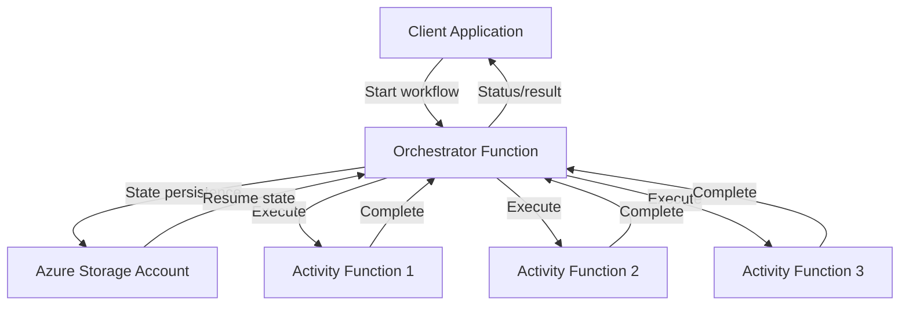
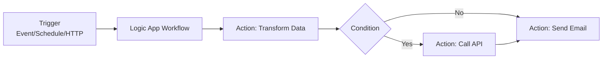
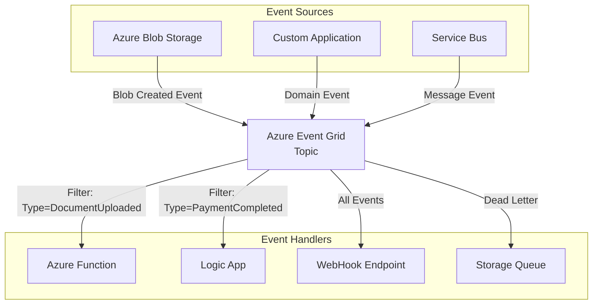
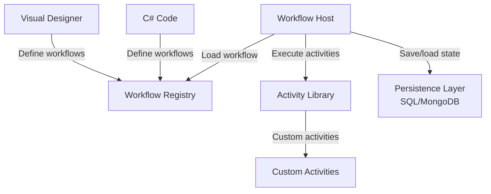
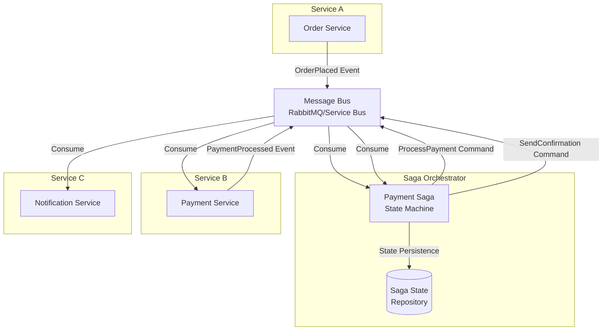
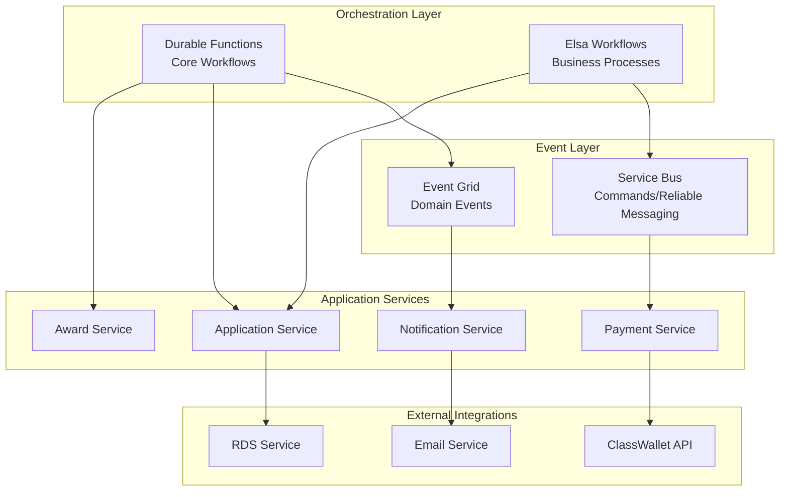

# Workflow Technology Overview

**Document Purpose:** Comprehensive analysis of workflow orchestration technologies for K-12 SEAA system

**Last Updated:** October 22, 2025

---

## Table of Contents

1. [Introduction](#introduction)
2. [Azure Native Technologies](#azure-native-technologies)
3. [.NET Workflow Engines](#net-workflow-engines)
4. [Technology Comparison Matrix](#technology-comparison-matrix)
5. [Decision Criteria](#decision-criteria)
6. [Recommended Technology Stack](#recommended-technology-stack)

---

## Introduction

Modern distributed systems require robust workflow orchestration to manage complex, long-running business processes. This document evaluates technologies suitable for the K-12 SEAA system, which requires:

- **Long-running workflows** (multi-month application processes)
- **State persistence** (tracking workflow progress across services)
- **Event-driven architecture** (decoupled microservices)
- **Third-party integrations** (ClassWallet, RDS, email services)
- **Scalability and resilience** (Azure cloud-native)
- **.NET compatibility** (existing technology stack)

---

## Azure Native Technologies

### 1. Azure Durable Functions

**Overview:**  
Azure Durable Functions is an extension of Azure Functions that enables writing stateful workflows in serverless compute environments using standard programming languages ([Microsoft Learn: Durable Functions Overview](https://learn.microsoft.com/en-us/azure/azure-functions/durable/durable-functions-overview)).

**Key Capabilities:**

- **Stateful Orchestration:** Write workflows as orchestrator functions with automatic state management and checkpoints
- **Programming Model:** Use C#, JavaScript, Python, or PowerShell to define workflows as code
- **Application Patterns:** Supports function chaining, fan-out/fan-in, async HTTP APIs, monitoring, and human interaction patterns
- **Automatic Checkpoints:** State is persisted automatically, allowing workflows to resume after interruptions
- **Built-in Retries:** Configurable retry policies with exponential backoff
- **Long-running Support:** Can run for days, weeks, or months with minimal cost due to serverless pricing model

**Architecture:**



**Example Workflow Pattern:**

```csharp
[FunctionName("ApplicationProcessingOrchestrator")]
public static async Task<string> RunOrchestrator(
    [OrchestrationTrigger] IDurableOrchestrationContext context)
{
    var application = context.GetInput<Application>();
    
    // Step 1: Validate application
    await context.CallActivityAsync("ValidateApplication", application);
    
    // Step 2: Verify residency (external RDS call)
    var residencyVerified = await context.CallActivityAsync<bool>(
        "VerifyResidency", application.StudentId);
    
    if (!residencyVerified)
    {
        await context.CallActivityAsync("SendRejectionEmail", application);
        return "Rejected";
    }
    
    // Step 3: Wait for document upload (could take days)
    await context.WaitForExternalEvent("DocumentsUploaded");
    
    // Step 4: Review documents
    var approved = await context.CallActivityAsync<bool>(
        "ReviewDocuments", application);
    
    // Step 5: Create award
    if (approved)
    {
        await context.CallActivityAsync("CreateAward", application);
        await context.CallActivityAsync("SendApprovalEmail", application);
    }
    
    return approved ? "Approved" : "Rejected";
}
```

**Pros:**
- ✅ Native Azure integration with excellent tooling
- ✅ Serverless cost model (pay per execution)
- ✅ Strong type safety with C# workflows
- ✅ Automatic scaling and reliability
- ✅ Built-in monitoring with Application Insights
- ✅ Supports human interaction patterns (approvals, timeouts)

**Cons:**
- ❌ Learning curve for orchestrator function constraints
- ❌ State stored in Azure Storage (additional cost/latency)
- ❌ Limited visual workflow designer
- ❌ Cannot use non-deterministic code in orchestrators

**Best Use Cases for K-12 SEAA:**
- Application processing workflows (end-to-end)
- Award disbursement processes
- Multi-step verification workflows
- Long-running state management

**References:**
- [Azure Durable Functions Overview](https://learn.microsoft.com/en-us/azure/azure-functions/durable/durable-functions-overview)
- [Durable Functions for Complex Workflows](https://www.geeksforgeeks.org/devops/azure-durable-functions-complex-workflows/)
- [Long-Running Workflows Made Simple](https://keyholesoftware.com/long-running-workflows-made-simple-with-c-azure-durable-functions/)

---

### 2. Azure Logic Apps

**Overview:**  
Azure Logic Apps is a low-code/no-code platform for creating automated workflows and integrations using a visual designer with 1,400+ prebuilt connectors ([Microsoft Learn: Azure Logic Apps](https://learn.microsoft.com/en-us/azure/logic-apps/)).

**Key Capabilities:**

- **Visual Designer:** Drag-and-drop workflow designer in Azure Portal
- **Extensive Connectors:** 1,400+ prebuilt connectors for Microsoft and third-party services
- **Triggers:** Supports both polling triggers (check endpoint periodically) and push triggers (event-driven)
- **Integration Patterns:** Built-in actions for data transformation, conditional logic, loops, and error handling
- **Hybrid Connectivity:** Can connect to on-premises systems via Integration Service Environment (ISE)
- **Managed Service:** Fully managed by Azure with automatic scaling

**Architecture:**



**Example Workflow Scenario:**

A Logic App that processes document uploads:
1. **Trigger:** When a blob is uploaded to Azure Storage
2. **Action:** Extract metadata from document
3. **Condition:** Check if document type is valid
4. **Action:** Call Azure Function to process document
5. **Action:** Update database with document info
6. **Action:** Send notification email to user

**Pros:**
- ✅ Visual designer - no code required for simple workflows
- ✅ Massive connector library for integrations
- ✅ Great for IT operations and DevOps automation
- ✅ Built-in retry and error handling
- ✅ Easy to build and modify workflows quickly
- ✅ Event Grid integration for event-driven patterns

**Cons:**
- ❌ Limited complex logic capabilities (better suited for integration than business logic)
- ❌ Can become expensive at scale
- ❌ Debugging can be challenging with complex workflows
- ❌ Version control and CI/CD requires Infrastructure as Code
- ❌ Less suitable for intricate business rules

**Best Use Cases for K-12 SEAA:**
- Document routing and processing
- Simple approval workflows
- Email campaign orchestration
- System-to-system integrations
- Scheduled batch jobs

**References:**
- [Azure Logic Apps: Orchestrating Microservices](https://www.thecloudguru.in/2025/09/30/azure-logic-apps-orchestrating-microservices/)
- [Event-Driven Integration with Event Grid and Logic Apps](https://multishoring.com/blog/event-driven-integration-azure-event-grid-and-logic-apps-together/)
- [Building Event-Driven Workflows](https://cloudlearn.io/labs/building-event-driven-workflows-with-azure-event-grid-and-logic-apps)

---

### 3. Azure Event Grid

**Overview:**  
Azure Event Grid is a fully managed event routing service that enables event-driven architectures with publish-subscribe patterns at massive scale ([Microsoft Learn: Event Grid](https://learn.microsoft.com/en-us/azure/event-grid/)).

**Key Capabilities:**

- **Event Routing:** Routes events from sources to subscribers with filtering and transformation
- **Massive Scale:** Can handle millions of events per second
- **Native Azure Integration:** First-class support for Azure services as event sources and handlers
- **Custom Topics:** Create custom event topics for domain events
- **Event Filtering:** Advanced filtering on event properties and data
- **Reliable Delivery:** Built-in retry policies and dead-letter queues
- **Push-based Model:** Events pushed to subscribers (no polling required)

**Architecture:**



**Event-Driven Patterns:**

1. **Event Notification:** Inform subscribers about state changes
2. **Event Sourcing:** Store events as source of truth
3. **CQRS:** Separate command and query responsibilities
4. **Saga Pattern:** Coordinate distributed transactions

**Example Domain Events for K-12:**

```csharp
// Application domain events
public class ApplicationSubmittedEvent
{
    public Guid ApplicationId { get; set; }
    public Guid StudentId { get; set; }
    public DateTime SubmittedAt { get; set; }
    public string ProgramType { get; set; } // "ESA+" or "OS"
}

public class DocumentUploadedEvent
{
    public Guid ApplicationId { get; set; }
    public string DocumentType { get; set; }
    public string BlobUrl { get; set; }
    public DateTime UploadedAt { get; set; }
}

public class AwardCreatedEvent
{
    public Guid AwardId { get; set; }
    public Guid StudentId { get; set; }
    public decimal Amount { get; set; }
    public string Program { get; set; }
    public DateTime CreatedAt { get; set; }
}
```

**Publishing Events:**

```csharp
public class EventPublisher
{
    private readonly EventGridPublisherClient _client;
    
    public async Task PublishApplicationSubmittedAsync(Application application)
    {
        var eventData = new EventGridEvent(
            subject: $"applications/{application.Id}",
            eventType: "K12.Application.Submitted",
            dataVersion: "1.0",
            data: new ApplicationSubmittedEvent
            {
                ApplicationId = application.Id,
                StudentId = application.StudentId,
                SubmittedAt = DateTime.UtcNow,
                ProgramType = application.ProgramType
            });
            
        await _client.SendEventAsync(eventData);
    }
}
```

**Pros:**
- ✅ Decouples services and enables microservices architecture
- ✅ Extremely scalable and reliable
- ✅ Low latency event delivery
- ✅ Native Azure integration
- ✅ Cost-effective (pay per operation)
- ✅ Simplifies complex integration scenarios

**Cons:**
- ❌ Not a workflow engine (needs orchestration layer)
- ❌ Event ordering not guaranteed (unless using Service Bus integration)
- ❌ Requires careful design of event schemas
- ❌ Debugging distributed events can be complex

**Best Use Cases for K-12 SEAA:**
- Domain event publishing (Application lifecycle events)
- Decoupling microservices
- Real-time notifications and triggers
- Integration between bounded contexts
- Event-driven workflow triggers

**References:**
- [Event-Driven Architecture on Azure](https://learn.microsoft.com/en-us/azure/architecture/guide/architecture-styles/event-driven)
- [Azure Event Grid Overview](https://docs.azure.cn/en-us/event-grid/overview)
- [Deploying Event-Driven Architectures with Functions and Event Grid](https://dev.to/skilltech/deploying-event-driven-architectures-with-azure-functions-and-event-grid-4gim)

---

## .NET Workflow Engines

### 1. Elsa Workflows

**Overview:**  
Elsa is an open-source .NET library for building workflow capabilities into applications with support for code-based, visual, and declarative workflow definitions ([Elsa Workflows Documentation](https://docs.elsaworkflows.io/)).

**Key Capabilities:**

- **Multiple Definition Modes:** Define workflows in C# code, visual designer, or JSON/YAML
- **Long-running Workflows:** Built-in persistence for long-running processes
- **Rich Activity Library:** Extensive library of activities (HTTP, email, timers, conditions, etc.)
- **Dynamic Expressions:** Use C#, JavaScript, or Liquid templates for runtime evaluations
- **Workflow Versioning:** Support for multiple versions of workflows running concurrently
- **Workflow Designer:** Web-based visual workflow designer
- **Extensibility:** Easy to create custom activities
- **Persistence:** Database-backed state persistence (SQL Server, PostgreSQL, MongoDB, etc.)

**Architecture:**



**Example Workflow:**

```csharp
public class DocumentReviewWorkflow : WorkflowBase
{
    protected override void Build(IWorkflowBuilder builder)
    {
        builder
            .StartWith<ReceiveDocumentActivity>()
            .Then<ValidateDocumentActivity>()
            .If(context => context.GetVariable<bool>("IsValid"))
                .Then<NotifyApproverActivity>()
                .Then<WaitForApprovalActivity>()
                .If(context => context.GetVariable<bool>("Approved"))
                    .Then<UpdateDatabaseActivity>()
                    .Then<SendApprovalEmailActivity>()
                .Else()
                    .Then<SendRejectionEmailActivity>()
            .Else()
                .Then<SendValidationErrorEmailActivity>()
            .Then<CompleteWorkflowActivity>();
    }
}
```

**Custom Activity Example:**

```csharp
public class VerifyResidencyActivity : Activity
{
    private readonly IRdsClient _rdsClient;
    
    public VerifyResidencyActivity(IRdsClient rdsClient)
    {
        _rdsClient = rdsClient;
    }
    
    protected override async ValueTask<IActivityExecutionResult> 
        OnExecuteAsync(ActivityExecutionContext context)
    {
        var studentId = context.GetInput<Guid>("StudentId");
        
        var result = await _rdsClient.VerifyResidencyAsync(studentId);
        
        context.SetOutput("IsResident", result.IsResident);
        context.SetOutput("VerificationDate", DateTime.UtcNow);
        
        return Done();
    }
}
```

**Pros:**
- ✅ Excellent for complex business workflows
- ✅ Strong .NET integration and type safety
- ✅ Visual designer available
- ✅ Workflow versioning built-in
- ✅ Active open-source community
- ✅ Database-agnostic persistence
- ✅ Can run in-process or as standalone server

**Cons:**
- ❌ Requires hosting and infrastructure management
- ❌ Learning curve for workflow concepts
- ❌ Less Azure-native than Durable Functions
- ❌ Need to manage database for persistence

**Best Use Cases for K-12 SEAA:**
- Complex enrollment processes
- Certification workflows with approvals
- Compliance tracking workflows
- Multi-step validation processes
- Business process automation

**NuGet Packages:**
- `Elsa.Workflows.Core` - Core workflow engine
- `Elsa.Activities.Http` - HTTP activities
- `Elsa.Activities.Email` - Email activities
- `Elsa.Activities.Temporal` - Timer and delay activities
- `Elsa.Persistence.EntityFramework.SqlServer` - SQL Server persistence
- `Elsa.Designer.Components.Web` - Visual workflow designer

**References:**
- [Elsa Workflows Documentation](https://docs.elsaworkflows.io/)
- [Elsa GitHub Repository](https://github.com/elsa-workflows/elsa-core)
- [Elsa Workflows Overview](https://elsa-workflows.github.io/elsa-documentation/overview.html)
- [NuGet: Elsa.Workflows.Core](https://www.nuget.org/packages/Elsa.Workflows.Core/)

---

### 2. MassTransit Saga

**Overview:**  
MassTransit is a .NET library for building distributed applications with message-based communication, featuring state machine-based sagas for orchestrating distributed workflows ([MassTransit Documentation](https://masstransit.io/documentation)).

**Key Capabilities:**

- **Saga State Machines:** Manage complex workflows with state machines (formerly Automatonymous)
- **Distributed Transactions:** Implements Saga pattern for managing distributed transactions with compensation
- **Message Broker Integration:** Works with RabbitMQ, Azure Service Bus, Amazon SQS, and others
- **Event Correlation:** Automatic correlation of messages to saga instances
- **State Persistence:** Store saga state in SQL Server, PostgreSQL, MongoDB, Redis, or Entity Framework
- **Automatic Retry:** Built-in retry and error handling
- **Observability:** Integration with OpenTelemetry for distributed tracing

**Architecture:**



**Example State Machine:**

```csharp
public class PaymentProcessingSaga : MassTransitStateMachine<PaymentProcessingState>
{
    public PaymentProcessingSaga()
    {
        InstanceState(x => x.CurrentState);
        
        Event(() => PaymentInitiated, x => 
            x.CorrelateById(context => context.Message.PaymentId));
        Event(() => PaymentVerified, x => 
            x.CorrelateById(context => context.Message.PaymentId));
        Event(() => PaymentFailed, x => 
            x.CorrelateById(context => context.Message.PaymentId));
        
        Initially(
            When(PaymentInitiated)
                .Then(context => 
                {
                    context.Instance.PaymentId = context.Data.PaymentId;
                    context.Instance.Amount = context.Data.Amount;
                })
                .TransitionTo(VerifyingPayment)
                .Publish(context => new VerifyPaymentCommand
                {
                    PaymentId = context.Instance.PaymentId
                })
        );
        
        During(VerifyingPayment,
            When(PaymentVerified)
                .TransitionTo(ProcessingDisbursement)
                .Publish(context => new DisburseFundsCommand
                {
                    PaymentId = context.Instance.PaymentId,
                    Amount = context.Instance.Amount
                }),
            When(PaymentFailed)
                .TransitionTo(Failed)
                .Publish(context => new PaymentFailedNotification
                {
                    PaymentId = context.Instance.PaymentId
                })
        );
        
        During(ProcessingDisbursement,
            When(DisbursementCompleted)
                .TransitionTo(Completed)
                .Finalize()
        );
    }
    
    public State VerifyingPayment { get; private set; }
    public State ProcessingDisbursement { get; private set; }
    public State Failed { get; private set; }
    
    public Event<PaymentInitiatedEvent> PaymentInitiated { get; private set; }
    public Event<PaymentVerifiedEvent> PaymentVerified { get; private set; }
    public Event<PaymentFailedEvent> PaymentFailed { get; private set; }
    public Event<DisbursementCompletedEvent> DisbursementCompleted { get; private set; }
}

public class PaymentProcessingState : SagaStateMachineInstance
{
    public Guid CorrelationId { get; set; }
    public string CurrentState { get; set; }
    public Guid PaymentId { get; set; }
    public decimal Amount { get; set; }
    public DateTime CreatedAt { get; set; }
    public DateTime? CompletedAt { get; set; }
}
```

**Pros:**
- ✅ Excellent for distributed transactions and compensation
- ✅ Strong message-based communication patterns
- ✅ Multiple message broker support
- ✅ Built-in retry and error handling
- ✅ Great observability with OpenTelemetry
- ✅ Active community and extensive documentation
- ✅ Works well in microservices architectures

**Cons:**
- ❌ Requires message broker infrastructure
- ❌ Learning curve for saga patterns
- ❌ More complex than simple workflow engines
- ❌ Additional operational overhead

**Best Use Cases for K-12 SEAA:**
- Payment processing workflows
- Multi-service coordination (ClassWallet integration)
- Financial transaction workflows
- Distributed workflows across microservices
- Compensation patterns for rollback

**NuGet Packages:**
- `MassTransit` - Core library
- `MassTransit.Azure.ServiceBus.Core` - Azure Service Bus transport
- `MassTransit.EntityFrameworkCore` - EF Core persistence
- `MassTransit.RabbitMQ` - RabbitMQ transport

**References:**
- [MassTransit State Machine Documentation](https://masstransit.io/documentation/patterns/saga/state-machine)
- [Implementing the Saga Pattern with MassTransit](https://www.milanjovanovic.tech/blog/implementing-the-saga-pattern-with-masstransit)
- [Building an Order Processing Saga](https://dev.to/stevsharp/building-an-order-processing-saga-with-masstransit-i9j)

---

### 3. Workflow Core

**Overview:**  
Workflow Core is a lightweight .NET workflow engine for building workflows in code with long-running process support ([Workflow Core GitHub](https://github.com/danielgerlag/workflow-core)).

**Key Capabilities:**

- **Code-Based Workflows:** Define workflows entirely in C# code
- **Lightweight:** Minimal dependencies and overhead
- **Long-running Support:** Built-in persistence for long-running workflows
- **Parallel Execution:** Support for parallel branches and fan-out/fan-in
- **Event Support:** Wait for external events within workflows
- **Persistence Providers:** SQL Server, PostgreSQL, MongoDB, Redis
- **Simple API:** Easy to learn and integrate

**Example Workflow:**

```csharp
public class ApplicationProcessingWorkflow : IWorkflow
{
    public string Id => "application-processing";
    public int Version => 1;
    
    public void Build(IWorkflowBuilder<ApplicationData> builder)
    {
        builder
            .StartWith<ValidateApplicationStep>()
            .Then<VerifyResidencyStep>()
            .If(data => data.IsResident)
                .Do(then => then
                    .StartWith<NotifyUserStep>()
                    .WaitFor("documents-uploaded", data => data.ApplicationId)
                    .Then<ReviewDocumentsStep>()
                    .If(data => data.Approved)
                        .Do(approved => approved
                            .StartWith<CreateAwardStep>()
                            .Then<SendApprovalEmailStep>())
                        .Else()
                            .Do(rejected => rejected
                                .StartWith<SendRejectionEmailStep>()))
            .Else()
                .Do(notResident => notResident
                    .StartWith<SendResidencyRejectionStep>());
    }
}
```

**Pros:**
- ✅ Very lightweight and easy to learn
- ✅ Good for simple to moderate workflows
- ✅ Strong C# typing
- ✅ Multiple persistence options
- ✅ Open source and free

**Cons:**
- ❌ Less feature-rich than Elsa or MassTransit
- ❌ No visual designer
- ❌ Smaller community compared to alternatives
- ❌ Limited built-in activities

**Best Use Cases for K-12 SEAA:**
- Simple linear workflows
- Background job orchestration
- Workflows that don't require visual design
- Lightweight process coordination

**NuGet Package:**
- `WorkflowCore` - Core workflow engine

**References:**
- [Workflow Core GitHub](https://github.com/danielgerlag/workflow-core)
- [Workflow Core NuGet](https://www.nuget.org/packages/WorkflowCore/)

---

## Technology Comparison Matrix

| Feature | Durable Functions | Logic Apps | Event Grid | Elsa Workflows | MassTransit Saga | Workflow Core |
|---------|------------------|------------|------------|----------------|------------------|---------------|
| **Execution Model** | Serverless | Serverless | Event Router | Self-hosted/.NET | Self-hosted/.NET | Self-hosted/.NET |
| **Definition Style** | Code (C#/JS/Python) | Visual/JSON | N/A | Code/Visual/JSON | Code (C#) | Code (C#) |
| **Long-running** | ✅ Excellent | ✅ Good | ❌ N/A | ✅ Excellent | ✅ Excellent | ✅ Good |
| **State Persistence** | Azure Storage | Managed | N/A | Database | Database | Database |
| **Scaling** | Automatic | Automatic | Automatic | Manual | Manual | Manual |
| **Cost Model** | Per execution | Per action | Per operation | Infrastructure | Infrastructure | Infrastructure |
| **Azure Integration** | ✅ Native | ✅ Native | ✅ Native | ⚠️ Via connectors | ⚠️ Via connectors | ⚠️ Via connectors |
| **Visual Designer** | ❌ Limited | ✅ Excellent | ❌ N/A | ✅ Good | ❌ No | ❌ No |
| **Complex Logic** | ✅ Excellent | ⚠️ Limited | ❌ N/A | ✅ Excellent | ✅ Excellent | ✅ Good |
| **Error Handling** | ✅ Built-in | ✅ Built-in | ✅ Dead letter | ✅ Built-in | ✅ Built-in | ✅ Built-in |
| **Versioning** | ⚠️ Manual | ⚠️ Manual | N/A | ✅ Built-in | ⚠️ Manual | ⚠️ Manual |
| **Compensation** | ⚠️ Manual | ⚠️ Manual | N/A | ✅ Good | ✅ Excellent | ⚠️ Manual |
| **Testing** | ✅ Good | ⚠️ Difficult | N/A | ✅ Good | ✅ Good | ✅ Good |
| **Learning Curve** | Medium | Low | Low | Medium | High | Low |
| **Best For** | Stateful workflows | Integrations | Event routing | Business workflows | Distributed txns | Simple workflows |

**Legend:**
- ✅ = Excellent/Full support
- ⚠️ = Partial support/with effort
- ❌ = Not supported/Not applicable

---

## Decision Criteria

### When to Choose Azure Durable Functions

Choose Durable Functions when:
- ✅ You need serverless, cloud-native orchestration
- ✅ You want automatic scaling and Azure-native integration
- ✅ You prefer writing workflows in code (C#, JavaScript, Python)
- ✅ You need long-running workflows with automatic checkpoints
- ✅ Cost optimization via serverless model is important
- ✅ You want minimal infrastructure management

**K-12 SEAA Examples:**
- Application processing (submit → verify → review → award)
- Award disbursement workflows
- Annual rollover processes
- Multi-step verification workflows

### When to Choose Azure Logic Apps

Choose Logic Apps when:
- ✅ You need quick, visual workflow creation
- ✅ Integration with multiple services is primary goal
- ✅ Non-developers need to create/modify workflows
- ✅ Workflows are relatively simple with clear branching
- ✅ You want extensive connector library

**K-12 SEAA Examples:**
- Document routing and classification
- Email campaign workflows
- Simple approval chains
- Integration between disparate systems

### When to Choose Azure Event Grid

Choose Event Grid when:
- ✅ You need to decouple services in microservices architecture
- ✅ You want event-driven, reactive patterns
- ✅ You need to broadcast events to multiple subscribers
- ✅ Real-time event processing is required
- ✅ You want to avoid tight coupling between components

**K-12 SEAA Examples:**
- Domain event publishing (ApplicationSubmitted, AwardCreated, etc.)
- Triggering workflows across bounded contexts
- Real-time notifications
- Integration event broadcasting

### When to Choose Elsa Workflows

Choose Elsa when:
- ✅ You need complex business workflow logic
- ✅ Workflow versioning is critical
- ✅ You want both code and visual workflow definition
- ✅ You need custom activity development
- ✅ Database-backed persistence is required
- ✅ You want full control over workflow execution

**K-12 SEAA Examples:**
- Enrollment process workflows
- Certification and compliance workflows
- Provider approval processes
- Complex multi-step application flows

### When to Choose MassTransit Saga

Choose MassTransit Saga when:
- ✅ You need distributed transaction coordination
- ✅ Compensation patterns are required (rollback across services)
- ✅ You have a microservices architecture with message bus
- ✅ You need reliable message-based communication
- ✅ Workflow spans multiple bounded contexts/services

**K-12 SEAA Examples:**
- Payment processing workflows
- ClassWallet fund disbursement coordination
- Cross-service financial transactions
- Multi-service data consistency requirements

### When to Choose Workflow Core

Choose Workflow Core when:
- ✅ You need a lightweight, simple workflow engine
- ✅ Workflows are relatively straightforward
- ✅ You prefer code-only workflow definition
- ✅ You want minimal dependencies
- ✅ Visual designer is not required

**K-12 SEAA Examples:**
- Background job orchestration
- Simple linear workflows
- Internal process automation
- Lightweight task coordination

---

## Recommended Technology Stack

Based on the analysis, the **recommended hybrid approach** for K-12 SEAA is:

### Primary Stack

1. **Azure Durable Functions** - For core application workflows
   - Application processing
   - Award lifecycle management
   - Long-running orchestrations

2. **Azure Event Grid** - For event-driven architecture
   - Domain event publishing
   - Service decoupling
   - Integration events

3. **Elsa Workflows** - For complex business workflows
   - Certification workflows
   - Compliance processes
   - Provider enrollments

4. **Azure Service Bus** - For reliable messaging
   - Guaranteed message delivery
   - Dead-letter queues
   - Integration with MassTransit (if needed)

### Supporting Technologies

- **MassTransit** (Optional) - If implementing saga patterns for distributed transactions
- **Azure Logic Apps** (Tactical) - For quick integrations and simple automation
- **Azure Functions** (Standard) - For event handlers and activity functions

### Architecture Pattern



### Rationale

This hybrid approach provides:

✅ **Flexibility** - Multiple tools for different workflow types  
✅ **Azure-native** - Leverages Azure platform strengths  
✅ **Cost-effective** - Serverless where appropriate, self-hosted where needed  
✅ **Scalable** - Automatic scaling for orchestration, manual control for business logic  
✅ **Developer-friendly** - Code-first with C# and .NET  
✅ **Maintainable** - Clear separation of concerns  
✅ **Event-driven** - Decoupled architecture supporting microservices  

---

## Next Steps

1. **Review [K-12 Workflow Analysis](./02-k12-workflow-analysis.md)** - Understand specific K-12 workflows and requirements
2. **Study [Architecture Recommendations](./03-architecture-recommendations.md)** - See detailed architecture diagrams and patterns
3. **Explore [Implementation Patterns](./04-implementation-patterns.md)** - Learn concrete implementation approaches
4. **Plan Migration** - Review [Migration Strategy](./06-migration-strategy.md) for transitioning from current task engine

---

## Conclusion

The K-12 SEAA system requires a sophisticated workflow orchestration approach that goes beyond the current naive task engine. By leveraging Azure Durable Functions, Elsa Workflows, and Azure Event Grid in a hybrid architecture, the system can achieve:

- Robust state management for long-running processes
- Event-driven decoupling for microservices
- Flexible workflow definition (code and visual)
- Scalability and resilience
- Cost optimization
- Developer productivity

This technology foundation will support the 100+ workflows identified across the 4 applications and enable systematic orchestration of complex enrollment, certification, payment, and communication processes.

---

**Document Version:** 1.0  
**Last Updated:** October 22, 2025  
**Next Review:** December 2025
