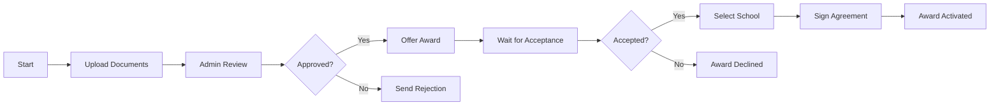

# K-12 SEAA Workflow Analysis

**Document Purpose:** Comprehensive analysis of workflows in the North Carolina K-12 Scholarship Administration system

**Last Updated:** October 22, 2025

---

## Table of Contents

1. [Current State Assessment](#current-state-assessment)
2. [Workflow Inventory](#workflow-inventory)
3. [Current Task Engine Limitations](#current-task-engine-limitations)
4. [Workflow Categorization](#workflow-categorization)
5. [State Requirements](#state-requirements)
6. [Long-Running Process Characteristics](#long-running-process-characteristics)
7. [Integration Touchpoints](#integration-touchpoints)
8. [Workflow Complexity Analysis](#workflow-complexity-analysis)

---

## Current State Assessment

### Existing Task Engine Overview

Based on the problem statement, the current K-12 SEAA system has a **naive task engine implementation** with the following characteristics:

**Current Capabilities:**
- ✅ Can create named tasks (e.g., "Upload Document", "Click This Link")
- ✅ Has task types for grouping related tasks
- ✅ Can associate tasks with workflows by name
- ✅ Provides administrative UI for task creation
- ✅ Can present tasks to users across 4 applications

**Critical Limitations:**
- ❌ **No workflow state management** - Cannot track where a workflow is in its lifecycle
- ❌ **No task sequencing** - Tasks exist independently without defined order
- ❌ **No state transitions** - No concept of workflow states (pending, in progress, completed, failed)
- ❌ **No orchestration** - Tasks don't trigger or depend on each other
- ❌ **No long-running support** - Cannot manage processes that span days/weeks/months
- ❌ **No event handling** - Cannot react to external events (document uploaded, payment received)
- ❌ **No compensation logic** - Cannot rollback or compensate failed steps
- ❌ **No visibility** - Cannot see overall workflow progress or instance state

### Problem Statement Summary

From the issue description:

> "They have created a task engine - a task is a name, has a task type... They can identify some workflows by name and they know which tasks are associated or have affinity towards that specific workflow. But they have not defined the sequence of the tasks for that specific workflow and or perhaps the states of that workflow, etc.. It is a pretty naïve implementation of just a task."

**Key Pain Points:**
1. 100+ workflows identified but not formally defined
2. Tasks exist in isolation without sequence or dependencies
3. No workflow state tracking or lifecycle management
4. Multiple applications (Admin, Providers, Schools, Households) need coordinated workflows
5. Third-party integrations (ClassWallet, RDS, email) need orchestration
6. Cannot determine workflow completion or status

---

## Workflow Inventory

Based on existing K-12 SEAA documentation ([Full Domain](../full-domain.md), [DDD Analysis](../ddd-2.md)), here is a comprehensive workflow inventory:

### Application: **Admin (NCSEAA Staff)**

#### 1. Application Review Workflows

**1.1 ESA+ Application Review**
- Receive application submission
- Verify disability documentation
- Check eligibility determination from LEA
- Request additional documents if needed
- Wait for document uploads
- Review uploaded documents
- Verify residency via RDS
- Make award decision
- Send notification to family
- Create award if approved

**1.2 Opportunity Scholarship Application Review**
- Receive application submission
- Verify household income documentation
- Check age/grade eligibility
- Request additional documents if needed
- Wait for document uploads
- Verify residency via RDS
- Apply priority/lottery rules
- Make award decision
- Send notification to family
- Create award if approved

**1.3 Renewal Application Processing**
- Check continuing eligibility requirements
- Request updated documentation
- Verify ongoing residency
- Review compliance history
- Make renewal decision
- Update award for new year
- Send renewal notification

#### 2. Award Management Workflows

**2.1 Award Activation**
- Award created (approved application)
- Parent accepts award
- Parent signs agreement
- School enrollment verified
- Award activated
- Initial funds disbursed
- Send activation confirmation

**2.2 Award Modification**
- Request for school transfer received
- Verify new school eligibility
- Calculate fund adjustments
- Update award record
- Notify affected parties
- Adjust fund allocations

**2.3 Award Termination**
- Termination trigger (compliance violation, withdrawal, etc.)
- Review termination reason
- Calculate fund recovery
- Stop disbursements
- Send termination notice
- Update award status
- Process fund returns

#### 3. Provider Management Workflows

**3.1 Provider Enrollment**
- Provider application submitted
- Verify provider credentials
- Check background checks
- Review qualifications
- Approve/deny provider
- Add to provider directory
- Send enrollment confirmation

**3.2 Provider Certification Renewal**
- Annual renewal notice sent
- Provider submits updated information
- Verify credentials current
- Review compliance history
- Renew or deny certification
- Update provider directory
- Send renewal confirmation

**3.3 Provider Compliance Review**
- Compliance issue identified
- Investigate issue
- Request provider response
- Review evidence
- Make compliance decision
- Take corrective action if needed
- Update provider status
- Send decision notification

#### 4. Compliance and Audit Workflows

**4.1 Annual Testing Compliance**
- Testing period begins
- Send reminders to schools
- Receive test results
- Verify compliance
- Flag non-compliant students
- Send warning notices
- Track resolution
- Report results

**4.2 Spending Requirement Monitoring**
- Monitor account spending
- Calculate minimum spending requirement
- Identify accounts below threshold
- Send warning to families
- Track spending progress
- Apply consequences if not met
- Update award status

**4.3 Audit Investigation**
- Audit trigger identified
- Collect relevant records
- Review transactions
- Interview parties if needed
- Make findings
- Apply sanctions if warranted
- Document audit results
- Close audit case

#### 5. Financial Workflows

**5.1 School Payment Processing**
- Semester begins
- Calculate payment amount (tuition + fees)
- Parent endorsement required
- Verify school certification
- Process payment to school
- Record transaction
- Send payment confirmation
- Update award balance

**5.2 ClassWallet Fund Disbursement (ESA+)**
- Calculate remaining ESA+ funds after tuition
- Transfer funds to ClassWallet
- Parent receives wallet notification
- Monitor transactions
- Track spending by category
- Enforce allowable expense rules
- Process reimbursements if applicable

**5.3 Year-End Rollover**
- Calculate unused funds
- Apply rollover rules
- Determine rollover amount
- Update account for new year
- Send rollover notification
- Adjust new year funding

#### 6. Communication Workflows

**6.1 Notification Campaign**
- Identify target audience
- Prepare message content
- Schedule send time
- Send notifications (email/portal)
- Track opens/clicks
- Handle bounces
- Record communication

**6.2 Reminder Workflow**
- Identify upcoming deadline
- Determine recipients with pending items
- Send reminder notification
- Track acknowledgment
- Send escalating reminders
- Flag overdue items

### Application: **Providers (Service Providers)**

#### 7. Service Delivery Workflows

**7.1 Service Request Fulfillment**
- Family requests service
- Provider accepts request
- Service delivered
- Provider submits documentation
- NCSEAA reviews documentation
- Payment approved
- Funds disbursed to provider
- Service marked complete

**7.2 Invoice Submission**
- Provider delivers service
- Provider creates invoice
- Submit invoice with documentation
- NCSEAA reviews invoice
- Approve/reject/request changes
- Process payment if approved
- Send payment confirmation

### Application: **Schools (Private School Administrators)**

#### 8. School Administration Workflows

**8.1 Student Enrollment Processing**
- Family applies to school
- School accepts student
- School notifies NCSEAA of enrollment
- NCSEAA verifies award
- School receives enrollment confirmation
- Student enrollment finalized

**8.2 Parent Endorsement Collection**
- Semester begins
- School requests endorsement from parents
- Parent signs endorsement
- School submits endorsements to NCSEAA
- NCSEAA processes endorsements
- Payment authorized
- School receives payment

**8.3 Annual Certification Submission**
- Certification period opens
- School collects required data
- School submits certification
- NCSEAA reviews certification
- Request clarifications if needed
- Approve certification
- School receives confirmation
- School eligible for payments

**8.4 Testing Result Reporting**
- Testing completed
- School submits results to NCSEAA
- NCSEAA validates results
- Results recorded for compliance
- School receives confirmation

### Application: **Households (Families/Parents)**

#### 9. Family Application Workflows

**9.1 New Application Submission**
- Parent creates account in MyPortal
- Begin application
- Enter student information
- Enter household information
- Upload required documents
- Review and submit
- Receive confirmation
- Application enters review queue

**9.2 Document Upload Workflow**
- NCSEAA requests document
- Parent receives notification
- Parent logs into MyPortal
- Navigate to document upload
- Select document type
- Upload file
- Submit document
- Receive upload confirmation
- NCSEAA notified of upload

**9.3 Award Acceptance Workflow**
- Parent receives award notification
- Review award details
- Read parent agreement
- Accept or decline award
- Sign agreement electronically
- Select school option
- Submit acceptance
- Receive confirmation

#### 10. Fund Management Workflows

**10.1 ClassWallet Purchase Workflow (ESA+)**
- Parent logs into ClassWallet
- Browse marketplace/providers
- Select product/service
- Add to cart
- Submit for approval
- NCSEAA reviews for allowable expense
- Approve/deny purchase
- If approved, process payment
- Update account balance
- Send purchase confirmation

**10.2 Reimbursement Request Workflow (ESA+)**
- Parent pays out-of-pocket for allowable expense
- Parent submits reimbursement request
- Upload receipt/documentation
- NCSEAA reviews request
- Verify allowable expense
- Approve/deny reimbursement
- If approved, process reimbursement
- Update account balance
- Send reimbursement confirmation

**10.3 School Transfer Workflow**
- Parent requests school transfer
- Submit school transfer form
- NCSEAA reviews request
- Verify new school eligibility
- Approve transfer
- Adjust fund allocations
- Notify old and new schools
- Update award record
- Send transfer confirmation

#### 11. Renewal Workflows

**11.1 Annual Renewal**
- Renewal period opens
- Parent receives renewal notification
- Log into MyPortal
- Update student information
- Upload updated documentation
- Submit renewal application
- Receive confirmation
- Application enters review

---

## Current Task Engine Limitations

### Identified Issues

#### 1. No Workflow State Management

**Problem:** Tasks exist in isolation without workflow context.

**Example Impact:**
```
Current State:
- Task 1: "Upload disability documentation" - Status: Complete
- Task 2: "Upload residency proof" - Status: Complete  
- Task 3: "Upload income verification" - Status: Pending
- Task 4: "Sign parent agreement" - Status: Not Started

Questions that cannot be answered:
- What is the overall application status? (10% complete? 75% complete?)
- What stage of the workflow are we in? (Document collection? Review? Approval?)
- What should happen next?
- Can we proceed without Task 3?
- Is Task 4 blocked by Task 3?
```

**Needed Capability:** Workflow instance with state tracking
```
Workflow Instance: "ESA+ Application #12345"
Current State: "Awaiting Documentation"
Progress: 60% complete (3 of 5 steps)
Next Steps: ["Complete income verification", "Admin review documents"]
Can Proceed: false (blocked by missing document)
```

#### 2. No Task Sequencing or Dependencies

**Problem:** Tasks don't have defined order or dependencies.

**Example Impact:**
```
Admin creates these tasks:
1. "Sign parent agreement"
2. "Select school"
3. "Upload documents"
4. "Accept award"

But the logical sequence should be:
1. Upload documents (first)
2. Admin reviews documents
3. Award offered
4. Accept award (only if approved)
5. Select school (only if accepted)
6. Sign parent agreement (only after school selected)
```

**Needed Capability:** Workflow definition with sequencing


#### 3. No Event Handling

**Problem:** Cannot react to external events or state changes.

**Example Impact:**
- Document is uploaded → Nothing happens automatically
- Payment is received from ClassWallet → No automatic processing
- RDS verification completes → No automatic workflow continuation
- Email bounces → No automatic retry or alternative action

**Needed Capability:** Event-driven workflow progression
```csharp
// Workflow automatically resumes when event occurs
await workflow.WaitForEvent<DocumentUploadedEvent>(
    eventFilter: e => e.ApplicationId == applicationId,
    timeout: TimeSpan.FromDays(30));

// Continue workflow after event received
await workflow.ContinueWith<ReviewDocumentsActivity>();
```

#### 4. No Long-Running Process Support

**Problem:** Cannot manage workflows that span weeks or months.

**Example Impact:**
```
Application Lifecycle:
- Day 1: Application submitted
- Day 3: Admin requests documents
- Day 15: Parent uploads documents (12 days later)
- Day 18: Admin reviews (3 days later)
- Day 25: Award offered
- Day 30: Parent accepts (5 days later)
- Day 31: School year begins, award activated

Current system: Cannot track this 30-day process as a cohesive workflow
Needed: Persistent workflow that can pause and resume over 30 days
```

**Needed Capability:** Durable workflow execution
```csharp
// Workflow persists state and resumes after long delays
await workflow.CallActivityAsync("RequestDocuments", application);

// Workflow pauses here - could be days/weeks
await workflow.WaitForExternalEvent("DocumentsUploaded");

// Workflow resumes when event occurs
await workflow.CallActivityAsync("ReviewDocuments", application);
```

#### 5. No Visibility or Tracking

**Problem:** Cannot see workflow progress or history.

**Example Impact:**
- Cannot answer "What stage is application #12345 in?"
- Cannot report "How many applications are stuck in document upload?"
- Cannot see "What's the average time from submission to award?"
- Cannot identify bottlenecks in the process

**Needed Capability:** Workflow monitoring and analytics
```
Dashboard View:
- Applications by State:
  - Document Upload: 127 instances
  - Admin Review: 43 instances  
  - Awaiting Acceptance: 15 instances
  - Active Awards: 1,247 instances

- Average Time by Stage:
  - Document Upload: 8.5 days
  - Admin Review: 2.3 days
  - Acceptance Wait: 5.1 days
  
- Bottleneck Alert: 
  - 15 applications stuck in "Document Upload" > 30 days
```

#### 6. No Compensation or Error Handling

**Problem:** Cannot rollback or compensate when things go wrong.

**Example Impact:**
```
Scenario: Payment Processing Failure
1. Award created ✓
2. Funds reserved in budget ✓
3. Payment sent to ClassWallet ✗ FAILED
4. Parent notified ✓ (incorrectly, payment didn't work)

Problem: No automatic compensation
- Funds still reserved but payment didn't happen
- Parent thinks they have funds (they don't)
- Manual intervention required to fix

Needed: Automatic compensation
If payment fails:
  → Unreserve funds
  → Send failure notification  
  → Retry or escalate
  → Update audit log
```

**Needed Capability:** Saga pattern with compensation
```csharp
public class PaymentSaga : StateMachine<PaymentState>
{
    Initially(
        When(PaymentInitiated)
            .Then(ReserveFunds)
            .TransitionTo(ProcessingPayment)
    );
    
    During(ProcessingPayment,
        When(PaymentFailed)
            .Then(UnreserveFunds) // Compensation
            .Then(NotifyFailure)
            .TransitionTo(Failed)
    );
}
```

---

## Workflow Categorization

### By Duration

#### Short-Running (< 1 hour)
- Document upload acknowledgment
- Single notification sends
- Database updates
- Simple validations

#### Medium-Running (1 hour - 1 day)
- Document review and approval
- Provider invoice processing
- Email campaign execution
- Batch processing jobs

#### Long-Running (> 1 day)
- Application processing (days to weeks)
- Annual renewal cycles (months)
- Award lifecycle (entire school year)
- Compliance monitoring (continuous)
- Provider certification (annual cycle)

### By Complexity

#### Simple (Linear, Few Branches)
- Document upload
- Notification sending
- Status updates
- Simple approvals

**Characteristics:**
- 3-5 steps
- Minimal branching
- Single actor
- No external integrations

#### Moderate (Multiple Branches, Some Integration)
- Invoice processing
- School enrollment
- Provider enrollment
- Test result reporting

**Characteristics:**
- 5-10 steps
- Conditional branching
- Multiple actors
- 1-2 external integrations

#### Complex (Many Branches, Multiple Integrations)
- Application processing
- Award lifecycle management
- Payment processing
- Compliance workflows

**Characteristics:**
- 10+ steps
- Extensive branching
- Multiple actors
- 3+ external integrations
- Error handling requirements
- Compensation logic needed

### By Actor

#### Single-Actor Workflows
- Parent document upload
- Admin task completion
- Provider invoice submission

#### Multi-Actor Workflows
- Application review (parent + admin)
- Payment processing (admin + school + ClassWallet)
- Enrollment (family + school + NCSEAA)

#### Multi-Application Workflows
- Award lifecycle (touches all 4 applications)
- Renewal process (Household + Admin)
- Compliance monitoring (Admin + Schools + Providers)

---

## State Requirements

### Workflow States

Different workflows require different state tracking:

#### Application Processing States
```
Created → Submitted → Document Collection → Under Review → 
Decision Made → Offered → Accepted → Activated | Rejected | Declined
```

#### Award States
```
Created → Pending Acceptance → Active → On Hold → 
Terminated | Completed
```

#### Payment Processing States
```
Initiated → Pending Approval → Approved → Processing → 
Completed | Failed | Cancelled
```

#### Document Review States
```
Uploaded → Pending Review → Under Review → 
Approved | Rejected | Needs Clarification
```

### State Data Requirements

Each workflow instance needs to store:

**Identity:**
- Workflow instance ID
- Workflow type/name
- Version number
- Correlation ID

**Progress:**
- Current state
- Previous states (history)
- Current step/activity
- Progress percentage
- Completion estimate

**Context Data:**
- Workflow inputs
- Intermediate results
- Variable values
- Decision outcomes

**Audit Trail:**
- Created timestamp
- Last updated timestamp
- State change history
- Actor history (who did what)
- Error history

**Integration Data:**
- External system references (RDS request ID, ClassWallet transaction ID)
- API call results
- Event correlation IDs

---

## Long-Running Process Characteristics

### Application Lifecycle (Multi-Month Process)

**Timeline:**
```
Month 1: Application Period
- Applications submitted
- Documents collected
- Initial reviews

Month 2: Review and Award
- Deep reviews
- Residency verification
- Award decisions

Month 3: Acceptance and Setup
- Award offers sent
- Parents accept
- School selections
- Agreements signed

Month 4-12: Active Award
- Semester payments
- Ongoing compliance
- Transfers and modifications
```

**Technical Requirements:**
- Persistent state storage for months
- Ability to pause and resume
- Handle timeout scenarios
- Event-driven progression
- State query capabilities

### Provider Certification (Annual Cycle)

**Timeline:**
```
Day 1: Renewal Notice
Day 30: Application Deadline
Day 45: Review Complete
Day 365: Next Renewal Due
```

**Technical Requirements:**
- Long-term scheduling
- Anniversary-based triggers
- Reminder escalation
- Deadline enforcement

### Award Year-End Rollover

**Timeline:**
```
May: Rollover Planning
June: Calculate Unused Funds
July: Apply Rollover Rules
August: New Year Setup
September: School Year Begins
```

**Technical Requirements:**
- Batch processing
- Complex calculations
- Multi-account coordination
- Financial transaction integrity

---

## Integration Touchpoints

### External System Integrations

#### 1. ClassWallet Integration

**Workflow Touchpoints:**
- Fund disbursement (ESA+)
- Purchase approval
- Transaction monitoring
- Reimbursement processing
- Balance reconciliation

**Integration Characteristics:**
- REST API calls
- Asynchronous responses
- Webhook callbacks
- Retry logic needed
- Transaction idempotency

#### 2. NC Residency Determination Service (RDS)

**Workflow Touchpoints:**
- Initial residency verification (application)
- Annual reverification (renewal)
- Change of address verification
- Appeal processing

**Integration Characteristics:**
- SOAP or REST API
- Synchronous request/response
- Caching strategy needed
- Rate limiting considerations
- Response time: 1-5 seconds

#### 3. Email Service (SendGrid / Azure Communication Services)

**Workflow Touchpoints:**
- Application status notifications
- Award offers and confirmations
- Reminder emails
- Compliance notifications
- Campaign emails

**Integration Characteristics:**
- REST API
- Asynchronous sending
- Webhook for status updates
- Template management
- Bounce/failure handling

#### 4. Document Storage (Azure Blob Storage)

**Workflow Touchpoints:**
- Document upload
- Document retrieval for review
- Document archival
- Audit document access

**Integration Characteristics:**
- Azure Storage SDK
- SAS token generation
- Large file handling
- Retention policies

#### 5. Identity Provider (Azure AD / Entra ID)

**Workflow Touchpoints:**
- User authentication
- Role-based access control
- Multi-factor authentication
- Session management

**Integration Characteristics:**
- OAuth 2.0 / OpenID Connect
- Token validation
- Group/role claims

### Internal System Integrations

#### 1. MyPortal (User Interface)

**Workflow Touchpoints:**
- Task presentation
- Workflow status display
- Form submission
- Document upload UI

#### 2. Database (Azure SQL)

**Workflow Touchpoints:**
- Application data
- Award records
- Transaction history
- Audit logs
- Workflow state persistence

#### 3. Reporting System

**Workflow Touchpoints:**
- Workflow metrics
- Status reports
- Compliance reports
- Financial reports

---

## Workflow Complexity Analysis

### Complexity Scoring

Each workflow scored on multiple dimensions:

| Workflow | Steps | Actors | Integrations | Duration | Branches | Complexity Score |
|----------|-------|--------|--------------|----------|----------|------------------|
| ESA+ Application | 15+ | 2-3 | 3+ | Weeks | High | **Complex** |
| OS Application | 12+ | 2-3 | 3+ | Weeks | High | **Complex** |
| Award Activation | 8 | 2 | 2 | Days | Medium | **Moderate** |
| Payment Processing | 10 | 3 | 3 | Days | High | **Complex** |
| Provider Enrollment | 10 | 2 | 2 | Days | Medium | **Moderate** |
| Document Upload | 4 | 1 | 1 | Minutes | Low | **Simple** |
| Notification Send | 3 | 1 | 1 | Minutes | Low | **Simple** |
| School Certification | 8 | 2 | 1 | Days | Medium | **Moderate** |
| Year-End Rollover | 12 | 1 | 2 | Days | High | **Complex** |
| Compliance Audit | 15+ | 3+ | 3+ | Weeks | High | **Complex** |

### High-Priority Workflows for Orchestration Engine

Based on complexity, frequency, and business criticality:

**Tier 1 (Immediate - Core Business Processes):**
1. ESA+ Application Processing
2. Opportunity Scholarship Application Processing
3. Award Activation Workflow
4. Payment Processing (School Payments)
5. ClassWallet Fund Disbursement

**Tier 2 (Near-term - Supporting Processes):**
6. Provider Enrollment
7. Annual Renewal Processing
8. Document Review Workflow
9. School Certification
10. Compliance Monitoring

**Tier 3 (Future - Administrative Processes):**
11. Year-End Rollover
12. Reporting Workflows
13. Communication Campaigns
14. Audit Investigation
15. Transfer Processing

---

## Conclusion

The K-12 SEAA system has **100+ workflows** ranging from simple notification sends to complex, multi-month application lifecycles. The current task engine is fundamentally inadequate because it lacks:

1. ❌ Workflow state management
2. ❌ Task sequencing and dependencies
3. ❌ Event-driven capabilities
4. ❌ Long-running process support
5. ❌ Visibility and monitoring
6. ❌ Error handling and compensation

**A proper workflow orchestration engine is absolutely essential** to manage:
- Complex multi-step processes
- Long-running workflows (months)
- Multiple third-party integrations
- Cross-application coordination
- Event-driven architecture
- State persistence and recovery

The next document ([Architecture Recommendations](./03-architecture-recommendations.md)) provides a comprehensive solution architecture using Azure Durable Functions, Elsa Workflows, and Azure Event Grid to address these requirements.

---

**Document Version:** 1.0  
**Last Updated:** October 22, 2025  
**Next Review:** December 2025
