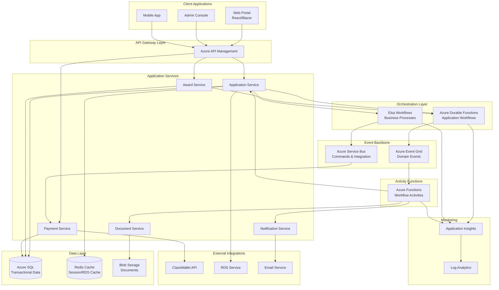
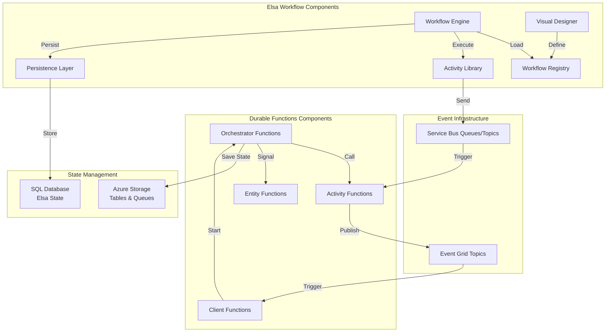
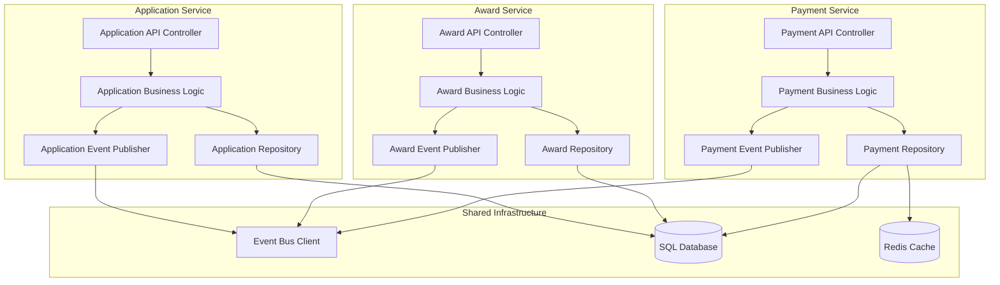
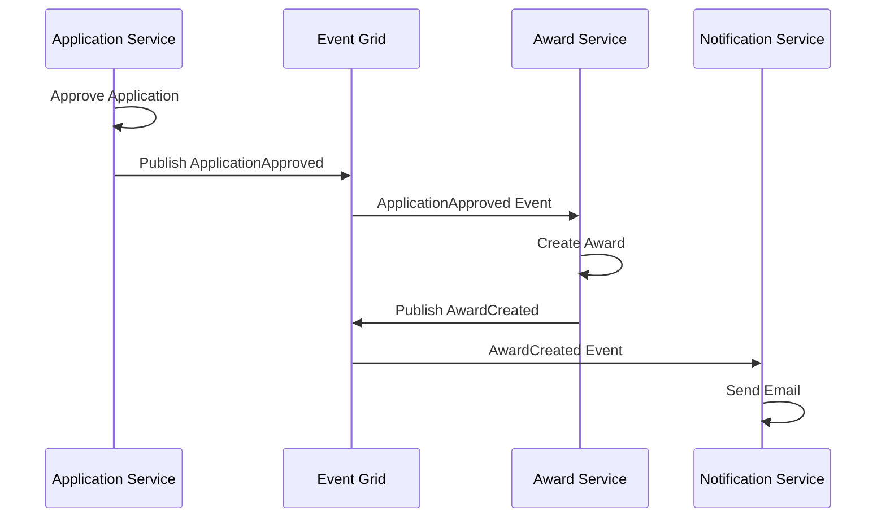
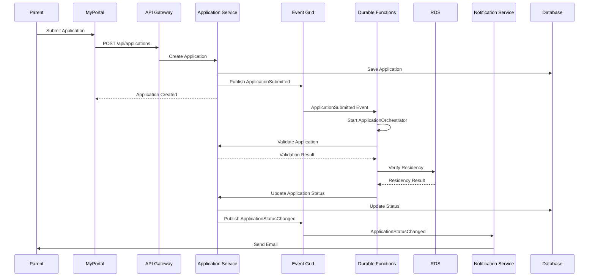
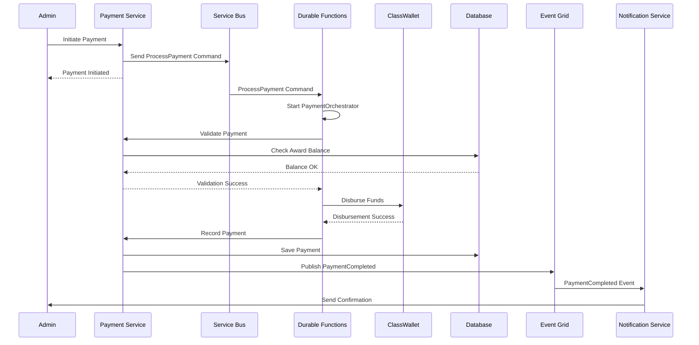

# Architecture Recommendations for K-12 SEAA Workflow Orchestration

**Document Purpose:** Comprehensive architecture design for implementing workflow orchestration in the K-12 SEAA system

**Last Updated:** October 22, 2025

---

## Table of Contents

1. [Architecture Overview](#architecture-overview)
2. [Technology Selection Rationale](#technology-selection-rationale)
3. [System Architecture](#system-architecture)
4. [Component Architecture](#component-architecture)
5. [Workflow State Management](#workflow-state-management)
6. [Event-Driven Architecture](#event-driven-architecture)
7. [Microservices Integration](#microservices-integration)
8. [Data Flow Patterns](#data-flow-patterns)
9. [Deployment Architecture](#deployment-architecture)
10. [Scalability and Resilience](#scalability-and-resilience)

---

## Architecture Overview

### Architectural Principles

The K-12 SEAA workflow orchestration architecture is built on these foundational principles:

1. **Event-Driven First**: Services communicate via events for loose coupling
2. **Cloud-Native**: Leverage Azure PaaS services for reduced operational overhead
3. **Hybrid Orchestration**: Use multiple orchestration tools for different workflow types
4. **State Persistence**: All workflow state stored durably for long-running processes
5. **Observable**: Comprehensive monitoring, logging, and tracing
6. **Scalable**: Automatic and manual scaling based on load
7. **Resilient**: Fault tolerance with retry, compensation, and dead-letter handling

### Recommended Technology Stack

Based on analysis in [Technology Overview](./01-technology-overview.md) and [K-12 Workflow Analysis](./02-k12-workflow-analysis.md), the recommended stack is:

| Layer | Technology | Purpose |
|-------|-----------|---------|
| **Workflow Orchestration** | Azure Durable Functions | Long-running stateful workflows (application processing, awards) |
| **Business Process Management** | Elsa Workflows | Complex business workflows with versioning (certification, compliance) |
| **Event Backbone** | Azure Event Grid | Domain event publishing and routing |
| **Reliable Messaging** | Azure Service Bus | Guaranteed message delivery, dead-letter handling |
| **Activity Functions** | Azure Functions | Individual workflow steps and event handlers |
| **State Persistence** | Azure SQL Database | Workflow state, business data |
| **Caching** | Azure Redis Cache | RDS response caching, session state |
| **Document Storage** | Azure Blob Storage | Document uploads, archives |
| **API Gateway** | Azure API Management | External API exposure, rate limiting |
| **Monitoring** | Application Insights | APM, logging, alerts |

---

## Technology Selection Rationale

### Why Azure Durable Functions?

**Selected For:**
- Application processing workflows (ESA+, OS)
- Award lifecycle management
- Payment orchestration
- Long-running stateful processes

**Rationale:**
1. ✅ **Native Azure Integration**: Seamless integration with other Azure services
2. ✅ **Serverless Cost Model**: Pay only for execution time (cost-effective)
3. ✅ **Automatic State Management**: Built-in state persistence and checkpoints
4. ✅ **Code-First Approach**: Strong typing with C#, fits .NET ecosystem
5. ✅ **Proven at Scale**: Used by many enterprise applications on Azure
6. ✅ **Human Interaction Patterns**: Built-in support for approvals, timeouts
7. ✅ **Excellent Monitoring**: Application Insights integration out-of-box

**Example Use Case:**
```csharp
// ESA+ Application Processing Workflow
[FunctionName("ESAPlusApplicationOrchestrator")]
public static async Task<ApplicationResult> RunOrchestrator(
    [OrchestrationTrigger] IDurableOrchestrationContext context)
{
    var application = context.GetInput<ESAPlusApplication>();
    
    // Parallel document validation
    var validationTasks = new List<Task<ValidationResult>>
    {
        context.CallActivityAsync<ValidationResult>(
            "ValidateDisabilityDocumentation", application),
        context.CallActivityAsync<ValidationResult>(
            "ValidateLEARelease", application),
        context.CallActivityAsync<ValidationResult>(
            "VerifyResidency", application)
    };
    
    var validationResults = await Task.WhenAll(validationTasks);
    
    if (validationResults.Any(r => !r.IsValid))
    {
        await context.CallActivityAsync("SendRejectionNotification", application);
        return ApplicationResult.Rejected;
    }
    
    // Wait for additional documents (could be days/weeks)
    using (var timeout = context.CreateTimer(
        context.CurrentUtcDateTime.AddDays(30), CancellationToken.None))
    {
        var documentEvent = context.WaitForExternalEvent<DocumentUploadedEvent>(
            "AdditionalDocumentsUploaded");
        var completedTask = await Task.WhenAny(documentEvent, timeout);
        
        if (completedTask == timeout)
        {
            await context.CallActivityAsync("SendDocumentReminderNotification", application);
            return ApplicationResult.IncompleteTimeout;
        }
    }
    
    // Admin review
    var approved = await context.CallActivityAsync<bool>(
        "AdminReviewDocuments", application);
    
    if (approved)
    {
        await context.CallActivityAsync("CreateAward", application);
        await context.CallActivityAsync("SendApprovalNotification", application);
        return ApplicationResult.Approved;
    }
    
    return ApplicationResult.Rejected;
}
```

### Why Elsa Workflows?

**Selected For:**
- Provider enrollment and certification
- Compliance workflows
- Multi-step approval processes
- Workflows requiring versioning

**Rationale:**
1. ✅ **Workflow Versioning**: Critical for evolving compliance requirements
2. ✅ **Visual Designer**: Stakeholders can see workflow logic
3. ✅ **Complex Business Rules**: Better for intricate conditional logic
4. ✅ **Custom Activities**: Easy to create domain-specific activities
5. ✅ **Database Persistence**: Flexible persistence options
6. ✅ **Long-Running Support**: Built-in support for multi-month processes

**Example Use Case:**
```csharp
// Provider Certification Workflow
public class ProviderCertificationWorkflow : WorkflowBase
{
    protected override void Build(IWorkflowBuilder builder)
    {
        builder
            .StartWith<ReceiveProviderApplicationActivity>()
            .Then<ValidateProviderCredentialsActivity>()
            .If(context => context.GetVariable<bool>("CredentialsValid"))
                .Then<RequestBackgroundCheckActivity>()
                .Then<WaitForBackgroundCheckActivity>() // Could take days
                .If(context => context.GetVariable<bool>("BackgroundCheckPassed"))
                    .Then<ScheduleInterviewActivity>()
                    .Then<WaitForInterviewCompletionActivity>()
                    .If(context => context.GetVariable<int>("InterviewScore") >= 70)
                        .Then<ApproveProviderActivity>()
                        .Then<AddToProviderDirectoryActivity>()
                        .Then<SendApprovalEmailActivity>()
                        .Then<ScheduleAnnualRenewalActivity>()
                    .Else()
                        .Then<RejectProviderActivity>()
                        .Then<SendRejectionEmailActivity>()
                .Else()
                    .Then<RejectProviderActivity>()
                    .Then<SendBackgroundCheckFailureEmailActivity>()
            .Else()
                .Then<SendCredentialRejectionEmailActivity>();
    }
}
```

### Why Azure Event Grid?

**Selected For:**
- Domain event publishing
- Decoupling microservices
- Integration events
- Real-time notifications

**Rationale:**
1. ✅ **Massive Scale**: Handles millions of events per second
2. ✅ **Low Latency**: Sub-second event delivery
3. ✅ **Native Azure**: First-class integration with Azure services
4. ✅ **Filtering**: Advanced event filtering capabilities
5. ✅ **Reliable**: Built-in retry and dead-letter handling
6. ✅ **Cost-Effective**: Pay per operation model

**Example Domain Events:**
```csharp
// Domain Events for K-12 SEAA
public class K12DomainEvents
{
    // Application Events
    public record ApplicationSubmitted(Guid ApplicationId, Guid StudentId, string ProgramType);
    public record ApplicationApproved(Guid ApplicationId, Guid AwardId);
    public record ApplicationRejected(Guid ApplicationId, string Reason);
    
    // Award Events
    public record AwardCreated(Guid AwardId, Guid StudentId, decimal Amount);
    public record AwardActivated(Guid AwardId, DateTime ActivatedAt);
    public record AwardTerminated(Guid AwardId, string Reason);
    
    // Payment Events
    public record PaymentInitiated(Guid PaymentId, Guid AwardId, decimal Amount);
    public record PaymentCompleted(Guid PaymentId, DateTime CompletedAt);
    public record PaymentFailed(Guid PaymentId, string Reason);
    
    // Document Events
    public record DocumentUploaded(Guid DocumentId, Guid ApplicationId, string DocumentType);
    public record DocumentApproved(Guid DocumentId, Guid ReviewerId);
    public record DocumentRejected(Guid DocumentId, string Reason);
    
    // Compliance Events
    public record ComplianceViolationDetected(Guid AwardId, string ViolationType);
    public record ComplianceIssueResolved(Guid AwardId);
}
```

---

## System Architecture

### High-Level Architecture Diagram



### Architecture Layers

#### 1. Client Layer
- Web portal for families, schools, providers
- Admin console for NCSEAA staff
- Mobile applications for on-the-go access

#### 2. API Gateway Layer
- Azure API Management for API exposure
- Rate limiting and throttling
- Authentication/authorization
- Request/response transformation
- API versioning

#### 3. Orchestration Layer
- **Durable Functions**: Stateful workflow orchestration
- **Elsa Workflows**: Complex business process management
- Workflow versioning and evolution
- State persistence and recovery

#### 4. Event Backbone Layer
- **Event Grid**: Domain event pub/sub
- **Service Bus**: Reliable messaging for commands
- Event filtering and routing
- Dead-letter handling

#### 5. Application Services Layer
- Domain-driven microservices
- Business logic implementation
- RESTful APIs
- Event publishing

#### 6. Activity Layer
- Serverless functions for workflow steps
- Event handlers
- Integration adapters
- Background jobs

#### 7. Data Layer
- SQL Database for transactional data
- Redis for caching and sessions
- Blob Storage for documents
- State persistence for workflows

#### 8. Integration Layer
- Third-party API clients
- Retry and circuit breaker patterns
- Response caching
- Error handling

#### 9. Observability Layer
- Application Insights for APM
- Log Analytics for centralized logging
- Alerts and dashboards
- Distributed tracing

---

## Component Architecture

### Workflow Orchestration Components



### Application Service Components



---

## Workflow State Management

### State Persistence Strategy

Different workflows require different state management approaches:

#### Durable Functions State Management

**Storage:**
- Azure Storage Tables for orchestration state
- Azure Storage Queues for message passing
- Blob Storage for large state objects

**State Structure:**
```csharp
public class ApplicationWorkflowState
{
    // Identity
    public Guid ApplicationId { get; set; }
    public Guid OrchestrationInstanceId { get; set; }
    
    // Progress
    public ApplicationWorkflowStatus CurrentStatus { get; set; }
    public string CurrentStep { get; set; }
    public int ProgressPercentage { get; set; }
    
    // Context Data
    public ESAPlusApplication Application { get; set; }
    public Dictionary<string, object> Variables { get; set; }
    
    // Audit Trail
    public DateTime CreatedAt { get; set; }
    public DateTime LastUpdatedAt { get; set; }
    public List<StateChangeEvent> History { get; set; }
    
    // Integration References
    public string RdsRequestId { get; set; }
    public Guid? AwardId { get; set; }
}
```

#### Elsa Workflows State Management

**Storage:**
- SQL Database for workflow instance state
- Support for PostgreSQL, MongoDB alternatives

**State Structure:**
```csharp
public class ProviderCertificationWorkflowState : WorkflowInstance
{
    // Workflow Identity
    public Guid WorkflowDefinitionId { get; set; }
    public int Version { get; set; }
    public Guid CorrelationId { get; set; }
    
    // Execution State
    public WorkflowStatus Status { get; set; }
    public string CurrentActivityId { get; set; }
    public WorkflowPersistenceBehavior PersistenceBehavior { get; set; }
    
    // Business Data
    public ProviderApplication ProviderApplication { get; set; }
    public Dictionary<string, object> Workflow Variables { get; set; }
    
    // Execution History
    public List<WorkflowExecutionLogRecord> ExecutionLog { get; set; }
    public List<WorkflowFault> Faults { get; set; }
    
    // Scheduling
    public DateTime? ScheduledAt { get; set; }
    public DateTime? CompletedAt { get; set; }
    public DateTime? CancelledAt { get; set; }
}
```

### State Query Patterns

**Query by Status:**
```csharp
// Find all applications in "Document Collection" stage
var workflowInstances = await durableClient.ListInstancesAsync(
    new OrchestrationStatusQueryCondition
    {
        RuntimeStatus = new[]
        {
            OrchestrationRuntimeStatus.Running
        },
        CreatedTimeFrom = DateTime.UtcNow.AddDays(-30)
    },
    CancellationToken.None);

var documentCollectionInstances = workflowInstances.DurableOrchestrationState
    .Where(x => x.CustomStatus.ToString().Contains("DocumentCollection"));
```

**Query by Application:**
```csharp
// Get workflow status for specific application
var instanceId = $"application_{applicationId}";
var status = await durableClient.GetStatusAsync(instanceId);

var currentState = status.CustomStatus.ToObject<ApplicationWorkflowState>();
```

### State Cleanup Strategy

**Completed Workflows:**
- Retain for 90 days in hot storage
- Archive to cold storage (Blob)
- Purge after 7 years (compliance requirement)

**Failed Workflows:**
- Retain for 1 year for analysis
- Manual review and resolution
- Archive after resolution

**Implementation:**
```csharp
[FunctionName("WorkflowStateCleanup")]
public static async Task RunCleanup(
    [TimerTrigger("0 0 2 * * *")] TimerInfo timer, // Run daily at 2 AM
    [DurableClient] IDurableOrchestrationClient client,
    ILogger log)
{
    var cutoffDate = DateTime.UtcNow.AddDays(-90);
    
    var completedInstances = await client.ListInstancesAsync(
        new OrchestrationStatusQueryCondition
        {
            RuntimeStatus = new[] { OrchestrationRuntimeStatus.Completed },
            CreatedTimeTo = cutoffDate
        },
        CancellationToken.None);
    
    foreach (var instance in completedInstances.DurableOrchestrationState)
    {
        // Archive to Blob Storage
        await ArchiveWorkflowStateAsync(instance);
        
        // Purge from Durable Storage
        await client.PurgeInstanceHistoryAsync(instance.InstanceId);
        
        log.LogInformation($"Archived and purged workflow {instance.InstanceId}");
    }
}
```

---

## Event-Driven Architecture

### Domain Events Design

**Event Taxonomy:**

```mermaid
graph TB
    DomainEvents[Domain Events]
    
    DomainEvents --> AppEvents[Application Events]
    DomainEvents --> AwardEvents[Award Events]
    DomainEvents --> PaymentEvents[Payment Events]
    DomainEvents --> DocumentEvents[Document Events]
    DomainEvents --> ComplianceEvents[Compliance Events]
    
    AppEvents --> AppSubmitted[Application.Submitted]
    AppEvents --> AppApproved[Application.Approved]
    AppEvents --> AppRejected[Application.Rejected]
    
    AwardEvents --> AwardCreated[Award.Created]
    AwardEvents --> AwardActivated[Award.Activated]
    AwardEvents --> AwardTerminated[Award.Terminated]
    
    PaymentEvents --> PaymentInitiated[Payment.Initiated]
    PaymentEvents --> PaymentCompleted[Payment.Completed]
    PaymentEvents --> PaymentFailed[Payment.Failed]
    
    DocumentEvents --> DocumentUploaded[Document.Uploaded]
    DocumentEvents --> DocumentApproved[Document.Approved]
    DocumentEvents --> DocumentRejected[Document.Rejected]
    
    ComplianceEvents --> ViolationDetected[Compliance.ViolationDetected]
    ComplianceEvents --> IssueResolved[Compliance.IssueResolved]
```



### Event Schema Design

**Base Event:**
```csharp
public abstract class DomainEvent
{
    public Guid EventId { get; init; } = Guid.NewGuid();
    public DateTime OccurredAt { get; init; } = DateTime.UtcNow;
    public string EventType { get; init; }
    public int Version { get; init; } = 1;
    public Guid CorrelationId { get; init; }
    public Guid? CausationId { get; init; }
    public string Source { get; init; }
}
```

**Concrete Events:**
```csharp
public record ApplicationSubmittedEvent : DomainEvent
{
    public ApplicationSubmittedEvent()
    {
        EventType = "K12.Application.Submitted";
        Source = "Application Service";
    }
    
    public Guid ApplicationId { get; init; }
    public Guid StudentId { get; init; }
    public string ProgramType { get; init; } // "ESA+" or "OS"
    public Guid HouseholdId { get; init; }
    public DateTime SubmittedAt { get; init; }
    public Dictionary<string, string> Metadata { get; init; }
}

public record AwardActivatedEvent : DomainEvent
{
    public AwardActivatedEvent()
    {
        EventType = "K12.Award.Activated";
        Source = "Award Service";
    }
    
    public Guid AwardId { get; init; }
    public Guid StudentId { get; init; }
    public decimal Amount { get; init; }
    public string Program { get; init; }
    public Guid SchoolId { get; init; }
    public DateTime ActivatedAt { get; init; }
}

public record PaymentCompletedEvent : DomainEvent
{
    public PaymentCompletedEvent()
    {
        EventType = "K12.Payment.Completed";
        Source = "Payment Service";
    }
    
    public Guid PaymentId { get; init; }
    public Guid AwardId { get; init; }
    public decimal Amount { get; init; }
    public string PaymentType { get; init; } // "SchoolPayment", "Reimbursement"
    public string Recipient { get; init; }
    public DateTime CompletedAt { get; init; }
}
```

### Event Publishing

**Publisher Implementation:**
```csharp
public class EventGridPublisher : IEventPublisher
{
    private readonly EventGridPublisherClient _client;
    private readonly ILogger<EventGridPublisher> _logger;
    
    public EventGridPublisher(
        EventGridPublisherClient client,
        ILogger<EventGridPublisher> logger)
    {
        _client = client;
        _logger = logger;
    }
    
    public async Task PublishAsync<TEvent>(TEvent domainEvent) 
        where TEvent : DomainEvent
    {
        var eventGridEvent = new EventGridEvent(
            subject: $"{domainEvent.Source}/{domainEvent.EventType}",
            eventType: domainEvent.EventType,
            dataVersion: domainEvent.Version.ToString(),
            data: domainEvent)
        {
            Id = domainEvent.EventId.ToString(),
            EventTime = domainEvent.OccurredAt
        };
        
        await _client.SendEventAsync(eventGridEvent);
        
        _logger.LogInformation(
            "Published event {EventType} with ID {EventId}",
            domainEvent.EventType,
            domainEvent.EventId);
    }
    
    public async Task PublishBatchAsync<TEvent>(IEnumerable<TEvent> domainEvents) 
        where TEvent : DomainEvent
    {
        var eventGridEvents = domainEvents.Select(e => new EventGridEvent(
            subject: $"{e.Source}/{e.EventType}",
            eventType: e.EventType,
            dataVersion: e.Version.ToString(),
            data: e)
        {
            Id = e.EventId.ToString(),
            EventTime = e.OccurredAt
        });
        
        await _client.SendEventsAsync(eventGridEvents);
        
        _logger.LogInformation(
            "Published batch of {Count} events",
            domainEvents.Count());
    }
}
```

### Event Subscription

**Function-Based Subscriber:**
```csharp
[FunctionName("ApplicationSubmittedHandler")]
public static async Task HandleApplicationSubmitted(
    [EventGridTrigger] EventGridEvent eventGridEvent,
    [DurableClient] IDurableOrchestrationClient orchestrationClient,
    ILogger log)
{
    var applicationEvent = eventGridEvent.Data.ToObjectFromJson<ApplicationSubmittedEvent>();
    
    log.LogInformation(
        "Received ApplicationSubmitted event for application {ApplicationId}",
        applicationEvent.ApplicationId);
    
    // Start workflow orchestration
    var instanceId = $"application_{applicationEvent.ApplicationId}";
    await orchestrationClient.StartNewAsync(
        "ApplicationProcessingOrchestrator",
        instanceId,
        applicationEvent);
    
    log.LogInformation(
        "Started orchestration {InstanceId} for application {ApplicationId}",
        instanceId,
        applicationEvent.ApplicationId);
}

[FunctionName("AwardActivatedHandler")]
public static async Task HandleAwardActivated(
    [EventGridTrigger] EventGridEvent eventGridEvent,
    [Inject] INotificationService notificationService,
    ILogger log)
{
    var awardEvent = eventGridEvent.Data.ToObjectFromJson<AwardActivatedEvent>();
    
    log.LogInformation(
        "Received AwardActivated event for award {AwardId}",
        awardEvent.AwardId);
    
    // Send notification to parent
    await notificationService.SendAwardActivationEmailAsync(
        awardEvent.StudentId,
        awardEvent.AwardId);
    
    log.LogInformation(
        "Sent activation notification for award {AwardId}",
        awardEvent.AwardId);
}
```

### Event Filtering

**Event Grid Subscription Filters:**
```json
{
  "filter": {
    "includedEventTypes": [
      "K12.Application.Submitted",
      "K12.Application.Approved"
    ],
    "subjectBeginsWith": "Application Service/",
    "advancedFilters": [
      {
        "operatorType": "StringContains",
        "key": "data.ProgramType",
        "values": ["ESA+"]
      }
    ]
  }
}
```

---

## Microservices Integration

### Service Communication Patterns

#### 1. Event-Driven Communication (Preferred)

**Pattern:**
- Services publish domain events
- Interested services subscribe
- Loose coupling, high autonomy

**Example:**


#### 2. Command-Based Communication (Reliable)

**Pattern:**
- Services send commands via Service Bus
- Guaranteed delivery, dead-letter queue
- Stronger consistency guarantees

**Example:**
```csharp
public class ProcessPaymentCommand
{
    public Guid PaymentId { get; set; }
    public Guid AwardId { get; set; }
    public decimal Amount { get; set; }
    public string PaymentType { get; set; }
}

// Sender
public class AwardService
{
    private readonly ServiceBusSender _sender;
    
    public async Task InitiatePaymentAsync(Guid awardId, decimal amount)
    {
        var command = new ProcessPaymentCommand
        {
            PaymentId = Guid.NewGuid(),
            AwardId = awardId,
            Amount = amount,
            PaymentType = "SchoolPayment"
        };
        
        var message = new ServiceBusMessage(JsonSerializer.Serialize(command));
        await _sender.SendMessageAsync(message);
    }
}

// Receiver
[FunctionName("ProcessPaymentCommandHandler")]
public static async Task HandleProcessPayment(
    [ServiceBusTrigger("payment-commands", Connection = "ServiceBusConnection")] 
    string message,
    [Inject] IPaymentService paymentService,
    ILogger log)
{
    var command = JsonSerializer.Deserialize<ProcessPaymentCommand>(message);
    
    await paymentService.ProcessPaymentAsync(
        command.PaymentId,
        command.AwardId,
        command.Amount,
        command.PaymentType);
    
    log.LogInformation(
        "Processed payment {PaymentId} for award {AwardId}",
        command.PaymentId,
        command.AwardId);
}
```

#### 3. Synchronous API Calls (When Necessary)

**Pattern:**
- Direct HTTP calls between services
- Use for critical path operations
- Implement circuit breaker and retry

**Example:**
```csharp
public class RdsClient
{
    private readonly HttpClient _httpClient;
    private readonly IDistributedCache _cache;
    
    public async Task<ResidencyVerificationResult> VerifyResidencyAsync(
        Guid studentId)
    {
        // Check cache first
        var cacheKey = $"residency_{studentId}";
        var cachedResult = await _cache.GetStringAsync(cacheKey);
        if (cachedResult != null)
        {
            return JsonSerializer.Deserialize<ResidencyVerificationResult>(cachedResult);
        }
        
        // Call RDS API with retry policy
        var response = await _httpClient.PostAsJsonAsync(
            "/api/verify-residency",
            new { StudentId = studentId });
        
        response.EnsureSuccessStatusCode();
        
        var result = await response.Content
            .ReadFromJsonAsync<ResidencyVerificationResult>();
        
        // Cache result for 24 hours
        await _cache.SetStringAsync(
            cacheKey,
            JsonSerializer.Serialize(result),
            new DistributedCacheEntryOptions
            {
                AbsoluteExpirationRelativeToNow = TimeSpan.FromHours(24)
            });
        
        return result;
    }
}
```

---

## Data Flow Patterns

### Application Processing Flow



### Payment Processing Flow



---

## Deployment Architecture

### Azure Resource Topology

```mermaid
graph TB
    subgraph "Region: East US (Primary)"
        subgraph "Compute"
            AppService1[App Service Plan<br/>Premium v3]
            FunctionApp1[Function Apps<br/>Consumption]
        end
        
        subgraph "Data"
            SQL1[(SQL Database<br/>Primary)]
            Redis1[(Redis Cache<br/>Primary)]
            Storage1[Blob Storage<br/>Primary]
        end
        
        subgraph "Integration"
            APIM1[API Management]
            EventGrid1[Event Grid]
            ServiceBus1[Service Bus<br/>Premium]
        end
        
        subgraph "Monitoring"
            AppInsights1[Application Insights]
        end
    end
    
    subgraph "Region: West US (DR)"
        SQL2[(SQL Database<br/>Replica)]
        Redis2[(Redis Cache<br/>Replica)]
        Storage2[Blob Storage<br/>Geo-Redundant)]
    end
    
    SQL1 -.->|Geo-Replication| SQL2
    Redis1 -.->|Replication| Redis2
    Storage1 -.->|GRS| Storage2
```

### Environment Strategy

**Environments:**

1. **Development** (`dev`)
   - Minimal resources
   - Shared services
   - Frequent deployments

2. **Test/QA** (`test`)
   - Mirrors production topology
   - Isolated test data
   - CI/CD validation

3. **Staging** (`staging`)
   - Production-like environment
   - Final validation before prod
   - Load testing

4. **Production** (`prod`)
   - Full redundancy
   - Auto-scaling enabled
   - Multi-region DR

### Infrastructure as Code

**Bicep Template Example:**
```bicep
// Durable Functions Storage Account
resource durableFunctionsStorage 'Microsoft.Storage/storageAccounts@2023-01-01' = {
  name: '${resourcePrefix}dfstorage${environment}'
  location: location
  sku: {
    name: 'Standard_LRS'
  }
  kind: 'StorageV2'
  properties: {
    supportsHttpsTrafficOnly: true
    minimumTlsVersion: 'TLS1_2'
  }
}

// Function App for Durable Functions
resource durableFunctionApp 'Microsoft.Web/sites@2022-09-01' = {
  name: '${resourcePrefix}-durable-func-${environment}'
  location: location
  kind: 'functionapp'
  properties: {
    serverFarmId: functionAppServicePlan.id
    siteConfig: {
      appSettings: [
        {
          name: 'AzureWebJobsStorage'
          value: 'DefaultEndpointsProtocol=https;AccountName=${durableFunctionsStorage.name};AccountKey=${durableFunctionsStorage.listKeys().keys[0].value}'
        }
        {
          name: 'FUNCTIONS_EXTENSION_VERSION'
          value: '~4'
        }
        {
          name: 'FUNCTIONS_WORKER_RUNTIME'
          value: 'dotnet-isolated'
        }
        {
          name: 'APPLICATIONINSIGHTS_CONNECTION_STRING'
          value: appInsights.properties.ConnectionString
        }
      ]
    }
  }
}

// Event Grid Topic
resource eventGridTopic 'Microsoft.EventGrid/topics@2022-06-15' = {
  name: '${resourcePrefix}-events-${environment}'
  location: location
  properties: {
    inputSchema: 'EventGridSchema'
    publicNetworkAccess: 'Enabled'
  }
}

// Service Bus Namespace
resource serviceBusNamespace 'Microsoft.ServiceBus/namespaces@2022-10-01-preview' = {
  name: '${resourcePrefix}-sb-${environment}'
  location: location
  sku: {
    name: 'Premium'
    tier: 'Premium'
  }
  properties: {
    zoneRedundant: true
  }
}
```

---

## Scalability and Resilience

### Scaling Strategies

#### Durable Functions Auto-Scaling

- **Consumption Plan**: Scales automatically based on load
- **Premium Plan**: Pre-warmed instances for low latency
- **Concurrent Executions**: Configure max concurrent orchestrations

**Configuration:**
```json
{
  "extensions": {
    "durableTask": {
      "maxConcurrentActivityFunctions": 100,
      "maxConcurrentOrchestratorFunctions": 50,
      "extendedSessionsEnabled": true,
      "extendedSessionIdleTimeoutInSeconds": 30
    }
  }
}
```

#### Application Services Scaling

- **App Service Plan**: Scale up (vertical) or out (horizontal)
- **Auto-scale Rules**: CPU, memory, custom metrics
- **Target**: 70% CPU utilization

**Auto-scale Rule:**
```json
{
  "profiles": [
    {
      "name": "Auto-scale based on CPU",
      "capacity": {
        "minimum": "2",
        "maximum": "10",
        "default": "2"
      },
      "rules": [
        {
          "metricTrigger": {
            "metricName": "CpuPercentage",
            "operator": "GreaterThan",
            "threshold": 70,
            "timeAggregation": "Average"
          },
          "scaleAction": {
            "direction": "Increase",
            "type": "ChangeCount",
            "value": "2",
            "cooldown": "PT5M"
          }
        }
      ]
    }
  ]
}
```

### Resilience Patterns

#### 1. Retry Pattern

```csharp
public class RdsClientWithRetry
{
    private readonly HttpClient _httpClient;
    
    public async Task<ResidencyResult> VerifyResidencyAsync(Guid studentId)
    {
        var retryPolicy = Policy
            .Handle<HttpRequestException>()
            .OrResult<HttpResponseMessage>(r => !r.IsSuccessStatusCode)
            .WaitAndRetryAsync(
                retryCount: 3,
                sleepDurationProvider: attempt => TimeSpan.FromSeconds(Math.Pow(2, attempt)),
                onRetry: (outcome, timespan, retryAttempt, context) =>
                {
                    _logger.LogWarning(
                        "RDS call failed, attempt {Attempt} of 3, retrying in {Delay}s",
                        retryAttempt,
                        timespan.TotalSeconds);
                });
        
        var response = await retryPolicy.ExecuteAsync(() =>
            _httpClient.PostAsJsonAsync("/api/verify", new { studentId }));
        
        return await response.Content.ReadFromJsonAsync<ResidencyResult>();
    }
}
```

#### 2. Circuit Breaker Pattern

```csharp
public class ClassWalletClientWithCircuitBreaker
{
    private readonly HttpClient _httpClient;
    
    private readonly AsyncCircuitBreakerPolicy<HttpResponseMessage> _circuitBreaker;
    
    public ClassWalletClientWithCircuitBreaker(HttpClient httpClient)
    {
        _httpClient = httpClient;
        
        _circuitBreaker = Policy
            .HandleResult<HttpResponseMessage>(r => !r.IsSuccessStatusCode)
            .Or<HttpRequestException>()
            .CircuitBreakerAsync(
                handledEventsAllowedBeforeBreaking: 5,
                durationOfBreak: TimeSpan.FromSeconds(30),
                onBreak: (result, duration) =>
                {
                    _logger.LogError(
                        "Circuit breaker opened for {Duration}s due to {Failures} failures",
                        duration.TotalSeconds,
                        5);
                },
                onReset: () =>
                {
                    _logger.LogInformation("Circuit breaker reset");
                });
    }
    
    public async Task<PaymentResult> ProcessPaymentAsync(PaymentRequest request)
    {
        try
        {
            var response = await _circuitBreaker.ExecuteAsync(() =>
                _httpClient.PostAsJsonAsync("/api/payments", request));
            
            return await response.Content.ReadFromJsonAsync<PaymentResult>();
        }
        catch (BrokenCircuitException)
        {
            _logger.LogError("Circuit breaker is open, payment request rejected");
            throw new ServiceUnavailableException("ClassWallet service is currently unavailable");
        }
    }
}
```

#### 3. Bulkhead Pattern

```csharp
// Isolate ClassWallet calls to prevent cascade failures
public class BulkheadConfiguration
{
    public static IAsyncPolicy<HttpResponseMessage> CreateClassWalletBulkhead()
    {
        return Policy
            .BulkheadAsync<HttpResponseMessage>(
                maxParallelization: 10, // Max 10 concurrent ClassWallet calls
                maxQueuingActions: 20,  // Max 20 queued requests
                onBulkheadRejectedAsync: context =>
                {
                    _logger.LogWarning("ClassWallet bulkhead rejected request");
                    return Task.CompletedTask;
                });
    }
}
```

### Disaster Recovery

**RTO and RPO Targets:**
- **RTO** (Recovery Time Objective): 4 hours
- **RPO** (Recovery Point Objective): 15 minutes

**DR Strategy:**
1. **Geo-Redundant Storage**: Automatic replication to secondary region
2. **SQL Geo-Replication**: Active geo-replication to West US
3. **Traffic Manager**: Automatic failover for API endpoints
4. **Runbooks**: Documented failover procedures
5. **Regular DR Drills**: Quarterly failover testing

---

## Conclusion

This architecture provides a robust, scalable, and resilient foundation for K-12 SEAA workflow orchestration:

✅ **Hybrid Orchestration**: Durable Functions + Elsa for different workflow types  
✅ **Event-Driven**: Decoupled services with Event Grid  
✅ **State Management**: Persistent state for long-running workflows  
✅ **Scalable**: Automatic and manual scaling strategies  
✅ **Resilient**: Retry, circuit breaker, and bulkhead patterns  
✅ **Observable**: Comprehensive monitoring and logging  
✅ **Cloud-Native**: Leverages Azure PaaS services  

The next document ([Implementation Patterns](./04-implementation-patterns.md)) provides concrete code examples and patterns for implementing these architectures in the K-12 SEAA system.

---

**Document Version:** 1.0  
**Last Updated:** October 22, 2025  
**Next Review:** December 2025
