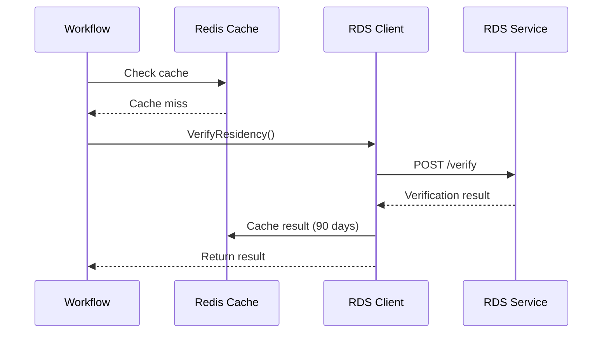
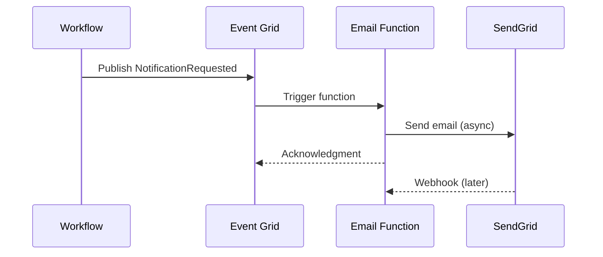
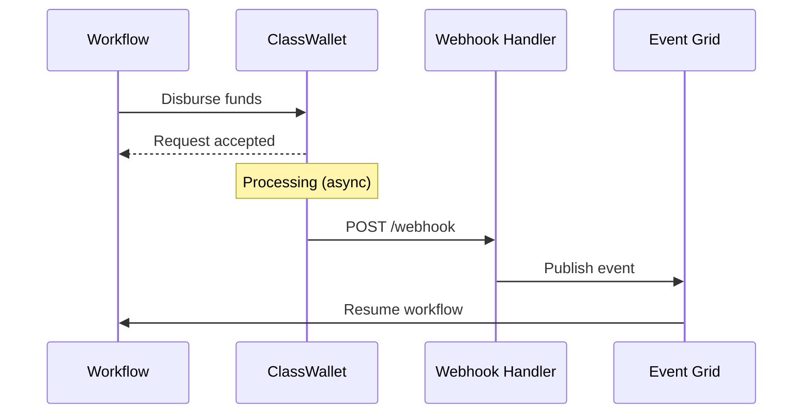
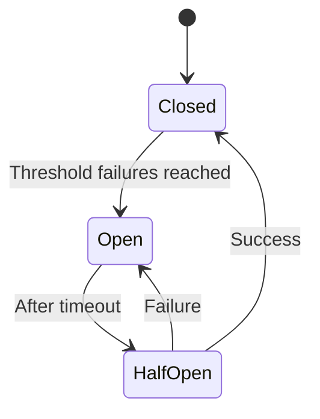

# Integration Architecture for K-12 SEAA Workflows

**Document Purpose:** Comprehensive integration patterns for third-party services in workflow orchestration

**Last Updated:** October 22, 2025

---

## Table of Contents

1. [Integration Overview](#integration-overview)
2. [ClassWallet Integration](#classwallet-integration)
3. [RDS Integration](#rds-integration)
4. [Email Service Integration](#email-service-integration)
5. [Document Storage Integration](#document-storage-integration)
6. [Integration Patterns](#integration-patterns)
7. [Error Handling and Resilience](#error-handling-and-resilience)

---

## Integration Overview

### Third-Party Services

The K-12 SEAA system integrates with multiple external services:

| Service | Purpose | Integration Type | Criticality |
|---------|---------|------------------|-------------|
| **ClassWallet** | ESA+ fund management, purchases | REST API, Webhooks | High |
| **RDS** | Residency verification | SOAP/REST API | High |
| **SendGrid/Azure Communication** | Email notifications | REST API, Webhooks | Medium |
| **Azure Blob Storage** | Document storage | Azure SDK | High |
| **Azure AD** | Authentication/Authorization | OAuth 2.0/OIDC | High |

### Integration Principles

1. **Resilience First**: Implement retry, circuit breaker, and bulkhead patterns
2. **Async When Possible**: Use event-driven patterns for non-critical-path operations
3. **Caching**: Cache responses where appropriate to reduce latency and cost
4. **Idempotency**: Ensure operations can be safely retried
5. **Monitoring**: Track integration health, latency, and errors
6. **Security**: Secure API keys in Key Vault, use managed identities

---

## ClassWallet Integration

### Overview

ClassWallet is the digital wallet platform for ESA+ fund management. Integration points include:
- Fund disbursement
- Purchase approval/rejection
- Transaction monitoring
- Balance inquiries
- Reimbursement processing

**Reference:** [ClassWallet for NC ESA+](https://k12.ncseaa.edu/families-of-awarded-students/esaplus-program/classwallet/)

### API Client Implementation

```csharp
public interface IClassWalletClient
{
    Task<DisbursementResult> DisburseFundsAsync(
        Guid awardId, decimal amount, string studentId, CancellationToken cancellationToken = default);
    
    Task<PurchaseApprovalResult> ApprovePurchaseAsync(
        string purchaseId, CancellationToken cancellationToken = default);
    
    Task<PurchaseRejectionResult> RejectPurchaseAsync(
        string purchaseId, string reason, CancellationToken cancellationToken = default);
    
    Task<BalanceInfo> GetBalanceAsync(
        string walletId, CancellationToken cancellationToken = default);
    
    Task<List<Transaction>> GetTransactionsAsync(
        string walletId, DateTime from, DateTime to, CancellationToken cancellationToken = default);
}

public class ClassWalletClient : IClassWalletClient
{
    private readonly HttpClient _httpClient;
    private readonly IDistributedCache _cache;
    private readonly ILogger<ClassWalletClient> _logger;
    private readonly ClassWalletOptions _options;
    
    private readonly AsyncPolicy<HttpResponseMessage> _retryPolicy;
    private readonly AsyncCircuitBreakerPolicy<HttpResponseMessage> _circuitBreaker;
    private readonly AsyncBulkheadPolicy<HttpResponseMessage> _bulkhead;
    
    public ClassWalletClient(
        HttpClient httpClient,
        IDistributedCache cache,
        IOptions<ClassWalletOptions> options,
        ILogger<ClassWalletClient> logger)
    {
        _httpClient = httpClient;
        _cache = cache;
        _options = options.Value;
        _logger = logger;
        
        // Configure resilience policies
        _retryPolicy = Policy
            .Handle<HttpRequestException>()
            .OrResult<HttpResponseMessage>(r => 
                r.StatusCode == System.Net.HttpStatusCode.TooManyRequests ||
                (int)r.StatusCode >= 500)
            .WaitAndRetryAsync(
                retryCount: 3,
                sleepDurationProvider: attempt => TimeSpan.FromSeconds(Math.Pow(2, attempt)),
                onRetry: (outcome, timespan, retryAttempt, context) =>
                {
                    _logger.LogWarning(
                        "ClassWallet API call failed, attempt {Attempt} of 3, retrying in {Delay}s",
                        retryAttempt, timespan.TotalSeconds);
                });
        
        _circuitBreaker = Policy
            .HandleResult<HttpResponseMessage>(r => !r.IsSuccessStatusCode)
            .Or<HttpRequestException>()
            .CircuitBreakerAsync(
                handledEventsAllowedBeforeBreaking: 5,
                durationOfBreak: TimeSpan.FromSeconds(30),
                onBreak: (result, duration) =>
                {
                    _logger.LogError(
                        "ClassWallet circuit breaker opened for {Duration}s",
                        duration.TotalSeconds);
                },
                onReset: () => _logger.LogInformation("ClassWallet circuit breaker reset"));
        
        _bulkhead = Policy.BulkheadAsync<HttpResponseMessage>(
            maxParallelization: 10,
            maxQueuingActions: 20,
            onBulkheadRejectedAsync: context =>
            {
                _logger.LogWarning("ClassWallet bulkhead rejected request");
                return Task.CompletedTask;
            });
    }
    
    public async Task<DisbursementResult> DisburseFundsAsync(
        Guid awardId,
        decimal amount,
        string studentId,
        CancellationToken cancellationToken = default)
    {
        _logger.LogInformation(
            "Disbursing {Amount:C} to ClassWallet for award {AwardId}",
            amount, awardId);
        
        var idempotencyKey = $"disburse_{awardId}_{amount}_{DateTime.UtcNow:yyyyMMdd}";
        
        var request = new HttpRequestMessage(HttpMethod.Post, "/api/v1/disbursements")
        {
            Content = JsonContent.Create(new
            {
                awardId,
                amount,
                studentId,
                currency = "USD",
                idempotencyKey
            })
        };
        
        request.Headers.Add("Authorization", $"Bearer {_options.ApiKey}");
        request.Headers.Add("X-Idempotency-Key", idempotencyKey);
        
        try
        {
            var response = await _bulkhead.ExecuteAsync(() =>
                _circuitBreaker.ExecuteAsync(() =>
                    _retryPolicy.ExecuteAsync(() =>
                        _httpClient.SendAsync(request, cancellationToken))));
            
            response.EnsureSuccessStatusCode();
            
            var result = await response.Content.ReadFromJsonAsync<DisbursementResult>(
                cancellationToken: cancellationToken);
            
            _logger.LogInformation(
                "Successfully disbursed funds to ClassWallet. TransactionId: {TransactionId}",
                result.TransactionId);
            
            return result;
        }
        catch (BrokenCircuitException ex)
        {
            _logger.LogError(ex, "ClassWallet circuit breaker is open");
            throw new ServiceUnavailableException("ClassWallet service is currently unavailable", ex);
        }
        catch (BulkheadRejectedException ex)
        {
            _logger.LogError(ex, "ClassWallet bulkhead rejected request");
            throw new ServiceUnavailableException("ClassWallet service is at capacity", ex);
        }
        catch (Exception ex)
        {
            _logger.LogError(ex, "Failed to disburse funds to ClassWallet");
            throw;
        }
    }
    
    public async Task<BalanceInfo> GetBalanceAsync(
        string walletId,
        CancellationToken cancellationToken = default)
    {
        // Check cache first
        var cacheKey = $"classwallet_balance_{walletId}";
        var cachedBalance = await _cache.GetStringAsync(cacheKey, cancellationToken);
        
        if (cachedBalance != null)
        {
            _logger.LogInformation("Returning cached balance for wallet {WalletId}", walletId);
            return JsonSerializer.Deserialize<BalanceInfo>(cachedBalance);
        }
        
        _logger.LogInformation("Fetching balance from ClassWallet for wallet {WalletId}", walletId);
        
        var response = await _retryPolicy.ExecuteAsync(() =>
            _httpClient.GetAsync($"/api/v1/wallets/{walletId}/balance", cancellationToken));
        
        response.EnsureSuccessStatusCode();
        
        var balance = await response.Content.ReadFromJsonAsync<BalanceInfo>(
            cancellationToken: cancellationToken);
        
        // Cache for 5 minutes
        await _cache.SetStringAsync(
            cacheKey,
            JsonSerializer.Serialize(balance),
            new DistributedCacheEntryOptions
            {
                AbsoluteExpirationRelativeToNow = TimeSpan.FromMinutes(5)
            },
            cancellationToken);
        
        return balance;
    }
}
```

### Webhook Handler

**ClassWallet sends webhooks for events like purchase requests, transaction updates:**

```csharp
[ApiController]
[Route("api/webhooks/classwallet")]
public class ClassWalletWebhookController : ControllerBase
{
    private readonly IEventPublisher _eventPublisher;
    private readonly ILogger<ClassWalletWebhookController> _logger;
    private readonly ClassWalletOptions _options;
    
    [HttpPost("purchase-request")]
    public async Task<IActionResult> HandlePurchaseRequest(
        [FromBody] ClassWalletPurchaseRequestWebhook webhook,
        [FromHeader(Name = "X-ClassWallet-Signature")] string signature)
    {
        // Verify webhook signature
        if (!VerifySignature(webhook, signature))
        {
            _logger.LogWarning("Invalid webhook signature received");
            return Unauthorized();
        }
        
        _logger.LogInformation(
            "Received purchase request webhook for purchase {PurchaseId}",
            webhook.PurchaseId);
        
        // Publish domain event
        await _eventPublisher.PublishAsync(new PurchaseRequestReceivedEvent
        {
            PurchaseId = webhook.PurchaseId,
            WalletId = webhook.WalletId,
            AwardId = Guid.Parse(webhook.Metadata["AwardId"]),
            Amount = webhook.Amount,
            Merchant = webhook.Merchant,
            Category = webhook.Category,
            Description = webhook.Description,
            ReceivedAt = DateTime.UtcNow
        });
        
        return Ok();
    }
    
    [HttpPost("transaction-completed")]
    public async Task<IActionResult> HandleTransactionCompleted(
        [FromBody] ClassWalletTransactionWebhook webhook,
        [FromHeader(Name = "X-ClassWallet-Signature")] string signature)
    {
        if (!VerifySignature(webhook, signature))
        {
            return Unauthorized();
        }
        
        _logger.LogInformation(
            "Transaction {TransactionId} completed in ClassWallet",
            webhook.TransactionId);
        
        await _eventPublisher.PublishAsync(new ClassWalletTransactionCompletedEvent
        {
            TransactionId = webhook.TransactionId,
            WalletId = webhook.WalletId,
            Amount = webhook.Amount,
            Status = webhook.Status,
            CompletedAt = webhook.CompletedAt
        });
        
        return Ok();
    }
    
    private bool VerifySignature(object payload, string signature)
    {
        var jsonPayload = JsonSerializer.Serialize(payload);
        var computedSignature = ComputeHmacSha256(jsonPayload, _options.WebhookSecret);
        return signature == computedSignature;
    }
    
    private string ComputeHmacSha256(string data, string secret)
    {
        using var hmac = new HMACSHA256(Encoding.UTF8.GetBytes(secret));
        var hash = hmac.ComputeHash(Encoding.UTF8.GetBytes(data));
        return Convert.ToBase64String(hash);
    }
}

// Event handler that processes purchase requests
[FunctionName("PurchaseRequestHandler")]
public static async Task HandlePurchaseRequest(
    [EventGridTrigger] EventGridEvent eventGridEvent,
    [DurableClient] IDurableOrchestrationClient orchestrationClient,
    ILogger log)
{
    var purchaseEvent = eventGridEvent.Data
        .ToObjectFromJson<PurchaseRequestReceivedEvent>();
    
    log.LogInformation(
        "Starting purchase approval workflow for purchase {PurchaseId}",
        purchaseEvent.PurchaseId);
    
    // Start purchase approval orchestration
    await orchestrationClient.StartNewAsync(
        "PurchaseApprovalOrchestrator",
        $"purchase_{purchaseEvent.PurchaseId}",
        purchaseEvent);
}
```

---

## RDS Integration

### Overview

The NC Residency Determination Service (RDS) provides residency verification for students applying for scholarships.

**Reference:** [NC Residency Determination Service](https://www.ncresidency.org/)  
**Related Documentation:** [RDS Integration Specification](../../rds-integration-research/rds-integration-specification.md)

### RDS Client Implementation

```csharp
public interface IRdsClient
{
    Task<ResidencyVerificationResult> VerifyResidencyAsync(
        Guid studentId, CancellationToken cancellationToken = default);
    
    Task<ResidencyVerificationResult> GetVerificationStatusAsync(
        string requestId, CancellationToken cancellationToken = default);
}

public class RdsClient : IRdsClient
{
    private readonly HttpClient _httpClient;
    private readonly IDistributedCache _cache;
    private readonly ILogger<RdsClient> _logger;
    private readonly RdsOptions _options;
    
    public RdsClient(
        HttpClient httpClient,
        IDistributedCache cache,
        IOptions<RdsOptions> options,
        ILogger<RdsClient> logger)
    {
        _httpClient = httpClient;
        _cache = cache;
        _options = options.Value;
        _logger = logger;
    }
    
    public async Task<ResidencyVerificationResult> VerifyResidencyAsync(
        Guid studentId,
        CancellationToken cancellationToken = default)
    {
        // Check cache first (residency results valid for 90 days)
        var cacheKey = $"rds_verification_{studentId}";
        var cachedResult = await _cache.GetStringAsync(cacheKey, cancellationToken);
        
        if (cachedResult != null)
        {
            var cached = JsonSerializer.Deserialize<ResidencyVerificationResult>(cachedResult);
            
            // Check if cache entry is still valid
            if (cached.VerifiedAt > DateTime.UtcNow.AddDays(-90))
            {
                _logger.LogInformation(
                    "Returning cached RDS verification for student {StudentId}",
                    studentId);
                return cached;
            }
        }
        
        _logger.LogInformation(
            "Verifying residency with RDS for student {StudentId}",
            studentId);
        
        // Get student information
        var student = await GetStudentInfoAsync(studentId, cancellationToken);
        
        // Call RDS API
        var request = new RdsVerificationRequest
        {
            FirstName = student.FirstName,
            LastName = student.LastName,
            DateOfBirth = student.DateOfBirth,
            SSN = student.SSN, // Last 4 digits only
            Address = student.Address,
            RequestingAgency = "NCSEAA",
            ProgramType = "K12Scholarship"
        };
        
        var response = await _httpClient.PostAsJsonAsync(
            "/api/v2/verify-residency",
            request,
            cancellationToken);
        
        response.EnsureSuccessStatusCode();
        
        var result = await response.Content.ReadFromJsonAsync<RdsVerificationResponse>(
            cancellationToken: cancellationToken);
        
        var verificationResult = new ResidencyVerificationResult
        {
            RequestId = result.RequestId,
            IsResident = result.ResidencyStatus == "Resident",
            ResidencyStatus = result.ResidencyStatus,
            County = result.County,
            VerifiedAt = DateTime.UtcNow,
            Details = result.Details,
            ExpiresAt = DateTime.UtcNow.AddDays(90)
        };
        
        // Cache result for 90 days
        await _cache.SetStringAsync(
            cacheKey,
            JsonSerializer.Serialize(verificationResult),
            new DistributedCacheEntryOptions
            {
                AbsoluteExpirationRelativeToNow = TimeSpan.FromDays(90)
            },
            cancellationToken);
        
        _logger.LogInformation(
            "RDS verification completed for student {StudentId}. Result: {Status}",
            studentId,
            verificationResult.ResidencyStatus);
        
        return verificationResult;
    }
    
    private async Task<StudentInfo> GetStudentInfoAsync(
        Guid studentId,
        CancellationToken cancellationToken)
    {
        // Get student info from database or student service
        // Implementation depends on your data access layer
        throw new NotImplementedException();
    }
}

// Activity function for workflow
[FunctionName("VerifyResidency")]
public static async Task<VerificationResult> VerifyResidency(
    [ActivityTrigger] Guid studentId,
    [Inject] IRdsClient rdsClient,
    [Inject] IStudentRepository studentRepository,
    ILogger log)
{
    log.LogInformation("Verifying residency for student {StudentId}", studentId);
    
    try
    {
        var result = await rdsClient.VerifyResidencyAsync(studentId);
        
        // Update student record with verification result
        await studentRepository.UpdateResidencyVerificationAsync(
            studentId,
            result.IsResident,
            result.VerifiedAt,
            result.ExpiresAt);
        
        return new VerificationResult
        {
            IsValid = result.IsResident,
            VerificationType = "Residency",
            VerifiedAt = result.VerifiedAt,
            ExpiresAt = result.ExpiresAt,
            Details = new Dictionary<string, object>
            {
                ["ResidencyStatus"] = result.ResidencyStatus,
                ["County"] = result.County,
                ["RequestId"] = result.RequestId
            }
        };
    }
    catch (Exception ex)
    {
        log.LogError(ex, "Failed to verify residency for student {StudentId}", studentId);
        
        return new VerificationResult
        {
            IsValid = false,
            VerificationType = "Residency",
            Error = ex.Message
        };
    }
}
```

---

## Email Service Integration

### Overview

Email notifications are critical for communicating with families, schools, providers, and staff. Integration with SendGrid or Azure Communication Services.

**Options:**
- **SendGrid**: Third-party email service with advanced features
- **Azure Communication Services**: Azure-native email service

### Email Client Implementation

```csharp
public interface IEmailService
{
    Task<EmailResult> SendEmailAsync(
        EmailRequest request, CancellationToken cancellationToken = default);
    
    Task<EmailResult> SendTemplatedEmailAsync(
        string templateId, string to, object templateData, CancellationToken cancellationToken = default);
    
    Task<BulkEmailResult> SendBulkEmailAsync(
        List<EmailRequest> requests, CancellationToken cancellationToken = default);
}

public class SendGridEmailService : IEmailService
{
    private readonly SendGridClient _client;
    private readonly ILogger<SendGridEmailService> _logger;
    private readonly SendGridOptions _options;
    
    public SendGridEmailService(
        IOptions<SendGridOptions> options,
        ILogger<SendGridEmailService> logger)
    {
        _options = options.Value;
        _logger = logger;
        _client = new SendGridClient(_options.ApiKey);
    }
    
    public async Task<EmailResult> SendEmailAsync(
        EmailRequest request,
        CancellationToken cancellationToken = default)
    {
        _logger.LogInformation("Sending email to {To}: {Subject}", request.To, request.Subject);
        
        var msg = new SendGridMessage
        {
            From = new EmailAddress(_options.FromEmail, _options.FromName),
            Subject = request.Subject,
            HtmlContent = request.HtmlContent,
            PlainTextContent = request.PlainTextContent
        };
        
        msg.AddTo(new EmailAddress(request.To, request.ToName));
        
        // Add tracking
        if (request.TrackingEnabled)
        {
            msg.SetClickTracking(true, true);
            msg.SetOpenTracking(true);
        }
        
        // Add custom args for tracking
        msg.AddCustomArgs(new Dictionary<string, string>
        {
            ["ApplicationId"] = request.Metadata.GetValueOrDefault("ApplicationId", ""),
            ["NotificationType"] = request.NotificationType ?? "",
            ["Environment"] = _options.Environment
        });
        
        try
        {
            var response = await _client.SendEmailAsync(msg, cancellationToken);
            
            if (response.IsSuccessStatusCode)
            {
                _logger.LogInformation(
                    "Email sent successfully. MessageId: {MessageId}",
                    response.Headers.GetValues("X-Message-Id").FirstOrDefault());
                
                return new EmailResult
                {
                    Success = true,
                    MessageId = response.Headers.GetValues("X-Message-Id").FirstOrDefault()
                };
            }
            else
            {
                var body = await response.Body.ReadAsStringAsync(cancellationToken);
                _logger.LogError(
                    "Failed to send email. Status: {Status}, Body: {Body}",
                    response.StatusCode,
                    body);
                
                return new EmailResult
                {
                    Success = false,
                    Error = $"SendGrid returned {response.StatusCode}: {body}"
                };
            }
        }
        catch (Exception ex)
        {
            _logger.LogError(ex, "Exception sending email to {To}", request.To);
            
            return new EmailResult
            {
                Success = false,
                Error = ex.Message
            };
        }
    }
    
    public async Task<EmailResult> SendTemplatedEmailAsync(
        string templateId,
        string to,
        object templateData,
        CancellationToken cancellationToken = default)
    {
        _logger.LogInformation("Sending templated email {TemplateId} to {To}", templateId, to);
        
        var msg = new SendGridMessage();
        msg.SetFrom(new EmailAddress(_options.FromEmail, _options.FromName));
        msg.AddTo(new EmailAddress(to));
        msg.SetTemplateId(templateId);
        msg.SetTemplateData(templateData);
        
        try
        {
            var response = await _client.SendEmailAsync(msg, cancellationToken);
            
            return new EmailResult
            {
                Success = response.IsSuccessStatusCode,
                MessageId = response.Headers.GetValues("X-Message-Id").FirstOrDefault()
            };
        }
        catch (Exception ex)
        {
            _logger.LogError(ex, "Exception sending templated email");
            return new EmailResult { Success = false, Error = ex.Message };
        }
    }
}

// Email templates stored in database
public class EmailTemplateService : IEmailTemplateService
{
    private readonly IDbConnection _db;
    private readonly IDistributedCache _cache;
    
    public async Task<EmailTemplate> GetTemplateAsync(string templateName)
    {
        // Check cache
        var cacheKey = $"email_template_{templateName}";
        var cached = await _cache.GetStringAsync(cacheKey);
        
        if (cached != null)
        {
            return JsonSerializer.Deserialize<EmailTemplate>(cached);
        }
        
        // Load from database
        var template = await _db.QuerySingleOrDefaultAsync<EmailTemplate>(
            "SELECT * FROM EmailTemplates WHERE Name = @Name AND IsActive = 1",
            new { Name = templateName });
        
        if (template == null)
        {
            throw new TemplateNotFoundException($"Email template '{templateName}' not found");
        }
        
        // Cache for 1 hour
        await _cache.SetStringAsync(
            cacheKey,
            JsonSerializer.Serialize(template),
            new DistributedCacheEntryOptions
            {
                AbsoluteExpirationRelativeToNow = TimeSpan.FromHours(1)
            });
        
        return template;
    }
    
    public async Task<string> RenderTemplateAsync(EmailTemplate template, object data)
    {
        // Use Liquid or Razor template engine
        var liquidTemplate = Template.Parse(template.HtmlBody);
        var rendered = liquidTemplate.Render(Hash.FromAnonymousObject(data));
        return rendered;
    }
}
```

### Email Event Handler (Webhooks)

**SendGrid sends webhooks for bounce, delivery, open, click events:**

```csharp
[ApiController]
[Route("api/webhooks/sendgrid")]
public class SendGridWebhookController : ControllerBase
{
    private readonly ILogger<SendGridWebhookController> _logger;
    private readonly IEmailEventRepository _eventRepository;
    
    [HttpPost("events")]
    public async Task<IActionResult> HandleEvents([FromBody] List<SendGridEvent> events)
    {
        _logger.LogInformation("Received {Count} SendGrid events", events.Count);
        
        foreach (var evt in events)
        {
            _logger.LogInformation(
                "Email event: {Event} for message {MessageId}",
                evt.Event,
                evt.MessageId);
            
            // Store event
            await _eventRepository.CreateAsync(new EmailEvent
            {
                EventType = evt.Event,
                MessageId = evt.MessageId,
                Email = evt.Email,
                Timestamp = DateTimeOffset.FromUnixTimeSeconds(evt.Timestamp).UtcDateTime,
                ApplicationId = evt.ApplicationId,
                Reason = evt.Reason,
                Response = evt.Response
            });
            
            // Handle specific events
            switch (evt.Event.ToLower())
            {
                case "bounce":
                case "dropped":
                    await HandleEmailFailureAsync(evt);
                    break;
                
                case "delivered":
                    await HandleEmailDeliveredAsync(evt);
                    break;
                
                case "opened":
                    await HandleEmailOpenedAsync(evt);
                    break;
            }
        }
        
        return Ok();
    }
    
    private async Task HandleEmailFailureAsync(SendGridEvent evt)
    {
        _logger.LogWarning(
            "Email {Event} for {Email}. Reason: {Reason}",
            evt.Event,
            evt.Email,
            evt.Reason);
        
        // Could trigger retry logic, alternative communication method, etc.
    }
}
```

---

## Document Storage Integration

### Azure Blob Storage

```csharp
public interface IDocumentStorageService
{
    Task<string> UploadDocumentAsync(
        Stream fileStream, string fileName, string contentType, DocumentMetadata metadata);
    
    Task<Stream> DownloadDocumentAsync(string blobName);
    
    Task<string> GenerateSasUrlAsync(string blobName, TimeSpan expiresIn);
    
    Task DeleteDocumentAsync(string blobName);
}

public class AzureBlobDocumentStorageService : IDocumentStorageService
{
    private readonly BlobContainerClient _containerClient;
    private readonly ILogger<AzureBlobDocumentStorageService> _logger;
    
    public AzureBlobDocumentStorageService(
        BlobServiceClient blobServiceClient,
        ILogger<AzureBlobDocumentStorageService> logger)
    {
        _containerClient = blobServiceClient.GetBlobContainerClient("documents");
        _logger = logger;
    }
    
    public async Task<string> UploadDocumentAsync(
        Stream fileStream,
        string fileName,
        string contentType,
        DocumentMetadata metadata)
    {
        var blobName = $"{metadata.ApplicationId}/{Guid.NewGuid()}_{fileName}";
        var blobClient = _containerClient.GetBlobClient(blobName);
        
        _logger.LogInformation("Uploading document {BlobName}", blobName);
        
        var uploadOptions = new BlobUploadOptions
        {
            HttpHeaders = new BlobHttpHeaders
            {
                ContentType = contentType
            },
            Metadata = new Dictionary<string, string>
            {
                ["ApplicationId"] = metadata.ApplicationId.ToString(),
                ["DocumentType"] = metadata.DocumentType,
                ["UploadedBy"] = metadata.UploadedBy,
                ["UploadedAt"] = DateTime.UtcNow.ToString("O")
            }
        };
        
        await blobClient.UploadAsync(fileStream, uploadOptions);
        
        _logger.LogInformation("Document uploaded successfully: {BlobName}", blobName);
        
        return blobName;
    }
    
    public async Task<string> GenerateSasUrlAsync(string blobName, TimeSpan expiresIn)
    {
        var blobClient = _containerClient.GetBlobClient(blobName);
        
        var sasBuilder = new BlobSasBuilder
        {
            BlobContainerName = _containerClient.Name,
            BlobName = blobName,
            Resource = "b",
            ExpiresOn = DateTimeOffset.UtcNow.Add(expiresIn)
        };
        
        sasBuilder.SetPermissions(BlobSasPermissions.Read);
        
        var sasUri = blobClient.GenerateSasUri(sasBuilder);
        
        _logger.LogInformation(
            "Generated SAS URL for {BlobName}, expires in {Expiration}",
            blobName,
            expiresIn);
        
        return sasUri.ToString();
    }
}

// Document upload workflow activity
[FunctionName("ProcessDocumentUpload")]
public static async Task ProcessDocumentUpload(
    [ActivityTrigger] DocumentUploadedEvent uploadEvent,
    [Inject] IDocumentStorageService documentStorage,
    [Inject] IDocumentRepository documentRepository,
    [Inject] IEventPublisher eventPublisher,
    ILogger log)
{
    log.LogInformation(
        "Processing document upload for application {ApplicationId}",
        uploadEvent.ApplicationId);
    
    // Save document metadata to database
    var document = await documentRepository.CreateAsync(new Document
    {
        Id = Guid.NewGuid(),
        ApplicationId = uploadEvent.ApplicationId,
        DocumentType = uploadEvent.DocumentType,
        FileName = uploadEvent.FileName,
        BlobName = uploadEvent.BlobName,
        ContentType = uploadEvent.ContentType,
        SizeBytes = uploadEvent.SizeBytes,
        UploadedBy = uploadEvent.UploadedBy,
        UploadedAt = uploadEvent.UploadedAt,
        Status = DocumentStatus.PendingReview
    });
    
    // Publish event for workflow to consume
    await eventPublisher.PublishAsync(new DocumentReadyForReviewEvent
    {
        DocumentId = document.Id,
        ApplicationId = uploadEvent.ApplicationId,
        DocumentType = uploadEvent.DocumentType
    });
    
    log.LogInformation(
        "Document {DocumentId} ready for review",
        document.Id);
}
```

---

## Integration Patterns

### Request-Response Pattern

For synchronous integrations like RDS:



### Fire-and-Forget Pattern

For non-critical notifications:



### Webhook Pattern

For async callbacks:



---

## Error Handling and Resilience

### Retry Strategy Matrix

| Integration | Retry Count | Backoff | Circuit Breaker | Bulkhead |
|-------------|-------------|---------|-----------------|----------|
| ClassWallet | 3 | Exponential | 5 failures/30s | 10 concurrent |
| RDS | 3 | Exponential | 3 failures/60s | 5 concurrent |
| SendGrid | 5 | Linear | No | 20 concurrent |
| Blob Storage | 3 | Exponential | No | N/A |

### Circuit Breaker States



---

## Conclusion

This integration architecture provides:

✅ **Resilient Integrations**: Retry, circuit breaker, and bulkhead patterns  
✅ **Performance Optimization**: Caching, bulkhead limiting  
✅ **Security**: API keys in Key Vault, webhook signature verification  
✅ **Observability**: Comprehensive logging and monitoring  
✅ **Idempotency**: Safe retry operations  
✅ **Event-Driven**: Async patterns where appropriate  

These patterns ensure reliable, performant, and maintainable integrations with all third-party services in the K-12 SEAA system.

---

**Document Version:** 1.0  
**Last Updated:** October 22, 2025  
**Next Review:** December 2025
