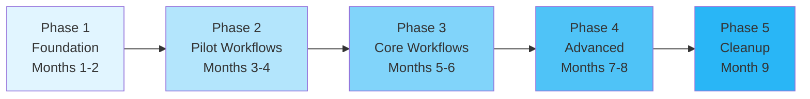

# Migration Strategy: From Task Engine to Workflow Orchestration

**Document Purpose:** Comprehensive strategy for migrating from the current task engine to workflow orchestration

**Last Updated:** October 22, 2025

---

## Table of Contents

1. [Migration Overview](#migration-overview)
2. [Current State Analysis](#current-state-analysis)
3. [Target State Architecture](#target-state-architecture)
4. [Migration Approach](#migration-approach)
5. [Priority Workflows](#priority-workflows)
6. [Coexistence Patterns](#coexistence-patterns)
7. [Risk Mitigation](#risk-mitigation)
8. [Timeline and Effort](#timeline-and-effort)
9. [Success Criteria](#success-criteria)

---

## Migration Overview

### Executive Summary

The K-12 SEAA system currently has a **naive task engine** that lacks workflow orchestration capabilities. This migration strategy outlines a phased, incremental approach to introduce proper workflow management while maintaining system availability.

**Migration Goals:**
1. ✅ Implement workflow orchestration for complex processes
2. ✅ Maintain system availability during migration (zero downtime)
3. ✅ Minimize risk through incremental rollout
4. ✅ Enable coexistence of old task engine and new workflows
5. ✅ Provide clear path from current to future state

**Estimated Duration:** 6-9 months  
**Estimated Effort:** 4-6 FTE (Full-Time Equivalent developers)

---

## Current State Analysis

### Existing Task Engine Capabilities

**What Exists:**
```
┌─────────────────────────────────────────┐
│         Current Task Engine             │
├─────────────────────────────────────────┤
│ • Named tasks (e.g., "Upload Document") │
│ • Task types for grouping               │
│ • Task-workflow associations by name    │
│ • Administrative UI for task creation   │
│ • User-facing task lists (4 apps)       │
└─────────────────────────────────────────┘
```

**What's Missing:**
- ❌ Workflow state management
- ❌ Task sequencing and dependencies
- ❌ Workflow orchestration engine
- ❌ Event-driven progression
- ❌ Long-running workflow support
- ❌ Workflow instance tracking
- ❌ Compensation and error handling

### Data Model Assessment

**Existing Tables (Assumed):**
```sql
-- Current task engine schema
CREATE TABLE Tasks (
    TaskId INT PRIMARY KEY,
    TaskName NVARCHAR(200),
    TaskType NVARCHAR(100),
    Description NVARCHAR(MAX),
    WorkflowName NVARCHAR(200), -- Association by name only
    CreatedBy INT,
    CreatedAt DATETIME2
);

CREATE TABLE UserTasks (
    UserTaskId INT PRIMARY KEY,
    TaskId INT,
    UserId INT,
    Status NVARCHAR(50), -- e.g., "Pending", "Complete"
    AssignedAt DATETIME2,
    CompletedAt DATETIME2
);

-- Problem: No workflow instance or state tracking
```

---

## Target State Architecture

### Future Workflow Architecture

```
┌───────────────────────────────────────────────────────┐
│           Workflow Orchestration System               │
├───────────────────────────────────────────────────────┤
│                                                        │
│  ┌──────────────────────┐  ┌─────────────────────┐   │
│  │  Azure Durable       │  │  Elsa Workflows     │   │
│  │  Functions           │  │  Business Processes │   │
│  │  (Core Workflows)    │  │  (Complex Logic)    │   │
│  └──────────────────────┘  └─────────────────────┘   │
│                                                        │
│  ┌─────────────────────────────────────────────────┐  │
│  │         Azure Event Grid                        │  │
│  │         (Event Backbone)                        │  │
│  └─────────────────────────────────────────────────┘  │
│                                                        │
│  ┌─────────────────────────────────────────────────┐  │
│  │      Workflow State Store (Azure SQL)           │  │
│  └─────────────────────────────────────────────────┘  │
│                                                        │
└───────────────────────────────────────────────────────┘
          ↓                           ↓
┌──────────────────┐        ┌──────────────────┐
│  Legacy Task     │        │  Application     │
│  Engine          │        │  Services        │
│  (Maintained)    │        │  (New/Updated)   │
└──────────────────┘        └──────────────────┘
```

### New Data Model

```sql
-- Workflow definitions
CREATE TABLE WorkflowDefinitions (
    WorkflowDefinitionId INT PRIMARY KEY IDENTITY,
    WorkflowName NVARCHAR(200) NOT NULL,
    WorkflowType NVARCHAR(100), -- "DurableFunction", "ElsaWorkflow"
    Version INT NOT NULL,
    Definition NVARCHAR(MAX), -- JSON/XML definition
    IsActive BIT DEFAULT 1,
    CreatedAt DATETIME2 DEFAULT GETUTCDATE(),
    UNIQUE (WorkflowName, Version)
);

-- Workflow instances (running workflows)
CREATE TABLE WorkflowInstances (
    WorkflowInstanceId UNIQUEIDENTIFIER PRIMARY KEY DEFAULT NEWID(),
    WorkflowDefinitionId INT FOREIGN KEY REFERENCES WorkflowDefinitions,
    OrchestrationInstanceId NVARCHAR(200), -- For Durable Functions
    CurrentState NVARCHAR(100),
    Status NVARCHAR(50), -- "Running", "Completed", "Failed"
    StartedAt DATETIME2,
    CompletedAt DATETIME2,
    ContextData NVARCHAR(MAX), -- JSON with workflow variables
    INDEX IX_Status (Status, StartedAt)
);

-- Workflow tasks (generated by workflows)
CREATE TABLE WorkflowTasks (
    WorkflowTaskId UNIQUEIDENTIFIER PRIMARY KEY DEFAULT NEWID(),
    WorkflowInstanceId UNIQUEIDENTIFIER FOREIGN KEY REFERENCES WorkflowInstances,
    TaskName NVARCHAR(200),
    TaskType NVARCHAR(100),
    Status NVARCHAR(50),
    AssignedTo INT, -- UserId
    DueDate DATETIME2,
    CompletedAt DATETIME2,
    Sequence INT, -- Order in workflow
    DependsOn UNIQUEIDENTIFIER, -- Previous task
    INDEX IX_WorkflowInstance (WorkflowInstanceId, Sequence)
);

-- Bridge table for legacy compatibility
CREATE TABLE TaskWorkflowMapping (
    LegacyTaskId INT FOREIGN KEY REFERENCES Tasks,
    WorkflowTaskId UNIQUEIDENTIFIER FOREIGN KEY REFERENCES WorkflowTasks
);
```

---

## Migration Approach

### Phased Migration Strategy



### Phase 1: Foundation (Months 1-2)

**Objectives:**
- Set up workflow orchestration infrastructure
- Implement core framework and patterns
- Create bridge layer for coexistence

**Deliverables:**

1. **Infrastructure Setup**
   - Deploy Azure Durable Functions app
   - Deploy Elsa Workflows server (if using)
   - Set up Event Grid topics
   - Configure Azure Service Bus
   - Set up Application Insights monitoring

2. **Database Schema**
   - Create workflow tables (WorkflowDefinitions, WorkflowInstances, WorkflowTasks)
   - Create bridge tables (TaskWorkflowMapping)
   - Add indexes and constraints

3. **Core Framework**
   ```csharp
   // Workflow bridge service
   public interface IWorkflowBridgeService
   {
       Task<Guid> StartWorkflowForTaskAsync(int legacyTaskId);
       Task SyncTaskStatusAsync(Guid workflowInstanceId);
       Task<WorkflowStatus> GetWorkflowStatusAsync(int legacyTaskId);
   }
   
   public class WorkflowBridgeService : IWorkflowBridgeService
   {
       private readonly IDurableOrchestrationClient _durableClient;
       private readonly ITaskRepository _taskRepository;
       private readonly IWorkflowInstanceRepository _workflowRepository;
       
       public async Task<Guid> StartWorkflowForTaskAsync(int legacyTaskId)
       {
           // Get legacy task
           var task = await _taskRepository.GetByIdAsync(legacyTaskId);
           
           // Determine workflow type
           var workflowType = DetermineWorkflowType(task);
           
           // Start orchestration
           var instanceId = await _durableClient.StartNewAsync(
               workflowType,
               input: task);
           
           // Create workflow instance record
           var workflowInstance = await _workflowRepository.CreateAsync(new WorkflowInstance
           {
               WorkflowDefinitionId = GetWorkflowDefinitionId(workflowType),
               OrchestrationInstanceId = instanceId,
               Status = "Running",
               StartedAt = DateTime.UtcNow
           });
           
           // Create bridge mapping
           await CreateTaskMappingAsync(legacyTaskId, workflowInstance.Id);
           
           return workflowInstance.Id;
       }
   }
   ```

4. **Monitoring Dashboard**
   - Create Application Insights dashboard
   - Set up alerts for workflow failures
   - Create workflow status visualization

**Effort:** 2 FTE × 2 months = 4 person-months

---

### Phase 2: Pilot Workflows (Months 3-4)

**Objectives:**
- Migrate 2-3 simple workflows to validate approach
- Prove coexistence patterns work
- Gather feedback and refine

**Candidate Workflows:**
1. Document Upload Workflow (simple, low risk)
2. Email Notification Workflow (simple, fire-and-forget)
3. Provider Inquiry Workflow (moderate complexity)

**Example: Document Upload Migration**

**Before (Task Engine):**
```
Admin creates task:
- Task: "Upload disability documentation"
- Assigned to: Parent
- No orchestration
```

**After (Workflow):**
```csharp
[FunctionName("DocumentUploadOrchestrator")]
public static async Task RunOrchestrator(
    [OrchestrationTrigger] IDurableOrchestrationContext context)
{
    var request = context.GetInput<DocumentUploadRequest>();
    
    // Create user task (visible in UI)
    await context.CallActivityAsync("CreateUserTask", new
    {
        TaskName = "Upload disability documentation",
        AssignedTo = request.ParentUserId,
        WorkflowInstanceId = context.InstanceId
    });
    
    // Wait for document upload
    await context.WaitForExternalEvent("DocumentUploaded");
    
    // Validate document
    var validationResult = await context.CallActivityAsync<ValidationResult>(
        "ValidateDocument", request);
    
    if (validationResult.IsValid)
    {
        await context.CallActivityAsync("CompleteUserTask", context.InstanceId);
        await context.CallActivityAsync("SendConfirmationEmail", request);
    }
    else
    {
        await context.CallActivityAsync("RequestReupload", request);
    }
}
```

**Migration Steps:**
1. Implement workflow orchestration
2. Deploy to test environment
3. Enable for 10% of users (feature flag)
4. Monitor for 2 weeks
5. Gradually increase to 100%
6. Keep legacy task engine as fallback

**Success Metrics:**
- ✅ Workflow completes successfully for 95%+ cases
- ✅ Average completion time ≤ legacy system
- ✅ Zero production incidents
- ✅ Positive user feedback

**Effort:** 3 FTE × 2 months = 6 person-months

---

### Phase 3: Core Workflows (Months 5-6)

**Objectives:**
- Migrate critical business workflows
- Implement full event-driven architecture
- Achieve 50%+ of workflows migrated

**Priority Workflows (from [K-12 Workflow Analysis](./02-k12-workflow-analysis.md)):**

**Tier 1 (High Priority):**
1. ✅ ESA+ Application Processing
2. ✅ Opportunity Scholarship Application Processing
3. ✅ Award Activation
4. ✅ School Payment Processing
5. ✅ ClassWallet Disbursement

**Migration Approach per Workflow:**

1. **Analysis** (1 week)
   - Document current flow
   - Identify decision points
   - Map integrations
   - Define state model

2. **Design** (1 week)
   - Design workflow definition
   - Create state diagram
   - Define activities
   - Design error handling

3. **Implementation** (2-3 weeks)
   - Implement orchestrator
   - Implement activities
   - Write unit tests
   - Write integration tests

4. **Testing** (1 week)
   - QA testing
   - UAT with stakeholders
   - Performance testing
   - Security review

5. **Rollout** (1 week)
   - Deploy to test
   - Feature flag to 10%
   - Monitor and adjust
   - Increase to 100%

**Example: ESA+ Application Processing Migration**

**Feature Flag Configuration:**
```json
{
  "features": {
    "UseWorkflowOrchestration": {
      "enabled": true,
      "workflows": {
        "ESAPlusApplication": {
          "enabled": true,
          "rolloutPercentage": 100,
          "fallbackEnabled": true
        }
      }
    }
  }
}
```

**Application Service with Feature Flag:**
```csharp
public class ApplicationService : IApplicationService
{
    private readonly IFeatureManager _featureManager;
    private readonly ILegacyTaskEngine _legacyEngine;
    private readonly IWorkflowOrchestrator _orchestrator;
    
    public async Task<Guid> SubmitApplicationAsync(Application application)
    {
        var useWorkflow = await _featureManager.IsEnabledAsync(
            "UseWorkflowOrchestration.ESAPlusApplication");
        
        if (useWorkflow && ShouldUseWorkflow(application))
        {
            try
            {
                // Use new workflow orchestration
                return await _orchestrator.StartApplicationWorkflowAsync(application);
            }
            catch (Exception ex)
            {
                _logger.LogError(ex, "Workflow orchestration failed, falling back to legacy");
                
                // Fallback to legacy
                return await _legacyEngine.CreateApplicationTasksAsync(application);
            }
        }
        else
        {
            // Use legacy task engine
            return await _legacyEngine.CreateApplicationTasksAsync(application);
        }
    }
    
    private bool ShouldUseWorkflow(Application application)
    {
        // Additional logic for gradual rollout
        // e.g., based on user cohort, application type, etc.
        var rolloutPercentage = 100; // From config
        var hash = application.Id.GetHashCode();
        return Math.Abs(hash % 100) < rolloutPercentage;
    }
}
```

**Effort:** 4 FTE × 2 months = 8 person-months

---

### Phase 4: Advanced Workflows (Months 7-8)

**Objectives:**
- Migrate complex workflows
- Implement advanced patterns (saga, compensation)
- Achieve 80%+ workflows migrated

**Advanced Workflows:**
1. Provider Enrollment with background checks
2. Compliance Monitoring workflows
3. Year-End Rollover process
4. Multi-step Certification workflows
5. Audit Investigation workflows

**New Capabilities Introduced:**
- MassTransit Saga for distributed transactions
- Workflow versioning
- Compensation patterns
- Advanced error handling
- Workflow analytics

**Effort:** 3 FTE × 2 months = 6 person-months

---

### Phase 5: Cleanup and Optimization (Month 9)

**Objectives:**
- Migrate remaining workflows
- Deprecate legacy task engine
- Optimize performance
- Documentation and training

**Activities:**

1. **Remaining Workflow Migration**
   - Migrate simple/infrequent workflows
   - Consolidate workflow definitions
   - Remove redundant workflows

2. **Legacy Task Engine Deprecation**
   ```csharp
   // Mark legacy engine as deprecated
   [Obsolete("Use IWorkflowOrchestrator instead. Legacy task engine will be removed in v2.0")]
   public interface ILegacyTaskEngine
   {
       // ...
   }
   ```

3. **Performance Optimization**
   - Analyze workflow execution times
   - Optimize slow activities
   - Add caching where beneficial
   - Tune retry policies

4. **Documentation**
   - Create workflow developer guide
   - Document workflow patterns
   - Create troubleshooting guide
   - Update operational runbooks

5. **Training**
   - Train development team
   - Train operations team
   - Create video tutorials
   - Conduct workshops

**Effort:** 2 FTE × 1 month = 2 person-months

---

## Priority Workflows

### Workflow Migration Priority Matrix

| Workflow | Complexity | Business Value | Risk | Priority | Phase |
|----------|-----------|----------------|------|----------|-------|
| Document Upload | Low | Medium | Low | High | 2 |
| Email Notifications | Low | Medium | Low | High | 2 |
| ESA+ Application | High | Critical | Medium | Tier 1 | 3 |
| OS Application | High | Critical | Medium | Tier 1 | 3 |
| Award Activation | Medium | Critical | Low | Tier 1 | 3 |
| School Payment | High | Critical | Medium | Tier 1 | 3 |
| ClassWallet Disburse | High | Critical | High | Tier 1 | 3 |
| Provider Enrollment | High | High | Medium | Tier 2 | 4 |
| Compliance Monitoring | High | High | Low | Tier 2 | 4 |
| Year-End Rollover | High | High | High | Tier 2 | 4 |
| Certification | Medium | High | Low | Tier 2 | 4 |

---

## Coexistence Patterns

### Pattern 1: Feature Flag Toggle

**Use Case:** Gradual rollout with fallback

```csharp
public async Task ProcessApplication(Application app)
{
    if (await _features.IsEnabledAsync("NewWorkflowEngine"))
    {
        await _newWorkflow.ProcessAsync(app);
    }
    else
    {
        await _legacyEngine.ProcessAsync(app);
    }
}
```

### Pattern 2: Adapter Pattern

**Use Case:** Workflow generates tasks for legacy UI

```csharp
[FunctionName("CreateUserTaskForWorkflow")]
public static async Task CreateUserTask(
    [ActivityTrigger] WorkflowTaskRequest request,
    [Inject] ILegacyTaskRepository legacyTaskRepo)
{
    // Create task in legacy system so it appears in UI
    var legacyTask = await legacyTaskRepo.CreateAsync(new LegacyTask
    {
        TaskName = request.TaskName,
        TaskType = request.TaskType,
        AssignedTo = request.UserId,
        Status = "Pending",
        WorkflowInstanceId = request.WorkflowInstanceId // Link to workflow
    });
}
```

### Pattern 3: Event-Driven Sync

**Use Case:** Keep legacy and new systems in sync

```csharp
// Workflow publishes events
await _eventPublisher.PublishAsync(new TaskCompletedEvent
{
    WorkflowInstanceId = instanceId,
    TaskId = taskId
});

// Legacy system listens to events
[FunctionName("SyncLegacyTask")]
public static async Task SyncLegacyTask(
    [EventGridTrigger] EventGridEvent eventGridEvent,
    [Inject] ILegacyTaskRepository legacyRepo)
{
    var taskEvent = eventGridEvent.Data.ToObject<TaskCompletedEvent>();
    
    // Update legacy task status
    await legacyRepo.UpdateStatusAsync(taskEvent.TaskId, "Complete");
}
```

---

## Risk Mitigation

### Risk Assessment Matrix

| Risk | Probability | Impact | Mitigation |
|------|-------------|--------|------------|
| Workflow orchestration fails in production | Medium | High | Feature flags, fallback to legacy, extensive testing |
| Performance degradation | Low | Medium | Load testing, performance monitoring, optimization |
| Data inconsistency between systems | Medium | High | Event-driven sync, reconciliation jobs |
| Learning curve for team | High | Low | Training, documentation, pair programming |
| Third-party integration issues | Medium | High | Retry policies, circuit breakers, monitoring |

### Mitigation Strategies

1. **Feature Flags**
   - Enable instant rollback
   - Gradual rollout (10% → 50% → 100%)
   - A/B testing capabilities

2. **Fallback Mechanisms**
   ```csharp
   try
   {
       await _newWorkflow.ExecuteAsync(data);
   }
   catch (Exception ex)
   {
       _logger.LogError(ex, "Workflow failed, falling back to legacy");
       await _legacyEngine.ExecuteAsync(data);
   }
   ```

3. **Reconciliation Jobs**
   ```csharp
   [FunctionName("ReconcileWorkflowsDaily")]
   public static async Task ReconcileWorkflows(
       [TimerTrigger("0 0 2 * * *")] TimerInfo timer)
   {
       // Find discrepancies between workflow instances and legacy tasks
       var discrepancies = await FindDiscrepanciesAsync();
       
       foreach (var discrepancy in discrepancies)
       {
           await ResolveDiscrepancyAsync(discrepancy);
       }
   }
   ```

4. **Comprehensive Testing**
   - Unit tests (80%+ coverage)
   - Integration tests
   - End-to-end tests
   - Load/stress tests
   - Chaos engineering (Netflix Chaos Monkey)

5. **Monitoring and Alerts**
   - Workflow success/failure rates
   - Execution duration
   - Error rates by workflow type
   - Integration health
   - Alerts for anomalies

---

## Timeline and Effort

### Gantt Chart

```
Month:     1    2    3    4    5    6    7    8    9
Phase 1:  [========]
Phase 2:       [========]
Phase 3:            [========]
Phase 4:                 [========]
Phase 5:                      [====]

Total: 9 months
```

### Resource Plan

| Phase | Duration | Resources | Effort (person-months) |
|-------|----------|-----------|----------------------|
| Phase 1: Foundation | 2 months | 2 FTE | 4 |
| Phase 2: Pilot | 2 months | 3 FTE | 6 |
| Phase 3: Core | 2 months | 4 FTE | 8 |
| Phase 4: Advanced | 2 months | 3 FTE | 6 |
| Phase 5: Cleanup | 1 month | 2 FTE | 2 |
| **Total** | **9 months** | **2-4 FTE** | **26 person-months** |

**Cost Estimate:**
- Developer rate: $100-150/hour
- 26 person-months × 160 hours/month = 4,160 hours
- Total: $416,000 - $624,000

**Plus Azure Infrastructure:**
- Azure Functions: ~$500-1,000/month
- Azure SQL: ~$500-1,000/month
- Event Grid: ~$100-200/month
- Service Bus: ~$200-500/month
- Application Insights: ~$200-400/month
- **Total**: ~$1,500-3,000/month

---

## Success Criteria

### Phase-Level Success Metrics

**Phase 1 (Foundation):**
- ✅ Infrastructure deployed and operational
- ✅ Database schema created and tested
- ✅ Framework code has 80%+ test coverage
- ✅ Monitoring dashboard live

**Phase 2 (Pilot):**
- ✅ 3 workflows migrated successfully
- ✅ 95%+ success rate for pilot workflows
- ✅ Zero critical production incidents
- ✅ Feature flags working correctly

**Phase 3 (Core):**
- ✅ 5 Tier 1 workflows migrated
- ✅ 50%+ of total workflows using orchestration
- ✅ Average workflow completion time ≤ legacy
- ✅ Positive stakeholder feedback

**Phase 4 (Advanced):**
- ✅ Complex workflows with compensation working
- ✅ 80%+ of workflows migrated
- ✅ Advanced patterns implemented and tested
- ✅ Saga pattern proven in production

**Phase 5 (Cleanup):**
- ✅ 100% of workflows migrated
- ✅ Legacy task engine deprecated
- ✅ Documentation complete
- ✅ Team trained

### Overall Success Criteria

1. **Functionality**
   - ✅ All workflows operational
   - ✅ Feature parity with legacy system
   - ✅ Enhanced capabilities (state tracking, monitoring)

2. **Performance**
   - ✅ 95th percentile latency ≤ legacy system
   - ✅ Throughput ≥ legacy system
   - ✅ Zero data loss

3. **Reliability**
   - ✅ 99.9% uptime
   - ✅ < 5 critical incidents during migration
   - ✅ < 1 hour MTTR (Mean Time To Recovery)

4. **Quality**
   - ✅ 80%+ code coverage
   - ✅ Zero P1/P2 bugs in production
   - ✅ Security audit passed

5. **Business**
   - ✅ Improved visibility into workflow status
   - ✅ Reduced manual intervention
   - ✅ Faster time to market for new workflows
   - ✅ Positive ROI within 12 months

---

## Conclusion

This migration strategy provides a comprehensive, phased approach to transitioning from the current task engine to a modern workflow orchestration system. The strategy emphasizes:

✅ **Incremental Migration** - Phased rollout minimizes risk  
✅ **Coexistence** - Legacy and new systems work side-by-side  
✅ **Risk Mitigation** - Feature flags, fallbacks, monitoring  
✅ **Clear Timeline** - 9-month roadmap with defined milestones  
✅ **Success Metrics** - Measurable criteria for each phase  

By following this strategy, the K-12 SEAA system can achieve modern workflow orchestration while maintaining system stability and user trust.

---

**Document Version:** 1.0  
**Last Updated:** October 22, 2025  
**Next Review:** Monthly during migration
