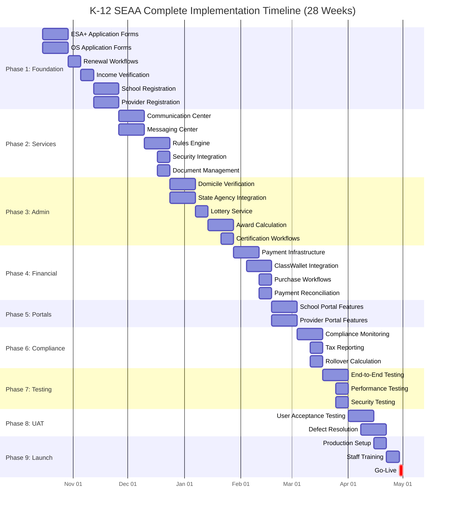

# K-12 SEAA Comprehensive Implementation Plan
## IT Stakeholder Presentation - Complete Scope Analysis

**Presentation Date:** October 2025  
**Timeline:** October 15, 2025 - May 1, 2026 (28 weeks)  
**Audience:** IT Leadership & Business Stakeholders  
**Purpose:** Complete project scope and implementation roadmap

---

## Executive Summary

The K-12 SEAA modernization project encompasses comprehensive scholarship program management for North Carolina's ESA+ and Opportunity Scholarship programs. This document provides a complete inventory of all core features required for production launch by **May 1, 2026**.

**Critical Scope Areas:**
1. **Household & Student Management** - Application submission, renewals, profile management
2. **School Management** - Registration, certification, endorsement, payment tracking
3. **Provider Management** - Enrollment, approval, directory, invoicing
4. **Admin Portal Operations** - Application processing, verification, approvals, reporting
5. **Payment & Financial Systems** - Award calculation, lottery, disbursements, reconciliation
6. **Verification & Compliance** - Eligibility verification, domicile, income, mandatory reviews

**Platform Serves:**
- Up to 80,000 concurrent users
- Two scholarship programs (ESA+, Opportunity Scholarship)
- Four web portals (Household, School, Provider, Admin)
- Multiple external integrations (ClassWallet, PandaDocs, State Agencies, Payment Rails)

---

## Complete Feature Inventory

### 1. HOUSEHOLD & STUDENT MANAGEMENT

#### 1.1 Application Workflows
**ESA+ New Application:**
- Student eligibility form (age, grade, disability documentation)
- Household income verification
- Domicile verification (multiple evidence types)
- Eligibility Determination Document (EDD) upload and validation
- 7-day deadline enforcement for EDD submission
- IEP/504 plan documentation
- Prior public school enrollment verification
- Parent agreement signature (PandaDocs integration)
- LEA Release form (for full-time nonpublic/home school)
- School selection and type determination
- Application status tracking and notifications

**Opportunity Scholarship New Application:**
- Student basic information (age, grade, demographics)
- Household composition and income data
- Income verification selection (4% sampling)
- IRS transcript upload for verified households
- Income calculation and eligibility determination
- Domicile verification workflow
- Application submission and confirmation
- Lottery participation (if funding limited)
- Award offer acceptance workflow
- Parent agreement signature
- School selection (Direct Payment schools only)
- Application status tracking

#### 1.2 Renewal & Continuing Eligibility
- Annual renewal application (simplified workflow)
- ESA+ continuing eligibility requirements
  - Minimum spending verification ($1,000 threshold)
  - School enrollment status confirmation
  - Updated household information
  - Disability status reconfirmation
- OS renewal workflow
  - Income re-verification (if required)
  - School enrollment confirmation
  - Award amount recalculation
- Deadline management and reminders
- Auto-renewal processing for eligible students
- Non-renewal notifications and appeals

#### 1.3 Student Profile & Account Management
- Student demographic information
- Household member management
- Contact information updates
- Document storage and retrieval
- Communication preferences
- Award history and status
- Payment history tracking
- Account security (password, MFA)

#### 1.4 School Selection & Transfers
- School search and directory browsing
- Direct Payment vs Reimbursement school identification
- School enrollment confirmation
- Mid-year transfer requests
- Transfer deadline enforcement
- Enrollment verification with schools
- Impact on award and payment schedules
- Transfer notification workflows

#### 1.5 Communication & Notifications
- To-Do list and task management
- Email notifications (application status, deadlines, payments)
- In-app messaging and alerts
- Document upload reminders
- Deadline approaching warnings
- Payment disbursement confirmations
- Banner/modal alerts for critical actions
- SMS notifications (optional)

---

### 2. SCHOOL MANAGEMENT

#### 2.1 School Registration & Profile
- School registration workflow
- DNPE registration verification
- School type classification (Direct Payment, Reimbursement, Home School)
- School demographic information
- Contact information management
- Banking information for ACH payments
- School administrator accounts and roles
- Background check requirements for leadership
- School profile updates and changes

#### 2.2 Student Enrollment Management
- Student roster management
- Enrollment confirmation workflows
- Semester enrollment updates
- Student withdrawal processing
- Transfer student acceptance
- Enrollment reporting to SEAA
- Grade level tracking
- Enrollment capacity management

#### 2.3 Certification & Endorsement
**Annual School Certification:**
- Certification deadline tracking (varies by program)
- Tuition and fee amount confirmation
- Enrollment verification for each student
- Certification submission workflow
- Reminder notifications (escalating)
- Late certification handling
- Certification approval process

**Semester Parent Endorsement:**
- Parent endorsement request generation
- Case-sensitive signature validation
- Endorsement deadline enforcement
- Reminder notifications to parents
- Endorsement status tracking
- Payment dependency on endorsement completion
- Bulk endorsement processing

#### 2.4 Payment & Financial Management
- Payment schedule visibility
- Expected payment calculations
- Payment disbursement tracking
- ACH deposit confirmations
- Payment reconciliation
- Dual award allocation (OS + ESA+)
- Tuition crediting workflows
- Refund processing (if applicable)
- Payment history and reporting

#### 2.5 Compliance & Reporting
**Testing Requirements:**
- Standardized test administration
- Test results submission (July 15 deadline)
- Grade level testing requirements (3-12)
- National achievement test selection
- Results reporting to SEAA
- Non-compliance notifications

**Financial Review Requirements:**
- 70+ student threshold monitoring
- CPA financial review requirement
- Review submission and approval
- Audit findings remediation

**Background Checks:**
- School leadership background check tracking
- Disqualifying offense identification
- Check renewal requirements
- Compliance reporting

#### 2.6 School Portal Features
- Dashboard with key metrics
- Student scholarship list and status
- Payment schedule and history
- Certification and endorsement tracking
- Document upload and management
- Communication center (emails, alerts)
- Reporting and analytics
- Help and support resources

---

### 3. PROVIDER MANAGEMENT

#### 3.1 Provider Registration & Enrollment
- Provider application submission
- Business information and credentials
- Service category selection
- Background check processing
- License and certification verification
- Banking information for payments
- Provider agreement signature
- Approval workflow and review
- Provider status management
- Profile updates and changes

#### 3.2 Provider Directory
- Public provider search functionality
- Category-based browsing
- Service area and location filters
- Provider ratings and reviews (future)
- Contact information display
- Service offerings and descriptions
- Provider profile pages
- Directory maintenance and updates

#### 3.3 Invoice & Payment Processing
- Invoice submission workflow
- Purchase request matching
- Invoice validation and approval
- Payment processing via ClassWallet
- Payment confirmation and tracking
- Invoice dispute resolution
- Payment history and reporting
- Reconciliation workflows

#### 3.4 Compliance & Quality
- Provider credential maintenance
- Annual review requirements
- Service quality monitoring
- Complaint tracking and resolution
- Provider suspension/termination workflows
- Compliance reporting
- Provider performance metrics

---

### 4. ADMIN PORTAL OPERATIONS

#### 4.1 Application Processing & Review
**Application Intake:**
- Application queue management
- Application review workflows
- Document verification
- Completeness checking
- Data validation and correction
- Exception handling
- Assignment to reviewers
- Processing status tracking

**Eligibility Determination:**
- Eligibility criteria evaluation
- Income calculation and verification
- Domicile verification review
- Disability documentation review
- Exception and appeal handling
- Eligibility decision recording
- Decision notification workflows

#### 4.2 Verification Management
**Domicile Verification:**
- Electronic verification via state agencies:
  - DMV (driver's license/ID verification)
  - DPI (public school enrollment)
  - Department of Revenue (tax filing)
  - DHHS (public benefits)
  - Department of Commerce (public benefits)
  - State Board of Elections (voter registration)
- Document evidence review (utility bills, bank statements, etc.)
- Multi-evidence coordination
- Verification result tracking
- Failure handling and appeals
- Manual override capabilities

**Income Verification (OS):**
- 4% random sample selection
- Error-prone application identification
- Verification notification generation
- IRS transcript validation
- Income calculation review
- Extension request processing
- Non-compliance handling
- Verification completion tracking

**Application Verification Sampling:**
- Random selection algorithm (4% of applications)
- Error-prone criteria identification
- Verification case creation
- Document request workflows
- Review and approval process
- Non-cooperation handling
- Award revocation for non-compliance

#### 4.3 Award Management
**Lottery Administration:**
- Lottery batch creation
- Random selection processing
- Priority period preference handling
- Award offer generation
- Waitlist management
- Lottery results communication
- Audit trail maintenance

**Award Calculation:**
- ESA+ award amount determination ($9,000 vs $17,000)
- OS tiered award calculation (income-based)
- Dual award ordering logic
- Per pupil allocation integration (DPI data)
- Annual award adjustments
- Award recalculation for changes
- Award cap enforcement

**Award Lifecycle:**
- Award offer management
- Acceptance deadline tracking
- Award activation
- Mid-year adjustments
- Award suspension/termination
- Renewal processing
- Award history tracking

#### 4.4 Document Management
- Document upload processing
- Document type classification
- Virus scanning and validation
- Document review workflows
- Approval/rejection processing
- Document storage and retrieval
- Secure access controls
- Document lifecycle management
- PandaDocs integration for e-signatures
- Document To-Do generation and tracking

#### 4.5 Communication & Case Management
- Bulk communication campaigns
- Email template management
- Scheduled notification triggers
- Deadline reminder automation
- Case assignment and tracking
- Escalation workflows
- Parent/school/provider correspondence
- Communication audit trail
- Exception queue management

#### 4.6 Reporting & Analytics
**Operational Dashboards:**
- Application pipeline status
- Processing time metrics
- Verification completion rates
- Award utilization tracking
- Payment disbursement status
- School compliance monitoring
- Provider activity metrics
- System performance indicators

**Compliance Reports:**
- Statutory reporting requirements
- Audit trail exports
- Financial reconciliation
- State agency coordination reports
- Verification completion reports
- Award distribution analysis
- Fraud detection indicators

**Business Intelligence:**
- Program participation trends
- Geographic distribution analysis
- Demographic insights
- Financial projections
- Resource allocation optimization
- Capacity planning
- Performance benchmarking

#### 4.7 System Administration
- User account management (RBAC)
- Role and permission configuration
- Security group management
- Microsoft Entra ID integration
- Audit logging
- System configuration
- Feature flag management
- Policy version control
- Help desk support tools

---

### 5. PAYMENT & FINANCIAL SYSTEMS

#### 5.1 Payment Processing Infrastructure
**Direct Payment Schools:**
- Payment schedule management (Aug/Sep and Jan/Feb cycles)
- Parent endorsement validation
- Tuition and fee calculation
- Dual award allocation (OS first, then ESA+)
- ACH payment file generation
- Bank integration and transmission
- Payment confirmation tracking
- Failed payment handling
- Payment reconciliation

**ESA+ Wallet (ClassWallet Integration):**
- Account provisioning
- Fund allocation after tuition payment
- Balance tracking
- Transaction logging
- Rollover calculation and processing
- Account closure handling

#### 5.2 ESA+ Purchasing & Expense Management
**Allowable Expense Categories:**
- Curriculum and educational materials
- Tutoring and educational services
- Educational technology
- Educational therapies
- Tuition and fees (school-related)
- Summer education programs
- Advanced placement exam fees
- National achievement tests
- Transportation services
- Educational software subscriptions

**Purchase Request Processing:**
- On-marketplace purchase workflow
- Off-marketplace invoice submission
- Category validation
- Expense documentation requirements
- Approval/rejection workflow
- Rejection code assignment
- Purchase approval notifications
- Payment to vendors
- Transaction recording

**Purchase Rules Engine:**
- Prohibited expense detection
- Accessory purchase timing (30-day window)
- Accessory frequency limits
- Summer purchasing pause enforcement
- Category-specific requirements
- Documentation validation
- Automatic approval criteria
- Manual review triggers

#### 5.3 Financial Compliance
**Minimum Spending (ESA+):**
- Annual spending calculation
- $1,000 threshold enforcement
- Non-renewal for insufficient spending
- Appeal process handling
- Exception tracking

**Rollover Management (ESA+):**
- Eligible award identification (higher award only)
- Annual rollover calculation
- $4,500 annual cap enforcement
- $30,000 lifetime cap enforcement
- Excess fund return to SEAA
- Rollover notification to families

**Tax Reporting:**
- 1099-G preparation for non-tuition ESA+ spending
- Parent tax statement generation
- IRS filing requirements
- Annual tax deadline tracking
- Tax document distribution

#### 5.4 Payment Reconciliation & Audit
- Daily payment transaction reconciliation
- School payment verification
- ClassWallet transaction matching
- Provider payment confirmation
- Discrepancy identification and resolution
- Refund processing
- Audit trail maintenance
- Financial reporting to stakeholders
- Compliance verification

---

### 6. VERIFICATION & COMPLIANCE SYSTEMS

#### 6.1 State Agency Integration Platform
**Agency Integration Framework:**
- DMV integration (driver's license/ID verification)
- DPI integration (school enrollment, per pupil allocation)
- Department of Revenue (tax filing verification)
- DHHS (public benefits verification)
- Department of Commerce (public benefits)
- State Board of Elections (voter registration)
- State CIO coordination

**Integration Capabilities:**
- Electronic verification request submission
- Response processing and validation
- Timeout and error handling
- Manual fallback workflows
- Data privacy and security compliance
- MOU and data use agreement enforcement
- Integration health monitoring
- Response time SLA tracking

#### 6.2 Eligibility Verification Workflows
**Domicile Determination:**
- G.S. 115C-366 implementation
- Multiple evidence type support
- Electronic verification priority
- Document upload alternatives
- Conflicting evidence resolution
- Temporary absence handling
- Mid-year domicile change processing
- Verification result notification

**Disability Verification (ESA+):**
- Eligibility Determination Document validation
- IEP/504 plan review
- Prior public school enrollment verification
- Disability category verification
- Re-evaluation requirements
- Documentation completeness checking

**Income Verification (OS):**
- Income calculation worksheet processing
- IRS transcript validation
- Income tier determination
- Verification sample selection
- Extension request handling
- Non-compliance processing

#### 6.3 Ongoing Compliance Monitoring
**Annual Verifications:**
- Per pupil allocation update (DPI, December 1 deadline)
- School testing compliance (July 15 deadline)
- School financial reviews (70+ students)
- Provider credential renewals
- Background check renewals
- Enrollment verification
- Award eligibility reconfirmation

**Mandatory Reviews:**
- Verification sampling (4% of applications)
- Error-prone application identification
- Random selection processing
- Documentation submission tracking
- Review completion monitoring
- Non-cooperation handling
- Award revocation workflows

#### 6.4 Audit & Compliance Reporting
- Immutable event logging
- Compliance audit trail
- Regulatory reporting
- Statutory requirement verification
- Policy adherence monitoring
- Exception tracking and analysis
- Fraud detection indicators
- External audit support

---

## Cross-Cutting Platform Services

### 7.1 Communication Center
- Email template engine (program-specific templates)
- Scheduled campaign management
- Event-triggered notifications
- Deadline reminder automation
- Multi-channel delivery (Email, SMS, Print/Mail)
- Communication audit logging
- Template versioning
- Localization support (EN/ES)

### 7.2 Messaging Center
- In-app notification system
- Banner alerts
- Modal dialogs
- Message inbox
- To-Do task orchestration
- Read/unread tracking
- Notification preferences
- Real-time updates

### 7.3 Rules Engine
- Eligibility calculation rules
- Income verification rules
- Award calculation logic
- Lottery selection rules
- Deadline management rules
- Purchase approval rules
- Compliance requirement rules
- Policy versioning (by program year)
- Rule audit trail

### 7.4 Document Service
- Secure document storage (Azure Blob)
- Document type management
- Virus scanning
- Document lifecycle management
- Access control and permissions
- PandaDocs e-signature integration
- Document search and retrieval
- Retention policy enforcement

### 7.5 Identity & Security
- Microsoft Entra ID integration
- Role-based access control (RBAC)
- Multi-factor authentication
- Single sign-on (SSO)
- Permission management
- Group synchronization
- Security audit logging
- Session management

### 7.6 Query & Reporting
- Cube.js reporting layer
- Ad-hoc query builder
- Pre-built report templates
- Data export capabilities
- Scheduled report generation
- Dashboard visualizations
- Data access controls
- Performance optimization

---

## Implementation Roadmap (October 15, 2025 - May 1, 2026)

### Phase 1: Foundation & Core Applications (Weeks 1-8)

**Weeks 1-4 (Oct 15 - Nov 11):**
- ✅ ESA+ application forms (reactive forms) - 2 weeks
- ✅ Opportunity Scholarship application forms - 2 weeks
- ✅ Application submission workflows
- ✅ Document upload integration
- ✅ Basic student profile management
- ✅ Application status tracking

**Weeks 5-8 (Nov 12 - Dec 9):**
- ✅ Renewal workflows (both programs) - 1 week
- ✅ Income verification workflow - 1 week
- ✅ Eligibility determination submission - 1 week
- ✅ Household profile management - 1 week
- ✅ School registration and profile - 2 weeks
- ✅ Provider registration workflow - 2 weeks

### Phase 2: Cross-Cutting Services & Integration (Weeks 9-12)

**Weeks 9-10 (Dec 10 - Dec 23):**
- ✅ Communication Center (email templates, triggers) - 2 weeks
- ✅ Messaging Center (in-app notifications) - 2 weeks
- ✅ Microsoft Entra Security integration - 1 week
- ✅ Document Management (PandaDocs) - 1 week

**Weeks 11-12 (Dec 24 - Jan 6):**
- ✅ Rules Engine integration - 2 weeks
- ✅ Query Builder (Cube.js) foundation - 1 week
- ✅ Basic reporting dashboards - 1 week

### Phase 3: Advanced Workflows & Admin Features (Weeks 13-16)

**Weeks 13-14 (Jan 7 - Jan 20):**
- ✅ Domicile verification workflows - 2 weeks
- ✅ State agency integration framework - 2 weeks
- ✅ Verification sampling service - 1 week
- ✅ Admin application review workflows - 1 week

**Weeks 15-16 (Jan 21 - Feb 3):**
- ✅ Lottery service implementation - 1 week
- ✅ Award calculation engine - 2 weeks
- ✅ Award lifecycle management - 1 week
- ✅ School certification workflows - 1 week
- ✅ Parent endorsement workflows - 1 week

### Phase 4: Financial & Payment Systems (Weeks 17-18)

**Weeks 17-18 (Feb 4 - Feb 17):**
- ✅ Payment processing infrastructure - 2 weeks
- ✅ ACH payment file generation - 1 week
- ✅ ClassWallet integration - 2 weeks
- ✅ ESA+ purchase request workflows - 1 week
- ✅ Expense approval rules engine - 1 week
- ✅ Payment reconciliation - 1 week

### Phase 5: School & Provider Portals (Weeks 19-20)

**Weeks 19-20 (Feb 18 - Mar 3):**
- ✅ School portal features - 2 weeks
  - Dashboard and metrics
  - Student roster management
  - Certification and endorsement
  - Payment tracking
- ✅ Provider portal features - 2 weeks
  - Provider directory
  - Invoice submission
  - Payment tracking

### Phase 6: Compliance & Reporting (Weeks 21-22)

**Weeks 21-22 (Mar 4 - Mar 17):**
- ✅ Compliance monitoring workflows - 2 weeks
- ✅ Testing requirement tracking - 1 week
- ✅ Financial review management - 1 week
- ✅ Background check tracking - 1 week
- ✅ Tax reporting (1099-G) - 1 week
- ✅ Rollover calculation - 1 week
- ✅ Minimum spending enforcement - 1 week

### Phase 7: Testing & Quality Assurance (Weeks 23-24)

**Weeks 23-24 (Mar 18 - Mar 31):**
- ✅ End-to-end workflow testing - 2 weeks
- ✅ Performance and load testing (80K users) - 1 week
- ✅ Security testing and penetration testing - 1 week
- ✅ Integration testing (all external systems) - 2 weeks
- ✅ User acceptance testing preparation - 1 week

### Phase 8: UAT & Refinement (Weeks 25-26)

**Weeks 25-26 (Apr 1 - Apr 14):**
- ✅ User acceptance testing - 2 weeks
- ✅ Defect resolution - 2 weeks
- ✅ Performance optimization - 1 week
- ✅ User feedback incorporation - 1 week

### Phase 9: Production Preparation (Weeks 27-28)

**Weeks 27-28 (Apr 15 - Apr 28):**
- ✅ Production environment setup - 1 week
- ✅ Data migration and validation - 1 week
- ✅ Staff training - 1 week
- ✅ Documentation finalization - 1 week
- ✅ Go-live preparation - 3 days
- ✅ **Production launch - May 1, 2026** ✅

---

## Detailed Gantt Chart

---

## Resource Allocation

### Development Teams (6-8 FTE)

**Frontend Team (2-3 FTE):**
- Angular application development
- Reactive forms implementation
- Portal UI components
- Responsive design
- Accessibility compliance

**Backend Team (2-3 FTE):**
- .NET API development
- Business logic implementation
- Database schema design
- Integration development
- Performance optimization

**Integration Team (1-2 FTE):**
- External system integration
- ClassWallet API
- PandaDocs integration
- State agency connections
- Payment rails integration

**QA Team (1-2 FTE):**
- Test plan development
- Automated testing
- Manual testing
- UAT coordination
- Defect tracking

### Subject Matter Experts (Part-time)

- Business analyst (requirements)
- DBA (database optimization)
- Security specialist (compliance)
- DevOps engineer (infrastructure)
- Technical writer (documentation)

---

## Risk Assessment & Mitigation

### High-Risk Areas

**1. State Agency Integrations**
- **Risk:** Multiple agencies, varying APIs, unknown response times
- **Mitigation:** 
  - Early integration testing
  - Fallback to manual workflows
  - Regular status monitoring
  - Agency coordination meetings

**2. ClassWallet Integration**
- **Risk:** Complex workflows, vendor dependency, webhook reliability
- **Mitigation:**
  - Sandbox testing early
  - Idempotency for transactions
  - Error handling and retry logic
  - Regular vendor communication

**3. Payment Processing**
- **Risk:** Financial transactions, regulatory compliance, ACH accuracy
- **Mitigation:**
  - Comprehensive testing
  - Reconciliation workflows
  - Audit trail maintenance
  - Financial controls

**4. Data Migration**
- **Risk:** Legacy data quality, volume, complexity
- **Mitigation:**
  - Data profiling early
  - Migration testing
  - Phased migration approach
  - Rollback procedures

**5. Performance at Scale**
- **Risk:** 80,000 concurrent users, peak load periods
- **Mitigation:**
  - Load testing early and often
  - Performance monitoring
  - Caching strategies
  - Infrastructure scaling

### Medium-Risk Areas

- User adoption and training
- Scope creep
- Resource availability
- Third-party delays
- Defect escape rate

---

## Success Criteria

### Delivery Milestones
- ✅ Phase 1 complete by December 9, 2025
- ✅ Cross-cutting services by December 23, 2025
- ✅ Admin features by February 3, 2026
- ✅ Financial systems by February 17, 2026
- ✅ Portal features by March 3, 2026
- ✅ Testing complete by March 31, 2026
- ✅ UAT approved by April 14, 2026
- ✅ **Production launch May 1, 2026** ✅

### Quality Metrics
- Zero critical data integrity issues
- Platform supports 80,000+ concurrent users
- <2% defect escape rate post-UAT
- 95%+ user satisfaction
- 100% regulatory compliance
- <3 second page load times
- 99.9% uptime during business hours

### Business Outcomes
- ESA+ and OS applications processed without manual intervention
- Award calculations automated and auditable
- Payment disbursements on schedule
- Reduced support call volume
- Staff productivity gains
- Improved user experience
- Complete audit trail for compliance

---

## Dependencies & Prerequisites

### External Dependencies
1. **ClassWallet API** - ESA+ purchasing, wallet management
2. **PandaDocs API** - Document e-signatures
3. **State Agencies** - DMV, DPI, Revenue, DHHS, Commerce, Elections
4. **Payment Rails** - ACH disbursement infrastructure
5. **Email/SMS Providers** - Communication delivery
6. **Azure Services** - Hosting, storage, identity

### Technical Prerequisites
1. Microsoft Entra ID tenant configured
2. Azure subscription and resources
3. Development and staging environments
4. CI/CD pipeline established
5. Monitoring and logging infrastructure
6. Backup and disaster recovery

### Organizational Prerequisites
1. Project governance structure
2. Stakeholder approval process
3. Change management procedures
4. Training program development
5. Support team readiness
6. Communication plan execution

---

## Appendix: Feature-to-Phase Mapping

### Household Portal Features
| Feature | Phase | Weeks |
|---------|-------|-------|
| Application Forms | 1 | 1-4 |
| Renewal Workflows | 1 | 5-8 |
| Profile Management | 1 | 5-8 |
| School Selection | 1 | 5-8 |
| Document Upload | 1 | 1-4 |
| Communication Center | 2 | 9-10 |
| To-Do Lists | 2 | 9-10 |
| Award Acceptance | 3 | 13-16 |
| Payment History | 4 | 17-18 |
| Purchase Requests | 4 | 17-18 |

### School Portal Features
| Feature | Phase | Weeks |
|---------|-------|-------|
| School Registration | 1 | 5-8 |
| Student Roster | 5 | 19-20 |
| Certification | 3 | 13-16 |
| Endorsement | 3 | 13-16 |
| Payment Tracking | 5 | 19-20 |
| Testing Compliance | 6 | 21-22 |
| Financial Review | 6 | 21-22 |
| Dashboard | 5 | 19-20 |

### Provider Portal Features
| Feature | Phase | Weeks |
|---------|-------|-------|
| Provider Registration | 1 | 5-8 |
| Provider Directory | 5 | 19-20 |
| Invoice Submission | 4 | 17-18 |
| Payment Tracking | 5 | 19-20 |
| Credential Management | 6 | 21-22 |

### Admin Portal Features
| Feature | Phase | Weeks |
|---------|-------|-------|
| Application Review | 3 | 13-16 |
| Eligibility Determination | 3 | 13-16 |
| Verification Management | 3 | 13-16 |
| Lottery Administration | 3 | 13-16 |
| Award Management | 3 | 13-16 |
| Payment Processing | 4 | 17-18 |
| Compliance Monitoring | 6 | 21-22 |
| Reporting & Analytics | 6 | 21-22 |
| Document Management | 2 | 9-10 |
| Communication Management | 2 | 9-10 |

---

## Conclusion

This comprehensive implementation plan provides a complete roadmap for delivering all core K-12 SEAA features by the **May 1, 2026 hard deadline**. The plan is:

✅ **Complete** - All features from DDD analysis included  
✅ **Achievable** - 28-week timeline with appropriate phasing  
✅ **Balanced** - Parallel development where possible  
✅ **Risk-Aware** - Mitigation strategies for high-risk areas  
✅ **Realistic** - Based on proven technology patterns  

**Next Steps:**
1. Stakeholder review and approval
2. Resource allocation confirmation
3. Sprint planning and team assignments
4. Kickoff and execution
5. Weekly progress monitoring
6. Risk management and adjustment

**Success depends on:**
- Clear prioritization and scope control
- Adequate resource allocation
- Timely stakeholder decisions
- Effective communication
- Proactive risk management
- Quality focus throughout

With disciplined execution, the K-12 SEAA modernization project will meet its May 1, 2026 commitment and deliver a comprehensive, compliant, and scalable platform for North Carolina's scholarship programs.
