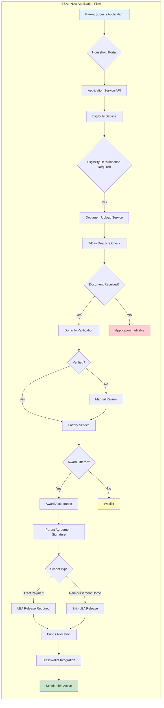
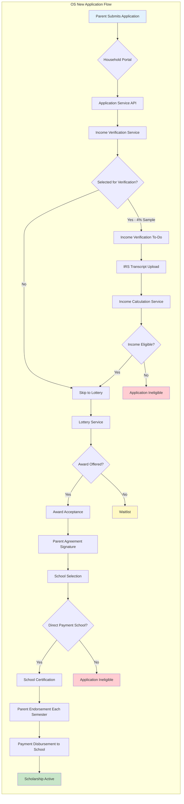
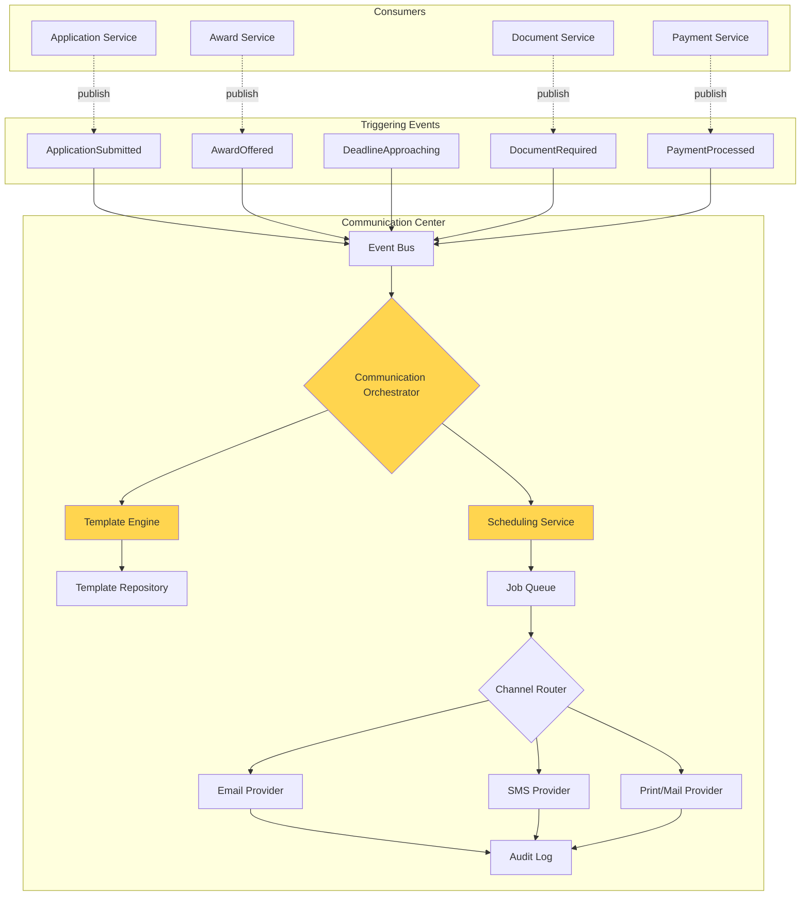
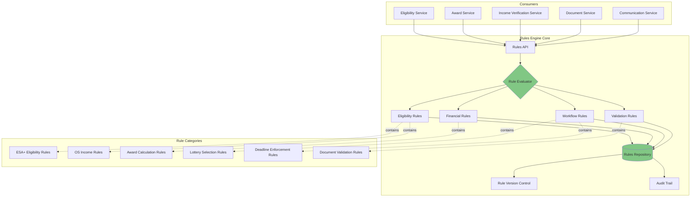
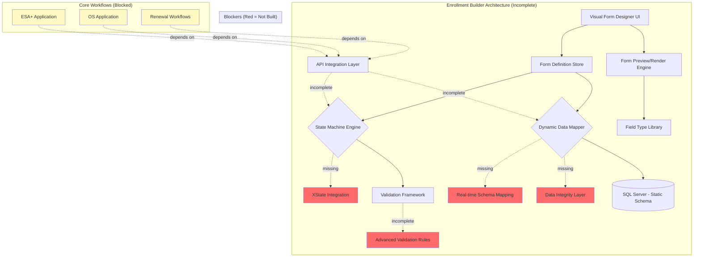

# System Dependencies & Architecture Map

## SEAA K-12 Platform Architecture Overview

This document provides detailed dependency mapping for the modernization project, showing relationships between components, critical paths, and integration points.

---

## High-Level Architecture Diagram

```mermaid
graph TB
    subgraph "User-Facing Applications (Angular SPAs)"
        A1[Household Portal]
        A2[School Portal]
        A3[Provider Portal]
        A4[Admin Portal]
    end
    
    subgraph "API Gateway Layer"
        B1[Azure APIM]
    end
    
    subgraph "Backend Services (.NET)"
        C1[Application Service]
        C2[Eligibility Service]
        C3[Award Service]
        C4[Payment Service]
        C5[Communication Service]
        C6[Document Service]
        C7[Rules Engine]
        C8[Identity Service]
    end
    
    subgraph "Cross-Cutting Infrastructure"
        D1[Communication Center]
        D2[Messaging Center]
        D3[Rules Engine Core]
        D4[Microsoft Entra Security]
        D5[Document Management]
        D6[Query Builder]
    end
    
    subgraph "Data Layer"
        E1[(SQL Server)]
        E2[(Blob Storage)]
    end
    
    subgraph "External Integrations"
        F1[ClassWallet API]
        F2[PandaDocs API]
        F3[State Agency APIs]
        F4[Payment Rails]
        F5[Email/SMS Providers]
    end
    
    A1 --> B1
    A2 --> B1
    A3 --> B1
    A4 --> B1
    
    B1 --> C1
    B1 --> C2
    B1 --> C3
    B1 --> C4
    B1 --> C5
    B1 --> C6
    B1 --> C7
    B1 --> C8
    
    C1 --> D1
    C1 --> D3
    C2 --> D3
    C3 --> D3
    C4 --> F4
    C5 --> D1
    C5 --> D2
    C6 --> D5
    C6 --> F2
    C7 --> D3
    C8 --> D4
    
    C1 --> E1
    C2 --> E1
    C3 --> E1
    C4 --> E1
    C5 --> E1
    C6 --> E2
    
    C1 --> F1
    C2 --> F3
    C5 --> F5
    
    style A1 fill:#4a90e2
    style A2 fill:#4a90e2
    style A3 fill:#4a90e2
    style A4 fill:#4a90e2
    style C1 fill:#7ed321
    style C2 fill:#7ed321
    style C3 fill:#7ed321
    style C4 fill:#7ed321
```



---

## Core Workflow Dependencies

### ESA+ Application Workflow



**Key Dependencies:**
1. **Household Portal** → Application Service → Eligibility Service
2. **Document Service** → 7-day deadline enforcement
3. **Domicile Verification** → State Agency APIs (DMV, DPI, Revenue, etc.)
4. **Lottery Service** → Award Service → Rules Engine
5. **Parent Agreement** → Document Management (PandaDocs)
6. **ClassWallet** → External API integration

**Critical Path Items:**
- Eligibility determination submission (7-day window)
- Domicile verification response time
- Document signature workflow (PandaDocs)
- ClassWallet account provisioning

---

### Opportunity Scholarship Application Workflow



**Key Dependencies:**
1. **Household Portal** → Application Service → Income Verification Service
2. **Income Verification** → Rules Engine (4% sampling logic)
3. **IRS Transcript** → Document Service → Document Management
4. **Income Calculation** → Rules Engine (complex income rules)
5. **Lottery** → Award Service
6. **School Selection** → School Registry (Direct Payment validation)
7. **Certification/Endorsement** → School Portal + Communication Service
8. **Payment** → Payment Service → Payment Rails

**Critical Path Items:**
- Income verification deadline enforcement
- IRS transcript validation
- School certification timing (annual)
- Parent endorsement timing (semester)
- Payment disbursement schedule (twice per year)

---

## Cross-Cutting Service Dependencies

### Communication Center Architecture



**Dependencies:**
- **Template Engine** requires program-specific templates (ESA+, OS)
- **Scheduling Service** requires deadline data from Rules Engine
- **Event Bus** requires domain events from all services
- **Audit Log** required for regulatory compliance
- **External Providers** require API keys and configuration

**Integration Points:**
- Application Service publishes domain events
- Award Service triggers award notifications
- Document Service triggers To-Do notifications
- Payment Service triggers disbursement confirmations

---

### Rules Engine Architecture



**Critical Rules:**
1. **ESA+ Eligibility:**
   - Disability determination requirement
   - 7-day submission deadline
   - North Carolina residency (domicile)
   - Grade level (K-12)

2. **OS Income Eligibility:**
   - Household income thresholds (tiered)
   - Family size calculations
   - Income verification sampling (4%)
   - IRS transcript validation

3. **Award Calculations:**
   - ESA+ base ($9,000) vs higher ($17,000) amounts
   - OS tiered amounts based on income
   - Dual award ordering (OS first, then ESA+)
   - Minimum spending requirements (ESA+)

4. **Lottery Rules:**
   - Random selection algorithm
   - Priority period preferences
   - Funding exhaustion handling
   - Waitlist ordering

5. **Deadline Rules:**
   - Application windows (priority vs open)
   - Eligibility document deadline (7 days)
   - Award acceptance deadline
   - Certification deadline (annual)
   - Endorsement deadline (semester)

**Dependencies:**
- Rules must be externalized (not hardcoded)
- Version control required for audit trail
- Annual updates synchronized with legislative changes
- Integration with all business services

---

## Enrollment Builder vs Reactive Forms Comparison

### Option A: Enrollment Builder Dependencies (COMPLEX)



**Dependency Analysis:**
- ❌ **State Machine:** Blocks workflow logic implementation
- ❌ **Data Mapper:** Blocks production data integrity
- ❌ **Validation Framework:** Blocks compliance readiness
- ❌ **API Integration:** Blocks backend service development
- ⚠️ **Core Workflows:** Cannot proceed until Builder complete

**Estimated Effort to Complete:**
- State Machine (XState): 3 weeks
- Data Mapping Layer: 4 weeks (HIGH RISK)
- Validation Framework: 2 weeks
- API Integration: 2 weeks
- Testing & Hardening: 6 weeks
- **Total: 17 weeks critical path**

---

### Option B: Reactive Forms Dependencies (SIMPLE)

```mermaid
graph TB
    subgraph "Angular Reactive Forms (Proven Pattern)"
        A[FormBuilder Service] --> B[FormGroup Definitions]
        B --> C[Typed Form Models]
        C --> D[Validation Directives]
        D --> E[Custom Validators]
        
        B --> F[Form Templates (HTML)]
        F --> G[Material UI Components]
        
        C --> H{API Integration}
        H --> I[Application API]
        H --> J[Document API]
        H --> K[Validation API]
        
        I --> L[(SQL Server - Static Schema)]
        
        style A fill:#51cf66
        style B fill:#51cf66
        style C fill:#51cf66
        style H fill:#51cf66
    end
    
    subgraph "Core Workflows (Parallel Development)"
        M[ESA+ Application]
        N[OS Application]
        O[Renewal Workflows]
    end
    
    subgraph "Cross-Cutting Services (Parallel)"
        P[Communication Center]
        Q[Messaging Center]
        R[Rules Engine]
    end
    
    B --> M
    B --> N
    B --> O
    
    I --> P
    I --> Q
    I --> R
    
    style M fill:#c8e6c9
    style N fill:#c8e6c9
    style O fill:#c8e6c9
    style P fill:#c8e6c9
    style Q fill:#c8e6c9
    style R fill:#c8e6c9
```

**Dependency Analysis:**
- ✅ **FormBuilder:** Built into Angular framework
- ✅ **Typed Models:** Direct TypeScript support
- ✅ **Validation:** Angular validators + custom logic
- ✅ **API Integration:** Standard HTTP client patterns
- ✅ **Schema Mapping:** Direct object-to-SQL mapping (no layer needed)
- ✅ **Parallel Development:** No blocking dependencies

**Estimated Effort:**
- ESA+ Form: 2 weeks
- OS Form: 2 weeks
- Renewal Forms: 1 week
- Validation Logic: 1 week
- API Integration: 1 week
- Testing: 2 weeks (parallel)
- **Total: 9 weeks (6 weeks parallel, 3 weeks sequential)**

---

## Integration Dependency Matrix

### External System Dependencies

| External System | Purpose | Dependent Services | Integration Complexity | Status |
|----------------|---------|-------------------|----------------------|---------|
| **ClassWallet API** | ESA+ wallet, expense tracking | Award Service, Payment Service | HIGH (complex workflows) | Not started |
| **PandaDocs API** | Document signing (Parent Agreement, LEA Release) | Document Service | MEDIUM (webhook callbacks) | Partially done |
| **State Agency APIs** | Domicile verification (DMV, DPI, Revenue, DHHS, etc.) | Eligibility Service | HIGH (multiple agencies, varying APIs) | Not started |
| **Payment Rails** | ACH disbursements to schools | Payment Service | MEDIUM (file-based integration) | Partially done |
| **Email Provider** | Transactional and campaign emails | Communication Service | LOW (standard SMTP/API) | Partially done |
| **SMS Provider** | Text notifications | Communication Service | LOW (standard API) | Not started |
| **Azure Entra ID** | Identity, RBAC, SSO | Identity Service, all portals | MEDIUM (OAuth/OIDC flows) | Partially done |
| **Azure Blob Storage** | Document storage, backups | Document Service | LOW (Azure SDK) | Done |
| **Azure APIM** | API gateway, rate limiting, monitoring | All backend services | MEDIUM (configuration) | Partially done |

**High-Risk Integrations:**
1. **ClassWallet:** Complex ESA+ workflows, vendor dependency
2. **State Agencies:** Multiple disparate systems, coordination required
3. **Payment Rails:** Financial transactions, regulatory compliance

**Integration Timeline (Option B):**
- **Phase 1 (Immediate):** Azure services, Email, Document signing
- **Phase 2 (Short-term):** ClassWallet, State agencies (partial)
- **Phase 3 (Medium-term):** Payment rails, SMS
- **Ongoing:** State agency coordination, API updates

---

## Critical Path Analysis

### Option A Critical Path (29 Weeks)

```
Week 0 ──────────────────────────────────────────────> Week 29
  │
  ├─ Enrollment Builder Dev (10 weeks) ──────────────┐
  │                                                    │
  │  ├─ State Machine (3w)                           │
  │  ├─ Data Mapper (4w)                             │
  │  ├─ Validation (2w)                              │
  │  └─ API Integration (1w)                         │
  │                                                    │
  ├─ Enrollment Builder Testing (6 weeks) ───────────┤
  │                                                    ▼
  │                                              (Week 16)
  │                                                    │
  ├─ Core Workflows Development (8 weeks) ───────────┤
  │  (blocked until Builder done)                     │
  │                                                    ▼
  │                                              (Week 24)
  │                                                    │
  ├─ Cross-Cutting Services (4 weeks) ───────────────┤
  │  (compressed timeline)                            │
  │                                                    ▼
  │                                              (Week 28)
  │                                                    │
  └─ End-to-End Testing (1 week) ────────────────────┘
     (severely compressed)                            ▼
                                                 (Week 29)
                                                CRITICAL
```

**Single-Threaded Execution:** One blocker delays entire project  
**Schedule Risk:** 75% probability of exceeding 29 weeks  
**Quality Risk:** Compressed testing phase

---

### Option B Critical Path (16 Weeks, with Parallel Work)

```
Week 0 ──────────────────────────────────────────────> Week 16
  │
  ├─ Core Workflows (parallel) ──────────┐
  │  ├─ ESA+ Forms (2w)                  │
  │  ├─ OS Forms (2w)                    │     (Week 8)
  │  ├─ Renewals (2w)                    ├────────┐
  │  └─ Verification (2w)                │        │
  │                                       │        │
  ├─ Cross-Cutting Services (parallel) ──┘        │
  │  ├─ Communication (2w)                         │
  │  ├─ Messaging (2w)                             │
  │  ├─ Rules Engine (2w)                          │
  │  └─ Security/Docs (2w)                         │
  │                                                 │
  ├─ End-to-End Testing (parallel start) ─────────┤
  │                                                 │
  │                                           (Week 16)
  └─ Integration & Hardening ─────────────────────┘
                                                    ▼
                                               COMPLETE
```

**Multi-Threaded Execution:** Teams work independently  
**Schedule Risk:** 25% probability of exceeding 16 weeks  
**Quality Risk:** Adequate testing time (4-6 weeks available)

---

## Dependency Reduction Strategies

### Option B Advantages

1. **No Dynamic Data Mapping:**
   - Reactive forms map directly to TypeScript models
   - Models map directly to SQL Server entities (Entity Framework)
   - No intermediate translation layer
   - Zero data loss risk

2. **No State Machine Complexity:**
   - Angular form states (pristine, dirty, valid, invalid) built-in
   - Workflow logic in service layer (not form layer)
   - Standard patterns, well-documented

3. **Parallel Development:**
   - Front-end teams can work on forms simultaneously
   - Backend teams can work on services simultaneously
   - Integration testing can start early

4. **Reduced External Dependencies:**
   - Angular framework handles form complexity
   - No custom form builder to maintain
   - Leverage Material UI components (proven)

5. **Faster Integration Testing:**
   - Static forms = predictable test cases
   - No dynamic form variations to test
   - End-to-end tests simpler to write and maintain

---

## Architectural Decision Records

### ADR-001: Retire Enrollment Builder from Phase 1

**Context:**
The Enrollment Builder was designed to allow non-technical users to create and modify application forms. After 12 months of development, critical components (state machine, data mapping layer) remain unbuilt, and the component consumes 50%+ of engineering resources.

**Decision:**
Retire the Enrollment Builder from Phase 1 scope and implement application forms using Angular reactive forms.

**Rationale:**
1. Enrollment Builder has missing critical components (10+ weeks to complete)
2. Data mapping layer introduces unacceptable data integrity risk
3. Core workflows remain incomplete due to resource allocation
4. Angular reactive forms are proven, type-safe, and well-supported
5. Schedule risk reduced from 75% to 25% with reactive forms
6. Cost savings of $180K-$240K in Phase 1

**Consequences:**
- **Positive:**
  - On-time delivery achievable (April 2026)
  - Lower technical risk
  - Better testing coverage
  - Redirected resources to high-value features
  
- **Negative:**
  - Form changes require developer involvement (estimated 40 hours/year)
  - Stakeholder communication required (original promise not delivered in Phase 1)
  - Enrollment Builder may return in Phase 2 (re-evaluation required)

**Status:** Recommended

---

## Conclusion

**Dependency Analysis Summary:**

**Option A (Enrollment Builder):**
- 29-week critical path
- Single-threaded execution
- Multiple high-risk dependencies
- 75% schedule overrun probability

**Option B (Reactive Forms):**
- 16-week critical path
- Parallel execution
- Minimal dependencies
- 25% schedule overrun probability

**Recommendation:** **Option B provides superior dependency management and schedule predictability.**
