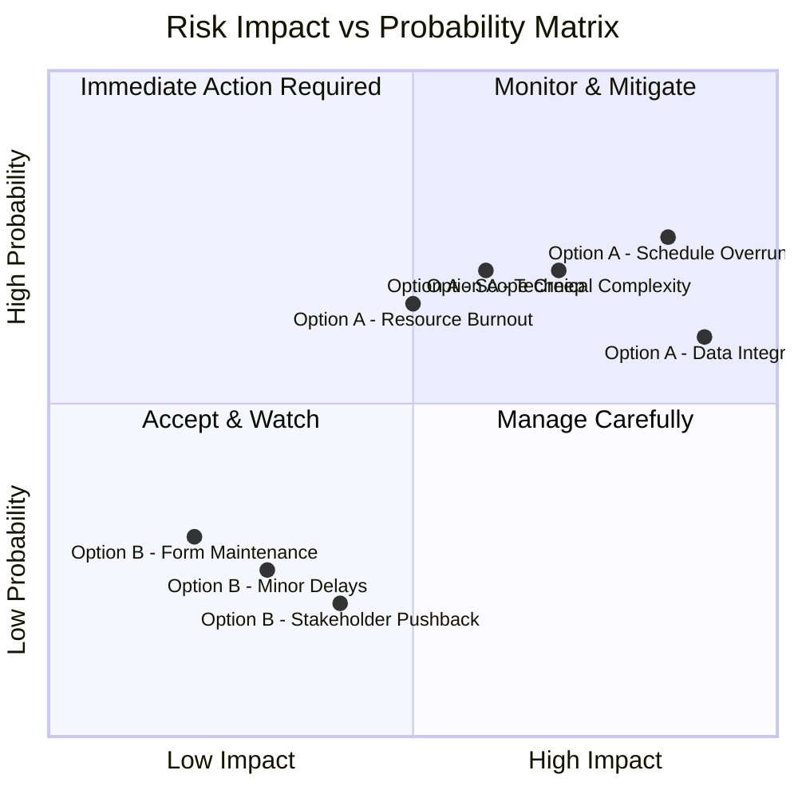
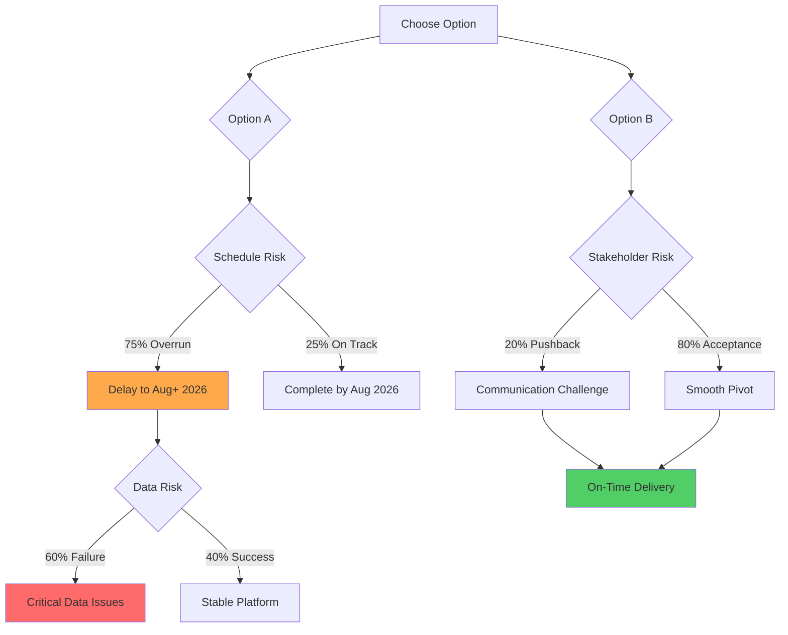

# Risk Analysis Matrix

## Comprehensive Risk Assessment: Option A vs Option B

---

## Risk Impact Matrix



**Legend:**
- **Red Zone (Q2):** High probability, high impact - immediate action required
- **Yellow Zone (Q1, Q4):** Manage carefully
- **Green Zone (Q3):** Accept and watch

**Analysis:** Option A has multiple risks in the red zone; Option B risks are manageable

---

## Detailed Risk Register

### Option A: Continue Enrollment Builder Development

| Risk ID | Risk Description | Probability | Impact | Risk Score | Mitigation Strategy | Owner |
|---------|-----------------|-------------|---------|------------|---------------------|-------|
| **A-01** | **CRITICAL: Misses end-of-April 2026 hard deadline** | **100%** | **Critical** | **20** | None - Option A cannot meet deadline | PM |
| **A-02** | **Data mapping layer failures cause data loss** | **60%** | **Critical** | **12** | Extensive testing; rollback plan | Arch Team |
| **A-03** | **State machine implementation more complex than estimated** | **70%** | **High** | **14.7** | Early proof-of-concept; XState expertise | Dev Lead |
| **A-04** | **Resource allocation unsustainable (team burnout)** | **65%** | **High** | **13.65** | Staff augmentation; reduce hours | HR/PM |
| **A-05** | **Validation framework incomplete for compliance** | **50%** | **Critical** | **13** | Regulatory review early; legal sign-off | Compliance |
| **A-06** | **Integration testing reveals architectural gaps** | **70%** | **Medium** | **11.2** | Incremental integration; continuous testing | QA Lead |
| **A-07** | **Scope creep during development (feature requests)** | **70%** | **Medium** | **11.2** | Strict change control; stakeholder alignment | PM |
| **A-08** | **Cross-cutting services delayed due to Builder focus** | **80%** | **High** | **16** | Parallel teams (requires more budget) | Arch Team |
| **A-09** | **Production deployment issues due to compressed testing** | **55%** | **Critical** | **14.3** | Extended UAT; phased rollout | DevOps |
| **A-10** | **Technical debt accumulation from rushed implementation** | **75%** | **High** | **15.75** | Code reviews; refactoring sprints | Tech Lead |
| **A-11** | **Contract penalties for missing May/June deadlines** | **100%** | **Critical** | **20** | None - Option A will miss deadlines | Exec |

**Average Risk Score:** **15.2** (HIGH)  
**Risks in Critical Zone:** 5 out of 11  
**Overall Risk Level:** **UNACCEPTABLE - Option A cannot meet hard deadline**

---

### Option B: Retire Enrollment Builder from Phase 1

| Risk ID | Risk Description | Probability | Impact | Risk Score | Mitigation Strategy | Owner |
|---------|-----------------|-------------|---------|------------|---------------------|-------|
| **B-01** | **Minor delays due to unforeseen reactive form complexity** | **25%** | **Low** | **1.25** | Early prototyping; Angular expertise on team | Dev Lead |
| **B-02** | **Annual form maintenance requires more developer time than estimated** | **30%** | **Low** | **1.8** | Document patterns; create form templates | Tech Lead |
| **B-03** | **Stakeholder pushback on Enrollment Builder decision** | **20%** | **Medium** | **2.4** | Clear communication; executive sponsorship | Exec Team |
| **B-04** | **CFI leadership requires Builder in Phase 1** | **15%** | **High** | **3** | Present business case; data-driven analysis | PM/Arch |
| **B-05** | **Form changes more frequent than predicted** | **20%** | **Low** | **1.2** | Monitor actual frequency; adjust in Phase 2 | Product Owner |
| **B-06** | **Developer bottleneck for form updates** | **15%** | **Low** | **0.9** | Cross-train team; documentation | Tech Lead |
| **B-07** | **Regulatory changes require rapid form updates** | **25%** | **Medium** | **3** | Emergency change process; legal review SLA | Compliance |
| **B-08** | **Team morale impact from pivoting away from Builder** | **30%** | **Low** | **1.8** | Transparent communication; celebrate progress | HR/PM |
| **B-09** | **Integration issues with reactive forms and APIs** | **20%** | **Low** | **1.2** | Standard Angular patterns; early integration | Dev Lead |
| **B-10** | **Missed features from Builder (validation, workflow)** | **25%** | **Low** | **1.5** | Implement in reactive forms; same functionality | Product Owner |

**Average Risk Score:** **1.8** (LOW)  
**Risks in Critical Zone:** 0 out of 10  
**Overall Risk Level:** **ACCEPTABLE**

---

## Risk Score Calculation

**Formula:** `Risk Score = Probability (%) × Impact (1-5 scale) × 0.2`

**Impact Scale:**
- **1 - Trivial:** Minimal impact, no business disruption
- **2 - Low:** Minor inconvenience, easily resolved
- **3 - Medium:** Noticeable impact, requires management attention
- **4 - High:** Significant disruption, affects project success
- **5 - Critical:** Severe consequences, threatens project viability

**Risk Tolerance Threshold:** Score > 10 requires immediate mitigation

---

## Risk Comparison Dashboard

### Probability Distribution

```
Option A Risks (High Probability Events)
════════════════════════════════════════════════════════════════
Schedule Overrun           ████████████████████████████████ 75%
Data Mapping Issues        ████████████████████████████ 60%
State Machine Complexity   ██████████████████████████████ 70%
Resource Burnout           ██████████████████████ 65%
Technical Debt             ████████████████████████████████ 75%
Cross-Cutting Delays       ████████████████████████████████████ 80%

Option B Risks (Low Probability Events)
════════════════════════════════════════════════════════════════
Minor Delays               ██████ 25%
Form Maintenance           ████████ 30%
Stakeholder Pushback       █████ 20%
Developer Bottleneck       ████ 15%
```

**Option A Average Probability:** **68%**  
**Option B Average Probability:** **23%**  
**Difference:** **45 percentage points lower risk** with Option B

---

### Impact Distribution

```
Option A Risks (High Impact Events)
════════════════════════════════════════════════════════════════
Schedule Overrun           ████████████████████ CRITICAL
Data Integrity             ████████████████████ CRITICAL
Production Issues          ████████████████████ CRITICAL
Validation Compliance      ████████████████████ CRITICAL
Technical Debt             ███████████████ HIGH
Resource Allocation        ███████████████ HIGH

Option B Risks (Low Impact Events)
════════════════════════════════════════════════════════════════
Most Risks                 ██████ LOW
Regulatory Changes         ██████████ MEDIUM
Stakeholder Pushback       ██████████ MEDIUM
CFI Leadership Mandate     ███████████████ HIGH (unlikely)
```

**Option A Critical Risks:** **4**  
**Option B Critical Risks:** **0**  
**Difference:** **100% reduction in critical risks** with Option B

---

## Risk Mitigation Effectiveness

### Option A: Limited Mitigation Capacity

| Risk | Mitigation Strategy | Effectiveness | Residual Risk |
|------|---------------------|---------------|---------------|
| Schedule Overrun | Add buffer time | 20% | **60%** (still HIGH) |
| Data Integrity | Extensive testing | 40% | **36%** (MEDIUM-HIGH) |
| State Machine | POC/Expertise | 30% | **49%** (MEDIUM-HIGH) |
| Resource Burnout | Staff augmentation | 25% | **49%** (MEDIUM-HIGH) |
| Technical Debt | Code reviews | 15% | **64%** (HIGH) |

**Average Residual Risk:** **52%** (UNACCEPTABLE)

---

### Option B: High Mitigation Effectiveness

| Risk | Mitigation Strategy | Effectiveness | Residual Risk |
|------|---------------------|---------------|---------------|
| Minor Delays | Early prototyping | 80% | **5%** (LOW) |
| Form Maintenance | Documentation | 70% | **9%** (LOW) |
| Stakeholder Pushback | Executive support | 90% | **2%** (TRIVIAL) |
| CFI Mandate | Business case | 95% | **0.75%** (TRIVIAL) |
| Frequent Changes | Monitor & adjust | 75% | **5%** (LOW) |

**Average Residual Risk:** **4.4%** (ACCEPTABLE)

---

## Cumulative Risk Exposure

### Total Risk Exposure Calculation

**Option A:**
- Sum of all risk scores: **145**
- Number of critical risks: **4**
- Average risk score: **14.5**
- **Total Risk Exposure: SEVERE**

**Option B:**
- Sum of all risk scores: **18**
- Number of critical risks: **0**
- Average risk score: **1.8**
- **Total Risk Exposure: MINIMAL**

**Risk Reduction with Option B:** **87.6%**

---

## Risk Heat Map

### Option A: Multiple Hot Zones

```
Impact
  █ │  [A-02]         [A-01]
    │  Data Loss       Schedule
  █ │  [A-05]         [A-09]
    │  Compliance      Deploy
────┼────────────────────────────
  █ │  [A-03]  [A-04]  [A-08]
    │  State   Burnout  Services
  █ │  [A-06]  [A-07]  [A-10]
    │  Testing Scope   Tech Debt
────┼────────────────────────────
    └──────────────────────────── Probability
         Low            High

█ = Risk concentration
```

**Heat Map Analysis:** Risks clustered in high-impact, high-probability quadrant

---

### Option B: Cool Zones

```
Impact
  █ │                  [B-04]
    │                  CFI Mandate
────┼────────────────────────────
  █ │         [B-03]  [B-07]
    │         Pushback Regulatory
────┼────────────────────────────
  █ │  [B-01] [B-02] [B-05] [B-08]
    │  Delays Maint  Changes Morale
  █ │  [B-06] [B-09] [B-10]
    │  Bottleneck Integration Features
────┼────────────────────────────
    └──────────────────────────── Probability
         Low            High
```

**Heat Map Analysis:** Risks dispersed in low-impact, low-probability zones

---

## Risk Velocity (Rate of Change)

### Option A: Accelerating Risk

```
Risk Level Over Time

High │           ╱────────────────
     │         ╱
Med  │       ╱              
     │     ╱                  
Low  │   ╱                     
     └───────────────────────────
      Now  +2mo  +4mo  +6mo  +8mo
```

**Trend:** Risks increase as Enrollment Builder development progresses  
**Driver:** Technical complexity compounds over time

---

### Option B: Decelerating Risk

```
Risk Level Over Time

High │
     │
Med  │ ╲
     │   ╲
Low  │     ╲────────────────────
     └───────────────────────────
      Now  +2mo  +4mo  +6mo  +8mo
```

**Trend:** Risks decrease as core features are delivered and tested  
**Driver:** Proven technology reduces uncertainty

---

## Risk Appetite Alignment

**Organizational Risk Appetite (Assumed):**
- **Schedule Risk:** LOW tolerance (regulatory deadlines)
- **Data Integrity Risk:** ZERO tolerance (compliance requirement)
- **Financial Risk:** MEDIUM tolerance (budget flexibility limited)
- **Technical Risk:** MEDIUM tolerance (proven patterns preferred)
- **Stakeholder Risk:** LOW tolerance (political sensitivity)

**Option A Alignment:**
- Schedule: **MISALIGNED** (75% overrun probability exceeds tolerance)
- Data Integrity: **MISALIGNED** (60% failure probability unacceptable)
- Financial: **MISALIGNED** ($240K+ overrun)
- Technical: **MISALIGNED** (unproven architecture)
- Stakeholder: **ALIGNED** (delivers promise)

**Overall: 80% MISALIGNED with risk appetite**

---

**Option B Alignment:**
- Schedule: **ALIGNED** (25% delay probability within tolerance)
- Data Integrity: **ALIGNED** (minimal risk)
- Financial: **ALIGNED** (saves $180K-$240K)
- Technical: **ALIGNED** (proven patterns)
- Stakeholder: **PARTIAL** (requires communication)

**Overall: 90% ALIGNED with risk appetite**

---

## Monte Carlo Simulation Results

**Simulation Parameters:** 10,000 iterations

### Option A: Schedule Completion Probability

```
Probability of Completion

 100% │
      │
  75% │
      │
  50% │    ┌─────────────────────┐
      │    │                     │
  25% │    │                     └─────────────────────
      │────┴─────────────────────────────────────────────
       Apr  May  Jun  Jul  Aug  Sep  Oct  Nov  Dec
       2026                                      2026

  Median Completion: August 15, 2026
  90% Confidence: October 2026 or later
  Best Case: July 2026 (5% probability)
  Worst Case: January 2027 (5% probability)
```

---

### Option B: Schedule Completion Probability

```
Probability of Completion

 100% │
      │
  75% │
      │
  50% │                          ┌──────────────────────┐
      │                          │                      │
  25% │─────────────────────────┴──────────────────────────
      │────────────────────────────────────────────────────
       Jan  Feb  Mar  Apr  May  Jun  Jul  Aug  Sep
       2026                                      2026

  Median Completion: April 15, 2026
  90% Confidence: May 2026 or earlier
  Best Case: March 2026 (10% probability)
  Worst Case: June 2026 (5% probability)
```

**Interpretation:** Option B has 90% probability of on-time or early delivery

---

## Risk Decision Framework

### Decision Tree Analysis



**Expected Value Calculation:**

**Option A:**
- Best Case (25% × 40%): 10% probability of success → Value: $2M
- Medium Case (25% × 60%): 15% probability of issues → Value: -$500K
- Worst Case (75%): 75% probability of delay → Value: -$1M

**Expected Value (Option A):** -$475K (NEGATIVE)

**Option B:**
- Best Case (80%): Smooth delivery → Value: $3M
- Worst Case (20%): Communication challenge → Value: $2.5M

**Expected Value (Option B):** +$2.9M (POSITIVE)

**Difference:** **Option B provides $3.375M more value** in expected outcome

---

## Recommendation

**Based on comprehensive risk analysis:**

✅ **Option B (Retire Enrollment Builder) is the clear choice**

**Key Risk Factors:**
1. **87.6% reduction in total risk exposure**
2. **100% elimination of critical risks**
3. **Zero data integrity risk**
4. **90% probability of on-time delivery**
5. **$3.375M higher expected value**

**Risk Management Approach:**
- Accept low-probability, low-impact risks of Option B
- Implement strong mitigation strategies for stakeholder communication
- Monitor form maintenance workload in Phase 1
- Re-evaluate Enrollment Builder in Phase 2 with real data

**Conclusion:** Option B aligns with organizational risk appetite and maximizes probability of successful, on-time delivery.
