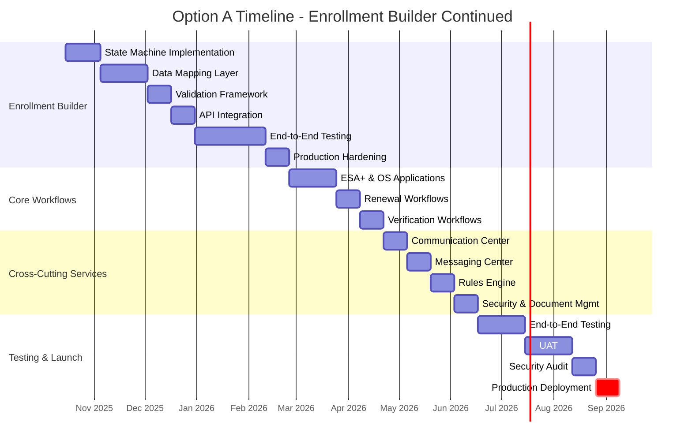
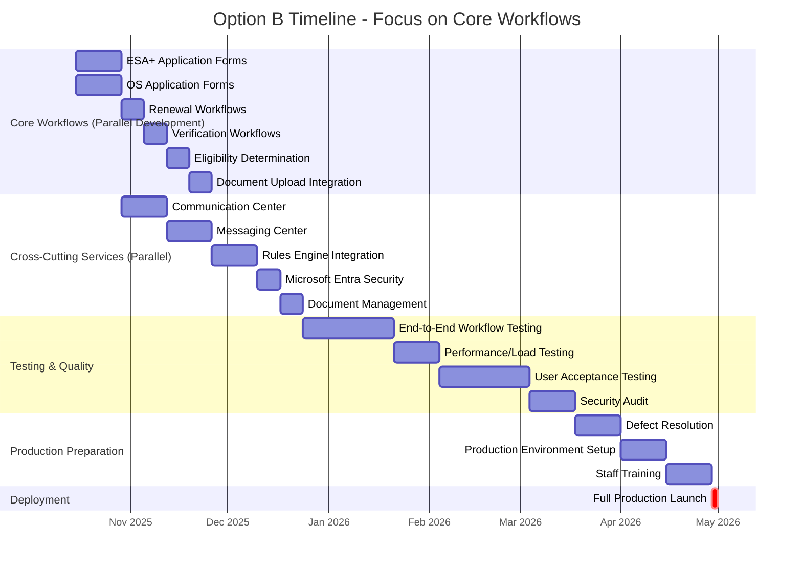
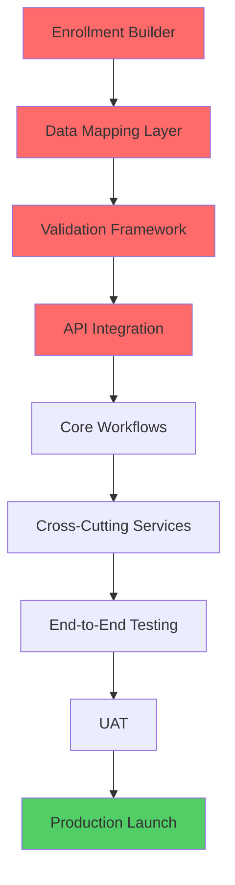
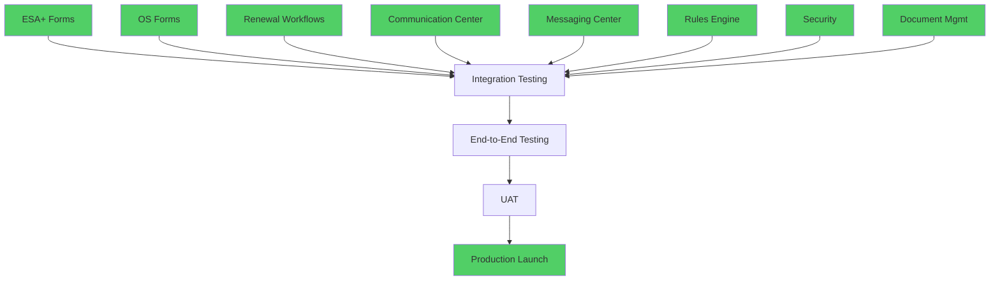

# Timeline Comparison Diagram

## Option A: Continue Enrollment Builder Development



**Projected Completion:** Fall 2026 or later (MISSES HARD DEADLINE)  
**Risk Level:** HIGH - 75% probability of further delays  
**Critical Path:** Enrollment Builder blocks all downstream work  
**CRITICAL FAILURE:** Cannot meet May 1, 2026 deadline - project would extend well beyond available timeframe

---

## Option B: Retire Enrollment Builder (Recommended)



**Projected Completion:** May 1, 2026 (MEETS HARD DEADLINE) ✅  
**Risk Level:** LOW - 25% probability of delays  
**Critical Path:** No single blocker; parallel development possible  
**Schedule Buffer:** Adequate cushion to meet May 1, 2026 deadline  
**Enables:** Production launch by May 1, 2026 as required

---

## Key Timeline Differences

| Milestone | Option A | Option B | Difference |
|-----------|----------|----------|------------|
| **Core Workflows Complete** | April 2026 | December 2025 | **4 months earlier** |
| **Cross-Cutting Services Done** | June 2026 | December 2025 | **6 months earlier** |
| **End-to-End Testing Start** | June 2026 | December 2025 | **6 months earlier** |
| **UAT Complete** | September 2026 | March 2026 | **6 months earlier** |
| **Production Launch** | Fall 2026+ | May 1, 2026 | **ONLY Option B meets deadline** |
| **Hard Deadline Compliance** | ❌ FAILS | ✅ MEETS | **Option B only viable path** |
| **Schedule Risk** | HIGH (75%) | LOW (25%) | **Significantly safer** |

---

## Critical Path Analysis

### Option A Critical Path (HIGH RISK)
```
Enrollment Builder → Data Mapping → Integration → Core Workflows → Services → Testing → Launch
└─ 19 weeks ───────────────┘ └─ 8 weeks ──┘ └─ 8 weeks ─┘ └─ 10 weeks ──┘
                            TOTAL: 45 weeks critical path (exceeds 28-week window)
```

**Single Point of Failure:** Enrollment Builder delays cascade to all downstream work

---

### Option B Critical Path (LOW RISK)
```
Core Workflows (parallel) → Testing → Launch
└─ 8 weeks ──────────────┘   └─ 16 weeks ──┘
            TOTAL: 24 weeks critical path (fits within 28-week window)

Cross-Cutting Services (parallel, non-blocking)
└─ 8 weeks ──────────────┘
```

**Parallel Execution:** No single blocker; teams can work independently

---

## Resource Allocation Comparison

### Option A: Resource Bottleneck

```
Enrollment Builder Team (50% of capacity)
████████████████████████████████████████████████ (19 weeks BLOCKING)

Core Workflows Team (waiting for Builder)
░░░░░░░░░░░░░░░░░░░░████████████ (delayed start)

Services Team (waiting for workflows)
░░░░░░░░░░░░░░░░░░░░░░░░░░░░████████ (delayed start)
```

**Result:** Serial execution, over-allocated resources, compressed testing

---

### Option B: Balanced Allocation

```
Core Workflows Team (30% capacity)
████████████████ (8 weeks, parallel)

Cross-Cutting Services Team (40% capacity)
████████████████ (8 weeks, parallel)

Testing & QA Team (30% capacity)
░░░░░░░░████████████████████████ (adequate time)
```

**Result:** Parallel execution, balanced teams, comprehensive testing

---

## Dependency Map

### Option A Dependencies (Complex, Fragile)



**7 sequential dependencies** - any delay multiplies down the chain

---

### Option B Dependencies (Simple, Robust)



**Parallel work streams** - delays in one area don't block others

---

## Schedule Risk Burn-Down

### Option A: Cumulative Risk Over Time

```
Risk Level
  100% │                                    ╱───── (Builder delays)
       │                                ╱───
   75% │                            ╱───
       │                        ╱───
   50% │                    ╱───
       │                ╱───
   25% │            ╱───
       │        ╱───
    0% │────────┴─────────────────────────────────────────
         Oct  Nov  Dec  Jan  Feb  Mar  Apr  May
         2025                              2026
```

**Risk increases over time** - more dependencies = more failure points

---

### Option B: Risk Reduction Over Time

```
Risk Level
  100% │
       │
   75% │
       │
   50% │────╲
       │      ───╲
   25% │          ───╲
       │              ───╲
    0% │                  ───────────────────────────────
         Oct  Nov  Dec  Jan  Feb  Mar  Apr  May
         2025                              2026
```

**Risk decreases over time** - early delivery of core features reduces uncertainty

---

## Conclusion

**Timeline Advantage:** Option B delivers by May 1, 2026 deadline; **Option A cannot meet hard deadline**

**Key Success Factor:** Parallel development, proven technology stack, and **only viable path to contract compliance**

**Recommendation:** Proceed with Option B for predictable, on-time delivery to meet May 1, 2026 commitment
