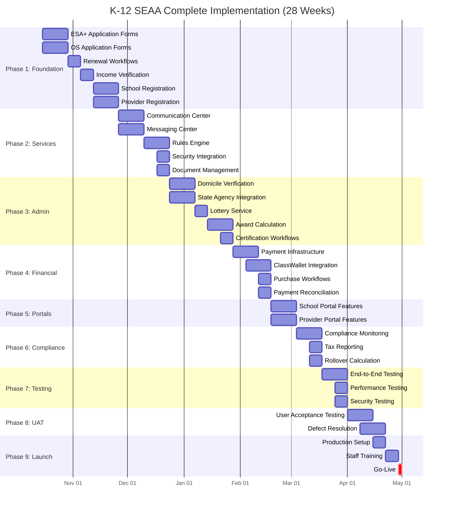

# IT Stakeholder Presentation
## SEAA K-12 Modernization: Comprehensive Implementation Plan

**Presentation Date:** October 2025  
**Audience:** Senior IT Leadership & Business Stakeholders  
**Duration:** 60 minutes (45 min presentation + 15 min Q&A)  
**Timeline:** October 15, 2025 - May 1, 2026 (28 weeks)

---

## Slide 1: Title Slide

**SEAA K-12 Modernization**  
**Comprehensive Implementation Plan**  
**Complete Scope & Delivery Roadmap**

IT Stakeholder Presentation  
October 2025

College Foundation, Inc.  
North Carolina SEAA Programs

**Timeline:** October 15, 2025 - May 1, 2026

---

## Slide 2: Agenda

1. **Executive Summary** – Project overview and timeline
2. **Platform Overview** – Complete system scope
3. **Complete Feature Inventory** – All core capabilities
4. **Implementation Roadmap** – Phased delivery plan
5. **Resource Allocation** – Team structure and assignments
6. **Risk Assessment** – Critical areas and mitigation
7. **Success Criteria** – Delivery milestones and quality metrics
8. **Next Steps** – Execution and monitoring

---

## Slide 3: Executive Summary

### Complete K-12 SEAA Modernization Scope

**Timeline:** October 15, 2025 - May 1, 2026 (28 weeks)

**Platform Serves:**
- Two scholarship programs (ESA+, Opportunity Scholarship)
- Up to 80,000 concurrent users
- Four web portals (Household, School, Provider, Admin)
- Comprehensive scholarship lifecycle management

**Core Capabilities Required:**
- **Household & Student Management** - Applications, renewals, profiles, school selection
- **School Management** - Registration, certification, endorsement, compliance
- **Provider Management** - Enrollment, directory, invoicing, payments
- **Admin Operations** - Application processing, verification, lottery, awards
- **Payment Systems** - Award calculation, disbursements, ESA+ purchasing, reconciliation
- **Verification & Compliance** - Eligibility, domicile, income, mandatory reviews

**Critical Deadline:** **May 1, 2026** - All core functionality must be production-ready

---

## Slide 4: Platform Overview

### SEAA K-12 Modernization Scope

**Programs:**
- ESA+ (Education Student Accounts) – students with disabilities
- Opportunity Scholarship – income-qualified families
- **Users:** Up to 80,000 concurrent (legacy system crashes under load)

**Platform Architecture:**
- **Front End:** 4 Angular SPAs (Household, School, Provider, Admin portals)
- **Backend:** .NET APIs, SQL Server, Azure APIM
- **Integrations:** ClassWallet, PandaDocs, State agencies, Payment rails

**Key Features:**
- Application submission and renewal
- Eligibility determination and income verification
- Award calculation and lottery processing
- School certification and parent endorsement
- Payment disbursements and compliance tracking

**CRITICAL Timeline Requirements:**
- **May 1, 2026:** All core functionality MUST be complete and production ready
- **Post-May 1, 2026:** Support/maintenance only - no new features

---

## Slide 5: Complete Feature Inventory - Overview

### Six Core Capability Areas

**1. Household & Student Management (15+ features)**
- Application submission (ESA+, OS)
- Renewal workflows
- Profile and account management
- School selection and transfers
- Communication and notifications

**2. School Management (20+ features)**
- Registration and profiles
- Student enrollment tracking
- Certification and endorsement workflows
- Payment and financial tracking
- Compliance and reporting

**3. Provider Management (12+ features)**
- Provider registration and enrollment
- Service directory
- Invoice and payment processing
- Compliance and quality management

---

## Slide 5a: Complete Feature Inventory - Continued

**4. Admin Portal Operations (30+ features)**
- Application processing and review
- Verification management (domicile, income, sampling)
- Award management (lottery, calculation, lifecycle)
- Document management
- Communication and case management
- Reporting and analytics
- System administration

**5. Payment & Financial Systems (18+ features)**
- Payment processing (direct payment schools)
- ESA+ wallet and purchasing
- Expense approval and compliance
- Tax reporting and reconciliation

**6. Verification & Compliance (15+ features)**
- State agency integrations
- Eligibility verification workflows
- Ongoing compliance monitoring
- Audit and compliance reporting

**Total: 110+ distinct features to implement**

---

## Slide 6: Household & Student Management Features

### What Parents/Guardians Need to Do

**Application Workflows:**
- ESA+ new application (disability documentation, EDD upload, LEA Release)
- Opportunity Scholarship application (income verification, lottery)
- Renewal applications (simplified for returning students)
- Application status tracking and notifications

**Profile & Account Management:**
- Student and household information
- Contact and communication preferences
- Document storage and retrieval
- Award and payment history

**School Selection & Transfers:**
- School search and directory
- Enrollment confirmation
- Mid-year transfer requests
- School type identification (Direct Payment vs Reimbursement)

**ESA+ Purchasing (ClassWallet):**
- Browse allowable expenses
- Submit purchase requests
- Track approvals and payments
- View transaction history

**Communication:**
- To-Do lists and tasks
- Email/SMS notifications
- In-app messaging
- Document upload reminders

---

## Slide 7: School Management Features

### What Schools Need to Manage

**Registration & Profile:**
- School registration workflow
- DNPE verification
- School type classification
- Banking information for payments
- Administrator account management

**Student Enrollment:**
- Student roster management
- Enrollment confirmations
- Semester updates
- Transfer processing
- Enrollment reporting

**Certification & Endorsement:**
- Annual school certification (tuition/fees)
- Parent endorsement requests (semester)
- Deadline tracking and reminders
- Certification approval workflow

**Payment & Financial:**
- Payment schedule visibility
- Expected payment calculations
- ACH deposit tracking
- Payment reconciliation
- Dual award allocation (OS + ESA+)

**Compliance:**
- Testing requirements (grades 3-12, July 15 deadline)
- Financial review (70+ students, CPA requirement)
- Background checks (school leadership)
- Compliance reporting

**School Portal:**
- Dashboard with key metrics
- Student scholarship list
- Payment history
- Document management
- Communication center

---

## Slide 8: Provider Management Features

### What Service Providers Need

**Registration & Enrollment:**
- Provider application submission
- Credentials and license verification
- Background check processing
- Service category selection
- Provider agreement signature
- Approval workflow

**Provider Directory:**
- Public provider search
- Category-based browsing
- Service area filters
- Contact information
- Service offerings

**Invoice & Payment:**
- Invoice submission
- Purchase request matching
- Payment processing via ClassWallet
- Payment confirmation
- Payment history
- Reconciliation

**Compliance:**
- Credential maintenance
- Annual reviews
- Service quality monitoring
- Complaint tracking
- Performance metrics

---

## Slide 9: Admin Portal Operations - Processing

### What CFI Staff Need to Do

**Application Processing:**
- Application queue management
- Application review workflows
- Document verification
- Data validation
- Exception handling
- Processing status tracking

**Eligibility Determination:**
- Criteria evaluation
- Income calculation
- Domicile verification review
- Disability documentation review
- Exception and appeal handling
- Decision recording and notification

**Verification Management:**

**Domicile Verification:**
- Electronic verification via state agencies (DMV, DPI, Revenue, DHHS, Commerce, Elections)
- Document evidence review (utility bills, bank statements)
- Multi-evidence coordination
- Verification result tracking

**Income Verification (OS):**
- 4% random sample selection
- IRS transcript validation
- Income calculation review
- Extension request processing

**Application Sampling:**
- Random selection (4% of applications)
- Error-prone identification
- Verification case management
- Non-compliance handling

---

## Slide 10: Admin Portal Operations - Awards & Documents

**Award Management:**

**Lottery Administration:**
- Lottery batch creation
- Random selection processing
- Award offer generation
- Waitlist management
- Audit trail maintenance

**Award Calculation:**
- ESA+ amount determination ($9,000 vs $17,000)
- OS tiered calculation (income-based)
- Dual award ordering
- Per pupil allocation integration (DPI)
- Award recalculation for changes

**Award Lifecycle:**
- Award offer management
- Acceptance tracking
- Award activation
- Mid-year adjustments
- Renewal processing

**Document Management:**
- Document upload processing
- Type classification
- Virus scanning
- Review workflows
- Approval/rejection
- PandaDocs e-signature integration
- Secure storage and retrieval

**Communication & Case Management:**
- Bulk campaigns
- Email template management
- Scheduled notifications
- Deadline reminders
- Case assignment and tracking
- Exception queue management

---

## Slide 11: Admin Portal Operations - Reporting

**Operational Dashboards:**
- Application pipeline status
- Processing time metrics
- Verification completion rates
- Award utilization tracking
- Payment disbursement status
- School compliance monitoring
- Provider activity metrics
- System performance indicators

**Compliance Reports:**
- Statutory reporting
- Audit trail exports
- Financial reconciliation
- State agency coordination
- Verification completion
- Award distribution analysis
- Fraud detection indicators

**Business Intelligence:**
- Program participation trends
- Geographic distribution
- Demographic insights
- Financial projections
- Resource allocation
- Capacity planning
- Performance benchmarking

**System Administration:**
- User account management (RBAC)
- Role and permission configuration
- Microsoft Entra ID integration
- Audit logging
- System configuration
- Feature flags
- Policy version control

---

## Slide 12: Payment & Financial Systems

### Direct Payment Schools

**Payment Processing:**
- Payment schedule management (Aug/Sep, Jan/Feb)
- Parent endorsement validation
- Tuition and fee calculation
- Dual award allocation (OS first, then ESA+)
- ACH payment file generation
- Payment confirmation tracking
- Failed payment handling
- Payment reconciliation

**ESA+ Wallet (ClassWallet):**
- Account provisioning
- Fund allocation after tuition
- Balance tracking
- Transaction logging
- Rollover calculation

### ESA+ Purchasing & Expenses

**Allowable Expense Categories:**
- Curriculum and materials
- Tutoring and services
- Educational technology
- Therapies
- Summer programs
- AP exams
- Transportation

**Purchase Processing:**
- On-marketplace purchases
- Off-marketplace invoice submission
- Category validation
- Approval/rejection workflow
- Payment to vendors
- Transaction recording

**Compliance:**
- Minimum spending ($1,000 threshold)
- Rollover management ($4,500 annual, $30,000 lifetime caps)
- Tax reporting (1099-G for non-tuition spending)
- Prohibited expense detection
- Accessory timing and frequency rules

---

## Slide 13: Verification & Compliance Systems

### State Agency Integration Platform

**Agency Integrations Required:**
- **DMV** - Driver's license/ID verification
- **DPI** - School enrollment, per pupil allocation
- **Department of Revenue** - Tax filing verification
- **DHHS** - Public benefits verification
- **Department of Commerce** - Public benefits
- **State Board of Elections** - Voter registration
- **State CIO** - Infrastructure coordination

**Integration Capabilities:**
- Electronic verification requests
- Response processing and validation
- Timeout and error handling
- Manual fallback workflows
- Data privacy compliance
- Integration health monitoring
- Response time SLA tracking

### Eligibility Verification

**Domicile Determination:**
- G.S. 115C-366 implementation
- Multiple evidence types
- Electronic verification priority
- Document upload alternatives
- Conflicting evidence resolution

**Disability Verification (ESA+):**
- EDD validation
- IEP/504 plan review
- Prior public school verification

**Income Verification (OS):**
- Income calculation worksheet
- IRS transcript validation
- Income tier determination

### Ongoing Compliance

**Annual Verifications:**
- Per pupil allocation update (DPI, Dec 1)
- School testing compliance (July 15)
- School financial reviews (70+ students)
- Provider credential renewals
- Background check renewals

**Audit & Reporting:**
- Immutable event logging
- Compliance audit trail
- Regulatory reporting
- Exception tracking
- Fraud detection

---

## Slide 14: Cross-Cutting Platform Services

### Essential Infrastructure for All Features

**Communication Center:**
- Email template engine
- Scheduled campaigns
- Event-triggered notifications
- Deadline reminders
- Multi-channel delivery (Email, SMS, Print/Mail)
- Localization (EN/ES)

**Messaging Center:**
- In-app notifications
- Banner alerts and modals
- Message inbox
- To-Do task orchestration
- Real-time updates

**Rules Engine:**
- Eligibility calculation rules
- Income verification rules
- Award calculation logic
- Purchase approval rules
- Compliance requirements
- Policy versioning (by program year)

**Document Service:**
- Secure storage (Azure Blob)
- Document lifecycle management
- Virus scanning
- PandaDocs e-signature integration
- Access controls
- Retention policies

**Identity & Security:**
- Microsoft Entra ID integration
- Role-based access control (RBAC)
- Multi-factor authentication
- Single sign-on (SSO)
- Security audit logging

**Query & Reporting:**
- Cube.js reporting layer
- Ad-hoc query builder
- Pre-built report templates
- Dashboard visualizations
- Data export capabilities

---

## Slide 15: Implementation Roadmap - Complete Timeline

### 28-Week Phased Delivery Plan (Oct 15, 2025 - May 1, 2026)

---

## Slide 16: Implementation Roadmap - Phase Details

### Phase 1: Foundation & Core Applications (Weeks 1-8)

**Weeks 1-4 (Oct 15 - Nov 11):**
- ESA+ and OS application forms (reactive forms)
- Application submission workflows
- Document upload integration
- Basic student profile management
- Application status tracking

**Weeks 5-8 (Nov 12 - Dec 9):**
- Renewal workflows (both programs)
- Income verification workflow
- Eligibility determination submission
- Household profile management
- School registration and profile
- Provider registration workflow

**Deliverable:** Families can submit applications, schools and providers can register

---

### Phase 2: Cross-Cutting Services (Weeks 9-12)

**Weeks 9-10 (Dec 10 - Dec 23):**
- Communication Center (email templates, triggers)
- Messaging Center (in-app notifications)
- Microsoft Entra Security integration
- Document Management (PandaDocs)

**Weeks 11-12 (Dec 24 - Jan 6):**
- Rules Engine integration
- Query Builder (Cube.js) foundation
- Basic reporting dashboards

**Deliverable:** Communication infrastructure operational, security implemented

---

### Phase 3: Advanced Workflows & Admin (Weeks 13-16)

**Weeks 13-14 (Jan 7 - Jan 20):**
- Domicile verification workflows
- State agency integration framework
- Verification sampling service
- Admin application review workflows

**Weeks 15-16 (Jan 21 - Feb 3):**
- Lottery service implementation
- Award calculation engine
- Award lifecycle management
- School certification workflows
- Parent endorsement workflows

**Deliverable:** Complete admin processing capabilities, awards can be offered

---

### Phase 4: Financial & Payment Systems (Weeks 17-18)

**Weeks 17-18 (Feb 4 - Feb 17):**
- Payment processing infrastructure
- ACH payment file generation
- ClassWallet integration
- ESA+ purchase request workflows
- Expense approval rules engine
- Payment reconciliation

**Deliverable:** End-to-end payment processing operational

---

### Phase 5: School & Provider Portals (Weeks 19-20)

**Weeks 19-20 (Feb 18 - Mar 3):**
- School portal features (dashboard, roster, certification, payments)
- Provider portal features (directory, invoicing, payments)

**Deliverable:** Schools and providers have full self-service capabilities

---

### Phase 6: Compliance & Reporting (Weeks 21-22)

**Weeks 21-22 (Mar 4 - Mar 17):**
- Compliance monitoring workflows
- Testing requirement tracking
- Financial review management
- Background check tracking
- Tax reporting (1099-G)
- Rollover calculation
- Minimum spending enforcement

**Deliverable:** Full compliance and regulatory reporting capabilities

---

### Phases 7-9: Testing & Launch (Weeks 23-28)

**Weeks 23-24 (Mar 18 - Mar 31):**
- End-to-end workflow testing
- Performance and load testing (80K users)
- Security testing and penetration testing
- Integration testing (all external systems)

**Weeks 25-26 (Apr 1 - Apr 14):**
- User acceptance testing
- Defect resolution
- Performance optimization
- User feedback incorporation

**Weeks 27-28 (Apr 15 - Apr 28):**
- Production environment setup
- Data migration and validation
- Staff training
- Documentation finalization

**May 1, 2026: Production Launch** ✅

---

## Slide 17: Resource Allocation & Team Structure

### Development Teams (6-8 FTE Total)

**Frontend Team (2-3 FTE):**
- Angular application development (4 portals)
- Reactive forms implementation
- Portal UI components
- Responsive design and accessibility
- Material UI integration

**Backend Team (2-3 FTE):**
- .NET API development
- Business logic implementation
- Database schema design and optimization
- Integration development
- Performance optimization

**Integration Team (1-2 FTE):**
- ClassWallet API integration
- PandaDocs integration
- State agency connections (7 agencies)
- Payment rails integration
- External system coordination

**QA Team (1-2 FTE):**
- Test plan development
- Automated testing (unit, integration, E2E)
- Manual testing
- UAT coordination
- Defect tracking and resolution

**Subject Matter Experts (Part-time):**
- Business analyst (requirements)
- DBA (database optimization)
- Security specialist (compliance, penetration testing)
- DevOps engineer (infrastructure, CI/CD)
- Technical writer (documentation)

---

## Slide 18: Risk Assessment - High Priority

### Critical Risk Areas & Mitigation

**1. State Agency Integrations (HIGH RISK)**
- **Challenge:** 7 different agencies, varying APIs, unknown response times, coordination complexity
- **Mitigation:**
  - Early integration testing starting Phase 3
  - Fallback to manual verification workflows
  - Regular agency coordination meetings
  - Integration health monitoring and SLA tracking
  - Dedicated integration team member

**2. ClassWallet Integration (HIGH RISK)**
- **Challenge:** Complex ESA+ workflows, vendor dependency, webhook reliability, transaction integrity
- **Mitigation:**
  - Sandbox environment testing early (Phase 4)
  - Idempotency keys for all transactions
  - Comprehensive error handling and retry logic
  - Regular vendor communication and status checks
  - Transaction reconciliation processes

**3. Payment Processing (HIGH RISK)**
- **Challenge:** Financial transactions, ACH accuracy, dual award ordering, regulatory compliance
- **Mitigation:**
  - Extensive testing with sample data
  - Automated reconciliation workflows
  - Comprehensive audit trail for all transactions
  - Financial controls and approval gates
  - Regular reconciliation with schools

---

## Slide 19: Risk Assessment - Medium Priority

**4. Data Migration (MEDIUM RISK)**
- **Challenge:** Legacy data quality, volume, complexity, schema mapping
- **Mitigation:**
  - Early data profiling (Phase 1)
  - Iterative migration testing
  - Phased migration approach
  - Validation checkpoints
  - Rollback procedures

**5. Performance at Scale (MEDIUM RISK)**
- **Challenge:** 80,000 concurrent users, peak load periods (application windows, payment cycles)
- **Mitigation:**
  - Load testing starting Phase 7
  - Performance monitoring infrastructure
  - Caching strategies (Redis)
  - Database optimization
  - Azure auto-scaling configuration

**6. User Adoption & Training (MEDIUM RISK)**
- **Challenge:** Multiple user groups, varying technical proficiency, change management
- **Mitigation:**
  - Early UAT involvement (Phase 8)
  - Comprehensive training program (Phase 9)
  - User documentation and video tutorials
  - Phased rollout by user group
  - Dedicated support during launch

**7. Scope Creep (MEDIUM RISK)**
- **Challenge:** Feature requests, changing requirements, stakeholder expectations
- **Mitigation:**
  - Formal change control process
  - Phase 2 feature parking lot
  - Regular stakeholder communication
  - Sprint-level scope reviews
  - Executive escalation for scope changes

---

## Slide 20: Success Criteria & Quality Metrics

### Delivery Milestones

✅ **Phase 1 complete** - December 9, 2025  
✅ **Cross-cutting services** - December 23, 2025  
✅ **Admin features** - February 3, 2026  
✅ **Financial systems** - February 17, 2026  
✅ **Portal features** - March 3, 2026  
✅ **Compliance features** - March 17, 2026  
✅ **Testing complete** - March 31, 2026  
✅ **UAT approved** - April 14, 2026  
✅ **Production ready** - April 28, 2026  
✅ **Production launch** - **May 1, 2026** ✅

### Quality Metrics

- ✅ **Zero critical data integrity issues** in production
- ✅ **80,000+ concurrent users** supported (load tested)
- ✅ **<2% defect escape rate** post-UAT
- ✅ **95%+ user satisfaction** in initial surveys
- ✅ **100% regulatory compliance** (audit ready)
- ✅ **<3 second page load times** (95th percentile)
- ✅ **99.9% uptime** during business hours
- ✅ **Complete audit trail** for all transactions

### Business Outcomes

- ✅ ESA+ and OS applications processed **without manual intervention**
- ✅ Award calculations **automated and auditable**
- ✅ Payment disbursements **on schedule**
- ✅ Reduced support call volume (improved UX)
- ✅ Staff productivity gains from automation
- ✅ **Improved user experience** across all portals
- ✅ **Complete transparency** for families, schools, providers

---

## Slide 21: Dependencies & Prerequisites

### External Dependencies (Critical Path Items)

**Required for Phase 4 (February 2026):**
1. **ClassWallet API** - ESA+ purchasing, wallet management
   - Sandbox access needed by January 2026
   - Webhook endpoints configured
   - Transaction testing completed

2. **PandaDocs API** - Document e-signatures
   - API credentials and templates
   - Webhook callback configuration
   - Integration testing

3. **Payment Rails** - ACH disbursement infrastructure
   - Bank account setup and verification
   - ACH file format specification
   - Test transaction capability

**Required for Phase 3 (January 2026):**
4. **State Agency APIs** - Domicile and income verification
   - DMV, DPI, Revenue, DHHS, Commerce, Elections
   - API contracts and authentication
   - Test environments
   - Data use agreements/MOUs

**Required for Phase 2 (December 2025):**
5. **Azure Services** - Hosting, storage, identity
   - Production subscription
   - Microsoft Entra ID tenant
   - Blob storage configuration
   - APIM setup

6. **Email/SMS Providers** - Communication delivery
   - Service selection and contracts
   - API integration
   - Template configuration

### Technical Prerequisites

- ✅ Development and staging environments (completed)
- ✅ CI/CD pipeline established (in progress)
- ✅ Monitoring and logging infrastructure (in progress)
- ⚠️ Backup and disaster recovery (Phase 9)
- ⚠️ Production environment (Phase 9)

### Organizational Prerequisites

- ✅ Project governance structure
- ✅ Stakeholder approval process
- ⚠️ Change management procedures (in development)
- ⚠️ Training program development (Phase 8-9)
- ⚠️ Support team readiness (Phase 9)
- ⚠️ Communication plan execution (ongoing)

## Slide 23: Implementation Approach & Execution

### Proven Development Methodology

**Technology Stack (Proven Patterns):**
- Angular reactive forms (type-safe, well-tested)
- .NET APIs (scalable, maintainable)
- SQL Server (static schema, high performance)
- Azure services (enterprise-grade infrastructure)
- Material UI (accessibility compliant)

**Development Approach:**
- Agile/Scrum methodology
- 2-week sprints
- Continuous integration/deployment
- Automated testing (unit, integration, E2E)
- Code reviews and quality gates
- Regular stakeholder demos

**Parallel Development Strategy:**
- Frontend and backend teams work simultaneously
- Portal development in parallel (Phases 1-5)
- Testing starts early (Phase 7)
- No critical blocking dependencies
- Risk mitigation through redundancy

### Communication & Governance

**Weekly Cadence:**
- Sprint planning Monday
- Daily standups
- Demo Friday
- Retrospective Friday
- Stakeholder update Friday

**Monthly Milestones:**
- Phase completion reviews
- Stakeholder presentations
- Risk assessment updates
- Budget and resource reviews

**Escalation Path:**
- Technical issues → Architecture team
- Scope changes → Change control board
- Resource constraints → Project steering committee
- External dependencies → Vendor management

---

## Slide 24: Monitoring & Course Correction

### How We Stay On Track

**Progress Tracking:**
- Sprint velocity monitoring
- Burn-down charts by phase
- Feature completion metrics
- Defect tracking and trends
- Integration test results
- Performance benchmarks

**Risk Monitoring:**
- Weekly risk register review
- External dependency status
- Resource availability tracking
- Technical debt assessment
- Testing coverage metrics

**Quality Gates:**
- Code coverage thresholds (>80%)
- Performance benchmarks (<3s page load)
- Security scan results (zero critical)
- Accessibility compliance (WCAG 2.1 AA)
- Load test results (80K concurrent users)

**Course Correction Triggers:**
- Sprint velocity drops >20%
- Critical defects discovered
- External dependency delays
- Resource availability issues
- Scope creep detected

**Contingency Plans:**
- Resource augmentation options
- Scope prioritization matrix
- Phase schedule buffers
- Alternative integration approaches
- Manual workflow fallbacks

---

## Slide 25: Post-Launch Support & Phase 2

### Production Support Plan

**Launch Support (May-June 2026):**
- Dedicated support team (24/5 coverage)
- Rapid response to critical issues
- User adoption monitoring
- Performance tuning
- Quick-fix deployment capability

**Ongoing Support (July 2026+):**
- Standard support hours (8am-6pm EST)
- Incident management process
- Change request handling
- Monthly maintenance windows
- Quarterly feature releases (minor)

**Monitoring & Operations:**
- Application performance monitoring (APM)
- Error tracking and alerting
- User analytics
- System health dashboards
- Capacity planning

### Phase 2 Planning (Post-May 1, 2026)

**Evaluation Period (May-July 2026):**
- Collect operational data
- Analyze user feedback
- Identify enhancement opportunities
- Assess technical debt

**Potential Phase 2 Features:**
- Advanced reporting and analytics
- Mobile applications (native iOS/Android)
- Enhanced provider marketplace
- Automated verification improvements
- AI-powered fraud detection
- Parent self-service enhancements
- **Enrollment Builder re-evaluation** (data-driven decision)

**Phase 2 Decision Criteria:**
- Actual form change frequency
- User feedback and pain points
- Operational efficiency metrics
- ROI analysis
- Technical debt assessment
- Budget availability

---

## Slide 26: Key Success Factors

### What Makes This Plan Achievable

**1. Focused Scope**
- Clear feature inventory (110+ features)
- No nice-to-have features in Phase 1
- Proven technology stack
- Parallel development possible

**2. Adequate Timeline**
- 28 weeks from October 15 to May 1
- Realistic phase durations
- Built-in testing time (6 weeks)
- Buffer for unexpected issues

**3. Right Resources**
- 6-8 dedicated FTE
- Specialized teams (frontend, backend, integration, QA)
- SME support available
- Vendor partnerships established

**4. Clear Governance**
- Defined decision-making process
- Regular stakeholder communication
- Change control procedures
- Escalation paths

**5. Risk Management**
- Identified high-risk areas
- Mitigation strategies defined
- Contingency plans ready
- Regular risk reviews

**6. Quality Focus**
- Automated testing throughout
- Early and continuous testing
- User acceptance testing (2 weeks)
- Performance and security testing
- Quality gates at each phase

**7. Stakeholder Alignment**
- Clear requirements and priorities
- Regular demos and feedback
- Transparent communication
- Shared understanding of constraints

---

## Slide 27: Questions & Discussion

**Key Topics for Discussion:**

1. **Scope Confirmation**
   - Do we have the right feature set?
   - Are there any must-have features missing?
   - Are there any features we can defer to Phase 2?

2. **Timeline & Resources**
   - Is the May 1, 2026 deadline still firm?
   - Are the resource assumptions realistic?
   - Do we need additional team members?

3. **External Dependencies**
   - Are the external integrations progressing?
   - Do we have commitments from state agencies?
   - Are vendor contracts in place?

4. **Risk Tolerance**
   - Are we comfortable with the identified risks?
   - Do we need additional mitigation strategies?
   - What are the acceptable trade-offs?

5. **Success Criteria**
   - Do we agree on the quality metrics?
   - Are the business outcomes achievable?
   - How will we measure success?

6. **Phase 2 Planning**
   - What are the priorities for Phase 2?
   - When should Phase 2 planning begin?
   - What budget is available?

**Open Floor for Discussion**

---

## Slide 28: Next Steps & Action Items

### Immediate Actions (This Week)

**Project Team:**
- Finalize sprint 0 planning
- Set up development environments
- Confirm team assignments
- Schedule kickoff meeting
- Begin Phase 1 development (Oct 15)

**Stakeholder Actions:**
- Review and approve scope
- Confirm resource allocation
- Approve budget
- Establish change control board
- Confirm decision-making authority

**External Dependencies:**
- Initiate state agency coordination
- Confirm ClassWallet timeline
- Finalize PandaDocs contract
- Azure subscription setup
- Payment rails coordination

### Short-Term Milestones (30 Days)

- Week 2: ESA+ application forms complete
- Week 4: OS application forms complete
- Week 4: First stakeholder demo
- Week 6: School registration complete
- Week 8: Phase 1 completion review

### Communication Plan

**Weekly Updates:**
- Project status report (Friday)
- Risk register update
- Upcoming milestones

**Monthly Updates:**
- Executive summary presentation
- Phase completion review
- Budget and resource status

**Quarterly Updates:**
- Comprehensive project review
- Strategic alignment check
- Phase 2 planning discussion

---

## Slide 29: Appendix - Reference Materials

**Available in Repository:**

**Core Documentation:**
- Complete Implementation Plan: `/stakeholder-decision/comprehensive-implementation-plan.md`
- Original Decision Brief: `/stakeholder-decision/decision-brief.md`
- Timeline Comparison: `/stakeholder-decision/diagrams/timeline-comparison.md`
- Dependency Map: `/stakeholder-decision/diagrams/dependency-map.md`
- Risk Matrix: `/stakeholder-decision/diagrams/risk-matrix.md`

**Domain Analysis:**
- Full Domain Model: `/research/full-domain.md`
- DDD Analysis Part 1: `/research/ddd-1.md`
- DDD Analysis Part 2: `/research/ddd-2.md`
- Aggregate Details: `/research/aggregate-details-enhancement.md`

**Additional Resources:**
- Feature-to-phase mapping matrix
- Resource allocation spreadsheet
- Technical architecture documentation
- Integration specifications
- Testing strategy
- Training plan

---

## Slide 30: Contact & Thank You

**Project Leadership**

**Questions or Concerns:**
- Schedule 1:1 meetings with project team
- Review supporting documentation in repository
- Submit questions via project portal
- Escalate to steering committee if needed

**Post-Meeting Deliverables:**
- Finalized project plan (within 3 days)
- Resource allocation confirmation (within 1 week)
- Sprint 0 plan (within 1 week)
- Communication plan (within 1 week)
- Risk management plan (within 2 weeks)

**Commitment:**
We are committed to delivering a comprehensive, compliant, and scalable K-12 SEAA platform by **May 1, 2026**. With focused execution, disciplined scope management, and proactive risk mitigation, we will meet this critical deadline and serve North Carolina's scholarship programs effectively.

**Thank you for your time, support, and partnership.**

---

# Presentation Notes

## Delivery Guidance

**Tone:** Professional, comprehensive, solution-oriented, confident

**Key Messages to Emphasize:**
1. This is a complete scope presentation - all features inventoried
2. Timeline is achievable with disciplined execution
3. We have a clear plan with realistic phases
4. Risks are identified with mitigation strategies
5. Success depends on stakeholder support and decision-making

**Anticipated Questions (and Responses):**

**Question:** "How do we know we can complete 110+ features in 28 weeks?"
- **Response:** "We're using proven technology patterns (Angular reactive forms, .NET APIs) that allow for rapid, parallel development. Our phased approach allows multiple teams to work simultaneously. The Gantt chart shows realistic timelines based on industry standards for similar work. Plus, we have 6 weeks dedicated to testing and 2 weeks buffer."

**Question:** "What happens if we encounter delays with state agency integrations?"
- **Response:** "State agency integrations are in Phase 3 (January), giving us time to coordinate. We have manual fallback workflows planned for each agency. We're prioritizing early communication and have dedicated integration team resources. If an agency is delayed, we can proceed with manual verification temporarily."

**Question:** "Is there room for additional features stakeholders might request?"
- **Response:** "We have a formal change control process. Any new features will be evaluated against: 1) Impact on May 1 deadline, 2) Resource availability, 3) Business priority. Most new requests will be candidates for Phase 2. Our commitment is to deliver the core 110+ features on time with high quality."

**Question:** "How confident are you in the May 1, 2026 deadline?"
- **Response:** "We're confident because: 1) This plan uses proven technology, 2) We have adequate resources (6-8 FTE), 3) We have realistic phase durations with buffers, 4) We've identified and mitigated key risks, 5) We have parallel development capability. The biggest threat to the deadline would be uncontrolled scope creep, which we'll manage through change control."

**Question:** "What about the Enrollment Builder - is it completely abandoned?"
- **Response:** "No, it's deferred to Phase 2 evaluation. We'll collect actual data on form change frequency and administrative burden during Phase 1 operation. This data will inform a fact-based decision about whether to resurrect the Builder, use a commercial alternative, or continue with reactive forms. The focus now is on delivering core functionality on time."

**Closing:** "This comprehensive plan gives us a clear roadmap to success. We have the scope, timeline, resources, and risk management strategies needed to deliver by May 1, 2026. What we need from this group is support, timely decision-making, and help removing obstacles. Are there any final questions or concerns?"

---

# End of Presentation

### What Happens to Enrollment Builder?

**Not Abandoned – Re-evaluated**

**Phase 2 Planning (Post-April 2026):**
1. Analyze Phase 1 operational data:
   - How often do forms actually change?
   - What types of changes occur?
   - Is developer involvement truly a bottleneck?

2. Consider alternative solutions:
   - Low-code platforms (OutSystems, Mendix)
   - Form-as-a-Service solutions (Typeform, JotForm Enterprise)
   - Headless CMS with form builders (Contentful, Strapi)
   - Continue with reactive forms (if working well)

3. Make data-driven decision:
   - Actual ROI calculation based on real usage
   - Technical debt assessment from Phase 1
   - Budget and resource availability

**Key Principle:** Validate assumptions before major investment

---

## Slide 18: Stakeholder Communication Plan

### Managing the Message

**Internal Team (This Week):**
- Transparent communication of decision rationale
- Acknowledge hard work on Enrollment Builder
- Emphasize strategic pivot, not failure
- Clear role assignments for reactive forms development

**CFI Leadership (Next Week):**
- Present business case for Option B
- Highlight risk mitigation and on-time delivery
- Address concerns about form maintenance
- Commit to Phase 2 evaluation

**NC SEAA (Following Week):**
- Reassure on May 1, 2026 commitment
- Explain technical decision in business terms
- Preview Phase 1 feature completeness
- Schedule demo of core workflows (December 2025)

**Success Metrics:**
- Team morale and focus improvement
- Stakeholder confidence in revised plan
- No major resistance or pushback

---

## Slide 19: Success Criteria (Option B)

### How We Measure Success

**Delivery Milestones:**
- ✅ Core K-12 workflows operational by **December 2025**
- ✅ Cross-cutting services integrated by **December 2025**
- ✅ End-to-end testing complete by **February 2026**
- ✅ UAT and stakeholder approval by **March 2026**
- ✅ Production launch **May 1, 2026** (on schedule)

**Quality Metrics:**
- ✅ Zero critical data integrity issues in production
- ✅ Platform supports 80,000+ concurrent users (load tested)
- ✅ <2% defect escape rate post-UAT
- ✅ 95%+ user satisfaction in initial surveys
- ✅ 100% regulatory compliance (audit ready)

**Business Outcomes:**
- ✅ ESA+ and OS applications processed without manual intervention
- ✅ Award calculations automated and auditable
- ✅ Payment disbursements on schedule
- ✅ Reduced support call volume (improved UX)
- ✅ Staff productivity gains from workflow automation

---

## Slide 20: Decision Framework

### What We Need from This Meeting

**Required Decision:** Select Option A or Option B

**Decision Criteria:**
1. **Hard Deadline:** Can we miss the May 1, 2026 deadline? (Option A will miss it)
2. **Contract Compliance:** Can we delay project completion by 6+ months? (Option A will)
3. **Business Priority:** Is Enrollment Builder more important than meeting committed deadlines?
4. **Risk Tolerance:** Can we accept 75% probability of schedule overrun (Option A)?
5. **Resource Reality:** Can we sustain 50%+ allocation to Builder while other features suffer?
6. **Data Integrity:** Are we comfortable with dynamic data mapping risks?

**Recommended Decision Process:**
1. Review analysis and ask clarifying questions (15 min)
2. Discuss concerns and alternatives (10 min)
3. Formal vote or consensus decision (5 min)
4. Document decision and rationale (immediately after meeting)

**Reality Check:** Option A cannot meet the hard deadline. The real question is whether to proceed with Option B or negotiate a new timeline with the client.

---

## Slide 21: Questions & Discussion

**Key Questions to Consider:**

1. **Hard Deadline:** Can we miss the May 1, 2026 completion requirement?

2. **Contract:** Can we delay project delivery by 6+ months?

3. **Penalties:** What are the financial and relationship costs of missing deadlines?

4. **Risk:** Are we comfortable with the data integrity risks of Option A?

5. **Value:** Does the Enrollment Builder deliver sufficient ROI to justify missing deadlines?

6. **Resources:** Can we continue allocating 50%+ of engineering to the Builder?

7. **Alternatives:** Should we consider commercial form solutions in Phase 2?

8. **Reality:** Is Option A even viable given the hard deadline?

**Open Floor for Discussion**

---

## Slide 22: Appendix – Reference Materials

**Available in Repository:**

- **Decision Brief (2-3 pages):** `/stakeholder-decision/decision-brief.md`
- **Domain-Driven Design:** `/research/full-domain.md`
- **C4 Architecture Diagrams:** `/research/ddd-1.md`
- **Aggregate Models:** `/research/aggregate-details-enhancement.md`
- **ESA+ and OS Domain Analysis:** `/research/ddd-2.md`
- **Visual Diagrams:** `/stakeholder-decision/diagrams/`

**Additional Resources:**
- Project timeline (Gantt chart)
- Resource allocation spreadsheet
- Technical architecture documentation
- Risk register

---

## Slide 23: Contact & Follow-Up

**Technical Architecture Team**

**Post-Meeting Deliverables:**
- Decision documentation and rationale
- Updated project plan (within 3 days)
- Stakeholder communication plan (within 1 week)
- Resource reallocation plan (within 1 week)
- First sprint plan under new direction (within 2 weeks)

**Questions or Concerns:**
- Schedule 1:1 meetings with architecture team
- Review supporting documentation in repository
- Escalate to project steering committee if needed

**Commitment:**
We are committed to delivering a comprehensive, compliant, and scalable K-12 SEAA platform by **May 1, 2026**. With focused execution, disciplined scope management, and proactive risk mitigation, we will meet this critical deadline and serve North Carolina's scholarship programs effectively.

**Thank you for your time, support, and partnership.**

---

# Presentation Notes

## Delivery Guidance

**Tone:** Professional, comprehensive, solution-oriented, confident

**Key Messages to Emphasize:**
1. This is a complete scope presentation - all features inventoried
2. Timeline is achievable with disciplined execution
3. We have a clear plan with realistic phases
4. Risks are identified with mitigation strategies
5. Success depends on stakeholder support and decision-making

**Anticipated Questions (and Responses):**

**Question:** "How do we know we can complete 110+ features in 28 weeks?"
- **Response:** "We're using proven technology patterns (Angular reactive forms, .NET APIs) that allow for rapid, parallel development. Our phased approach allows multiple teams to work simultaneously. The Gantt chart shows realistic timelines based on industry standards for similar work. Plus, we have 6 weeks dedicated to testing and 2 weeks buffer."

**Question:** "What happens if we encounter delays with state agency integrations?"
- **Response:** "State agency integrations are in Phase 3 (January), giving us time to coordinate. We have manual fallback workflows planned for each agency. We're prioritizing early communication and have dedicated integration team resources. If an agency is delayed, we can proceed with manual verification temporarily."

**Question:** "Is there room for additional features stakeholders might request?"
- **Response:** "We have a formal change control process. Any new features will be evaluated against: 1) Impact on May 1 deadline, 2) Resource availability, 3) Business priority. Most new requests will be candidates for Phase 2. Our commitment is to deliver the core 110+ features on time with high quality."

**Question:** "How confident are you in the May 1, 2026 deadline?"
- **Response:** "We're confident because: 1) This plan uses proven technology, 2) We have adequate resources (6-8 FTE), 3) We have realistic phase durations with buffers, 4) We've identified and mitigated key risks, 5) We have parallel development capability. The biggest threat to the deadline would be uncontrolled scope creep, which we'll manage through change control."

**Question:** "What about the Enrollment Builder - is it completely abandoned?"
- **Response:** "No, it's deferred to Phase 2 evaluation. We'll collect actual data on form change frequency and administrative burden during Phase 1 operation. This data will inform a fact-based decision about whether to resurrect the Builder, use a commercial alternative, or continue with reactive forms. The focus now is on delivering core functionality on time."

**Closing:** "This comprehensive plan gives us a clear roadmap to success. We have the scope, timeline, resources, and risk management strategies needed to deliver by May 1, 2026. What we need from this group is support, timely decision-making, and help removing obstacles. Are there any final questions or concerns?"

---

# End of Presentation
